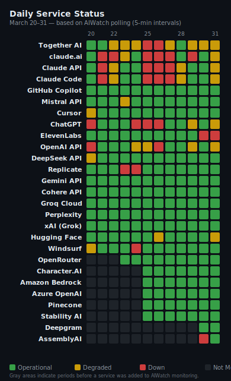
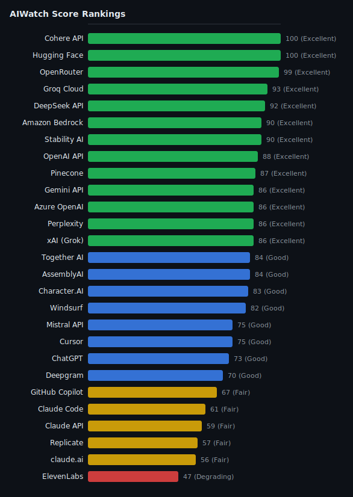

> **Inaugural Issue** — This is AIWatch's first monthly reliability report, establishing the baseline for AI service stability tracking across 27 providers.

> **Source**: [ai-watch.dev](https://ai-watch.dev) — Real-time AI service status monitoring
> **Period**: March 20–31, 2026
> **Published**: April 2026
> **Services monitored**: 27 — 20 API services, 4 coding agents, 3 AI apps

This report analyzes AI service reliability, uptime, incidents, and recovery time across 27 major providers including OpenAI, Anthropic (Claude), Google (Gemini), Amazon (Bedrock), and others — to help developers make informed infrastructure decisions. As the inaugural issue, it sets the benchmark for ongoing monthly comparisons.

March 2026 showed a clear reliability divide: Cohere and Hugging Face recorded perfect scores with zero incidents, while Anthropic services accumulated the highest incident counts due to per-model component reporting. ElevenLabs recorded the lowest uptime at 97.55%, and Deepgram experienced a 74-hour Voice Agent degradation triggered by an upstream OpenAI outage.

---

## Recommendations — Which AI should I use?

| Use Case | Recommended | Why |
|---|---|---|
| **Production-critical** | OpenAI API, Cohere | Only 2h 56m / zero downtime, highest stability |
| **Low latency / cost** | Groq Cloud, DeepSeek API | 100% uptime, fast recovery |
| **Coding workflows** | Cursor, Windsurf | High uptime despite some affected days |
| **Voice / audio** | AssemblyAI (with fallback) | 99.95% uptime; ElevenLabs and Deepgram had multi-hour outages |
| **General purpose** | Gemini, Perplexity | Good scores, but uptime not publicly disclosed — use with monitoring |

---

## TL;DR

- **Most reliable**: Cohere, Hugging Face (100/100 — zero incidents, near-perfect uptime)
- **Best balance (stability + ecosystem)**: OpenAI API (88/100, only 2h 56m downtime, 99.99% uptime)
- **Riskiest this month**: ElevenLabs (97.55% uptime, 8 affected days), Deepgram (74h single incident)
- **High incident noise**: Anthropic services — counts inflated due to per-model component reporting
- **Watch out**: GitHub Copilot infrastructure instability (18 affected days)

<strong>TL;DR in Korean</strong>

- **가장 안정적**: Cohere, Hugging Face (100점 — 인시던트 0건, 완벽한 업타임)
- **안정성 + 생태계 균형**: OpenAI API (88점, 총 다운타임 2시간 56분, 업타임 99.99%)
- **이번 달 가장 위험**: ElevenLabs (업타임 97.55%, 8일 영향), Deepgram (74시간 단일 장애)
- **인시던트 수 주의**: Anthropic 서비스는 모델별(Opus/Sonnet/Haiku) 개별 집계로 건수가 부풀려 보임
- **주의 필요**: GitHub Copilot 인프라 불안정 (18일 영향)

---

## Key Insight

March 2026 reveals three patterns worth noting:

- **High uptime ≠ low incidents**: Anthropic maintained 99%+ uptime yet recorded the most incidents — driven by per-model component reporting (Opus/Sonnet/Haiku counted separately), not systemic instability.
- **Short incidents add up**: Together AI had 20 incidents — the most of any service — but averaged just 25 minutes each. Total downtime (8h 37m) was less than a single Replicate outage (9h 38m).
- **Upstream dependencies matter**: Deepgram's longest incident (74h) was caused by an OpenAI outage affecting its Voice Agent downstream. Services built on other AI providers inherit their reliability risks.

<strong>Key Insight in Korean</strong>

- **높은 업타임 ≠ 적은 인시던트**: Anthropic은 99%+ 업타임을 유지했지만 인시던트가 가장 많았습니다. 모델별(Opus/Sonnet/Haiku) 개별 리포팅 방식 때문이지, 시스템 전체 불안정이 아닙니다.
- **짧은 장애도 쌓인다**: Together AI는 20건으로 최다 인시던트를 기록했지만 평균 25분이었습니다. 총 다운타임(8시간 37분)은 Replicate 단일 장애(9시간 38분)보다 적었습니다.
- **업스트림 의존성이 중요**: Deepgram의 최장 장애(74시간)는 OpenAI 장애가 Voice Agent 하류에 영향을 준 것입니다. 다른 AI 위에 구축된 서비스는 해당 API의 장애 영향을 피할 수 없습니다.

---

## AIWatch Score — March 2026 Reliability Rankings

**AIWatch Score (0–100)** is designed to answer one question:

> *"Which AI service is safest to rely on in production?"*

Unlike raw uptime %, it incorporates incident frequency (how often things break), recovery time (how fast they fix it), and real downtime impact — making it a more realistic reliability signal for developers. All formulas are publicly documented. [How it's calculated →](https://ai-watch.dev/#about-score)

| Rank | Service | Score | Grade | Confidence | Why |
|---|---|---|---|---|---|
| 1= | Cohere API | 100 | Excellent | High | Zero incidents, 100% uptime |
| 1= | Hugging Face | 100 | Excellent | High | Zero incidents, 99.99% uptime |
| 3 | OpenRouter | 99 | Excellent | High | Zero incidents, 99.89% uptime |
| 4 | Groq Cloud | 93 | Excellent | High | 100% uptime, 1 affected day |
| 5 | DeepSeek API | 92 | Excellent | High | 100% uptime, single 1h incident |
| 6= | Amazon Bedrock | 90 | Excellent | Medium | Zero incidents (added Mar 25, partial data) |
| 6= | Stability AI | 90 | Excellent | Medium | Zero incidents (added Mar 25, partial data) |
| 8 | OpenAI API | 88 | Excellent | High | Only 2h 56m downtime all period |
| 9 | Pinecone | 87 | Excellent | High | 99.98% uptime, 3 affected days |
| 10= | Gemini API | 86 | Excellent | Medium | Zero incidents (uptime not published) |
| 10= | Azure OpenAI | 86 | Excellent | Medium | Zero incidents (added Mar 25, uptime not published) |
| 10= | Perplexity | 86 | Excellent | Medium | Zero incidents (uptime not published) |
| 10= | xAI (Grok) | 86 | Excellent | Medium | Zero incidents (uptime not published) |
| 14= | Together AI | 84 | Good | High | 20 incidents but fast recovery (avg 25m) |
| 14= | AssemblyAI | 84 | Good | High | Single 5h incident, 99.95% uptime |
| 16 | Character.AI | 83 | Good | High | 4 minor incidents (avg 2m), 99.56% uptime |
| 17 | Windsurf | 82 | Good | High | Zero incidents in period, 3 affected days prior |
| 18= | Mistral API | 75 | Good | Medium | 7 incidents but very short (avg 6m) |
| 18= | Cursor | 75 | Good | High | 100% uptime despite 8 affected days |
| 20 | ChatGPT | 73 | Good | High | 4 incidents including 19h file-related outage |
| 21 | Deepgram | 70 | Good | Medium | 74h Voice Agent degradation (upstream OpenAI) |
| 22 | GitHub Copilot | 67 | Fair | High | 18 affected days, infrastructure instability |
| 23 | Claude Code | 61 | Fair | High | Per-model reporting inflates count |
| 24 | Claude API | 59 | Fair | High | Per-model reporting inflates count |
| 25 | Replicate | 57 | Fair | Medium | Single 9h 38m outage |
| 26 | claude.ai | 56 | Fair | High | 14 incidents, 21 affected days |
| 27 | ElevenLabs | 47 | Degrading | Medium | 8 affected days, lowest uptime (97.55%) |

**Grade scale**: Excellent (85+) · Good (70+) · Fair (55+) · Degrading (40+) · Unstable (<40)

> **Confidence** reflects data completeness: High = full uptime + incident data available; Medium = uptime not published (industry average assumed) or partial monitoring period.
> Amazon Bedrock, Azure OpenAI, Stability AI were added March 25 — scores reflect 7 days of data with medium confidence.
> Anthropic services score lower due to per-model component reporting — each model tier counts separately toward affected days.

---

## Incident Summary

> **Note on methodology**: Incident counts and downtime reflect all affected components per service (e.g., Claude API counts Opus, Sonnet, and Haiku separately). Official uptime % is based on a single primary component. These two metrics are not directly comparable.
>
> **A higher incident count does not necessarily indicate lower reliability.** Providers differ in reporting granularity — Anthropic reports per-model incidents (Opus/Sonnet/Haiku each counted separately), while others report at the service level. Direct comparisons should account for this difference.
>
> One Claude API incident ("Elevated connection reset errors in Cowork") was excluded — a Cowork-specific client issue (resolved by restarting Claude Desktop), not a Claude API outage.

<table>
<thead>
<tr><th>Service</th><th>Inc</th><th>Downtime (longest)</th><th class="hide-mobile">Longest</th><th class="hide-mobile">Avg Resolution</th></tr>
</thead>
<tbody>
<tr><td>Together AI</td><td>20</td><td>8h 37m (55m)</td><td class="hide-mobile">55m</td><td class="hide-mobile">~25m</td></tr>
<tr><td>claude.ai</td><td>14</td><td>41h 43m (9h 47m)</td><td class="hide-mobile">9h 47m</td><td class="hide-mobile">~2h 58m</td></tr>
<tr><td>Claude API</td><td>9</td><td>32h 30m (9h 47m)</td><td class="hide-mobile">9h 47m</td><td class="hide-mobile">~3h 36m</td></tr>
<tr><td>Claude Code</td><td>9</td><td>32h 30m (9h 47m)</td><td class="hide-mobile">9h 47m</td><td class="hide-mobile">~3h 36m</td></tr>
<tr><td>GitHub Copilot</td><td>8</td><td>13h 32m (6h 19m)</td><td class="hide-mobile">6h 19m</td><td class="hide-mobile">~1h 41m</td></tr>
<tr><td>Mistral API</td><td>7</td><td>44m (22m)</td><td class="hide-mobile">22m</td><td class="hide-mobile">~6m</td></tr>
<tr><td>Cursor</td><td>6</td><td>14h 45m (4h 4m)</td><td class="hide-mobile">4h 4m</td><td class="hide-mobile">~2h 27m</td></tr>
<tr><td>Character.AI</td><td>4</td><td>11m (8m)</td><td class="hide-mobile">8m</td><td class="hide-mobile">~2m</td></tr>
<tr><td>ChatGPT</td><td>4</td><td>36h 17m (19h 46m)</td><td class="hide-mobile">19h 46m</td><td class="hide-mobile">~9h 4m</td></tr>
<tr><td>ElevenLabs</td><td>2</td><td>4h 57m (4h 47m)</td><td class="hide-mobile">4h 47m</td><td class="hide-mobile">~2h 28m</td></tr>
<tr><td>Deepgram</td><td>2</td><td>74h 2m (74h 1m)</td><td class="hide-mobile">74h 1m</td><td class="hide-mobile">~37h 1m</td></tr>
<tr><td>OpenAI API</td><td>1</td><td>2h 56m</td><td class="hide-mobile">2h 56m</td><td class="hide-mobile">2h 56m</td></tr>
<tr><td>DeepSeek API</td><td>1</td><td>1h 4m</td><td class="hide-mobile">1h 4m</td><td class="hide-mobile">1h 4m</td></tr>
<tr><td>AssemblyAI</td><td>1</td><td>5h 14m</td><td class="hide-mobile">5h 14m</td><td class="hide-mobile">5h 14m</td></tr>
<tr><td>Replicate</td><td>1</td><td>9h 38m</td><td class="hide-mobile">9h 38m</td><td class="hide-mobile">9h 38m</td></tr>
</tbody>
</table>

**Zero incidents (12 services):** Gemini API, Amazon Bedrock, Azure OpenAI, Cohere API, Groq Cloud, Perplexity, xAI (Grok), OpenRouter, Hugging Face, Pinecone, Stability AI, Windsurf

---

## Official Uptime (Primary Component)

*Azure OpenAI, Deepgram, Gemini, Mistral, Perplexity, and xAI do not publish accessible uptime metrics on their status pages.*

<table class="uptime-cols">
<thead><tr><th>Service</th><th>Uptime</th></tr></thead>
<tbody>
<tr><td>Amazon Bedrock</td><td>100.00%</td></tr>
<tr><td>Cohere API</td><td>100.00%</td></tr>
<tr><td>Groq Cloud</td><td>100.00%</td></tr>
<tr><td>DeepSeek API</td><td>100.00%</td></tr>
<tr><td>Stability AI</td><td>100.00%</td></tr>
<tr><td>Cursor</td><td>100.00%</td></tr>
<tr><td>OpenAI API</td><td>99.99%</td></tr>
<tr><td>Hugging Face</td><td>99.99%</td></tr>
<tr><td>ChatGPT</td><td>99.99%</td></tr>
<tr><td>Windsurf</td><td>99.99%</td></tr>
<tr><td>Pinecone</td><td>99.98%</td></tr>
<tr><td>AssemblyAI</td><td>99.95%</td></tr>
<tr><td>OpenRouter</td><td>99.89%</td></tr>
<tr><td>GitHub Copilot</td><td>99.62%</td></tr>
<tr><td>Together AI</td><td>99.60%</td></tr>
<tr><td>Character.AI</td><td>99.56%</td></tr>
<tr><td>Claude Code</td><td>99.26%</td></tr>
<tr><td>Claude API</td><td>99.03%</td></tr>
<tr><td>claude.ai</td><td>98.88%</td></tr>
<tr><td>Replicate</td><td>98.61%</td></tr>
<tr><td>ElevenLabs</td><td>97.55%</td></tr>
</tbody>
</table>

---

## Notable Incidents

### 1. Deepgram — 74-Hour Voice Agent Degradation (Mar 20–23)
**Affected**: Voice Agent API (downstream providers)
**Duration**: 74h 1m

Deepgram's Voice Agent service experienced a prolonged degradation caused by an upstream OpenAI outage. The incident highlighted the dependency risk of AI services built on third-party LLM providers. Deepgram's core STT/TTS APIs were unaffected — only the Voice Agent component that routes through OpenAI was impacted.

---

### 2. Anthropic — Recurring Per-Model Incidents (Mar 20–31)
**Affected**: Claude API (9), claude.ai (14), Claude Code (9)
**Longest**: 9h 47m ("Elevated error rates on Opus 4.6")

Anthropic's high incident count reflects its granular per-model reporting. Each model tier (Opus/Sonnet/Haiku) is tracked as a separate component, so a platform-wide degradation registers as multiple simultaneous incidents across claude.ai, Claude API, and Claude Code. The practical impact on any single model was lower than the aggregate numbers suggest.

---

### 3. ChatGPT — File-Related Outages (Mar 24–25)
**Affected**: Project files, file downloads
**Longest**: 19h 46m ("Unable to download or preview project files")

Two of ChatGPT's four incidents were file-handling related (19h 46m + 6h 59m), affecting project file operations rather than core chat functionality. These are included in the count since ChatGPT is tracked as a consumer app, not just an API.

---

### 4. GitHub Copilot — 18 Affected Days
**Affected**: Copilot Chat, Webhooks, Codespaces, Actions
**Longest**: 6h 19m

GitHub Copilot had the highest number of affected days (18) of any service. Disruptions spanned multiple infrastructure components including Webhooks, Codespaces, and Actions. While core AI completions were less impacted, developers relying on full GitHub integration experienced repeated interruptions.

---

### 5. Replicate — Single Long Outage (9h 38m)
**Affected**: Model inference API

A single 9h 38m outage — the longest single-service incident after Deepgram. No other incidents in the period, but the extended recovery time significantly impacted the score.

---

## Observations

### If you build on Anthropic
- High incident count is mostly a reporting artifact (Opus/Sonnet/Haiku counted separately)
- Monitor per-model components individually (e.g., `claude-sonnet-4-5`)
- Longest single incident: 9h 47m — real disruption when it happens

### If you build on GitHub Copilot
- 18 affected days — highest of any service
- Webhooks and Codespaces disruptions are frequent
- Avoid tight CI/CD dependency on these features without fallback handling

### If you build on Deepgram
- Voice Agent API depends on upstream LLM providers (OpenAI)
- 74h degradation was not a Deepgram infrastructure failure — it was an upstream dependency
- Define multiple LLM providers for Voice Agent to mitigate

### If you build on ElevenLabs
- Lowest official uptime at 97.55%
- 8 affected days in the period
- Must implement retry logic and cache generated audio for critical flows

### Generally stable this month
OpenAI API (2h 56m total downtime), Groq Cloud (zero incidents), DeepSeek API (1h 4m) — good candidates for primary or fallback providers.

---

## About This Report

* **Data Sources:** Real-time data is aggregated from official status pages via multiple frameworks, including Atlassian Statuspage, incident.io, Google Cloud Status, Better Stack, Instatus, OnlineOrNot, and RSS feeds (Source: [ai-watch.dev](https://ai-watch.dev)).
* **Monitoring Frequency:** All 27 services are polled every **5 minutes** via Cloudflare Workers. Health check probes measure direct API response times (RTT) at the same interval.
* **AIWatch Score (0–100):** Calculated from three components — **Uptime** (50%), **Incident frequency** (30%), and **Recovery speed** (20%). Full methodology: [ai-watch.dev/#about-score](https://ai-watch.dev/#about-score)
* **Confidence Levels:** *High* = official uptime + incident data available; *Medium* = uptime not published (industry average 99.5% assumed) or partial monitoring period. Confidence reflects data completeness, not service quality.
* **Incident Counting:** Incident counts reflect all affected components per service. Providers differ in reporting granularity — Anthropic reports per-model incidents (Opus/Sonnet/Haiku each counted separately), while others report at the service level.
* **Uptime Metrics:** Uptime percentages reflect official single-component figures provided by the status pages. Services marked with "—" do not provide a publicly accessible uptime metric.
* **Timezone Standard:** All timestamps are recorded in **UTC**.
* **Data Coverage:** AIWatch monitoring began March 20, 2026. This report covers March 20–31 (12 days). Official uptime figures from provider status pages may cover longer periods. Services added March 25 (Amazon Bedrock, Azure OpenAI, Stability AI) have 7 days of data.

**Next report**: April 2026

---

- **Live status** — [ai-watch.dev](https://ai-watch.dev)
- **Slack/Discord alerts** — [ai-watch.dev/#settings](https://ai-watch.dev/#settings)
- **Score methodology** — [ai-watch.dev/#about-score](https://ai-watch.dev/#about-score)
- **All reports** — [reports.ai-watch.dev](https://reports.ai-watch.dev)

---

- *Have feedback or spotted an error?* [Open an issue](https://github.com/bentleypark/aiwatch/issues/new)
- *Want us to track a service?* [Request here](https://github.com/bentleypark/aiwatch/issues/new?template=service_request.md)
