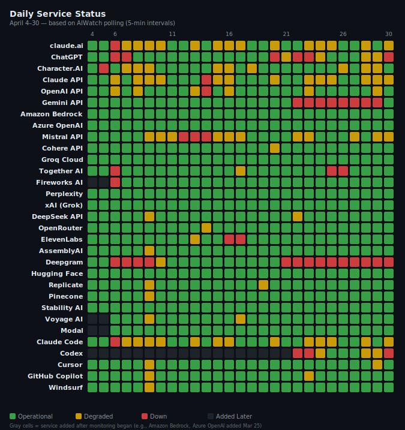
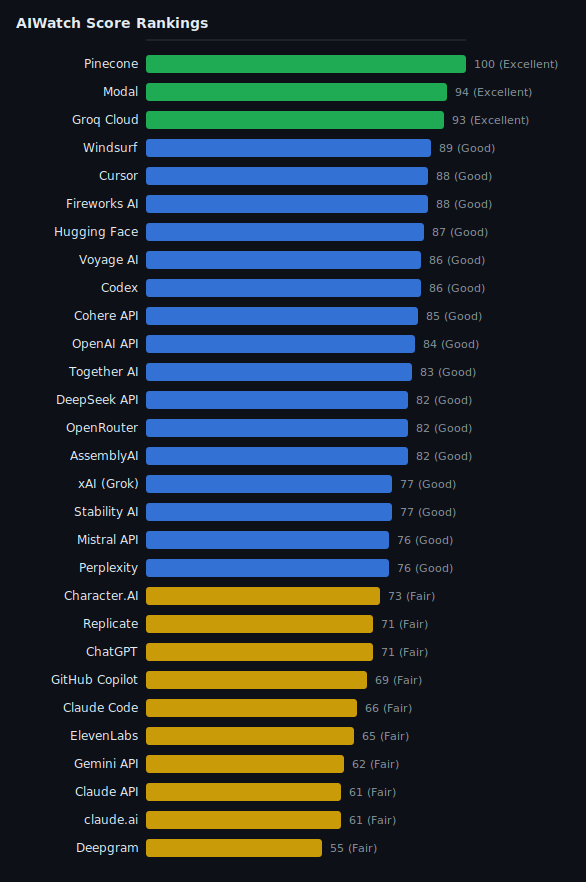

> **Source**: [ai-watch.dev](https://ai-watch.dev) — Real-time AI service status monitoring
> **Period**: April 1–30, 2026
> **Published**: May 2026
> **Services monitored**: 31 — 23 API services, 5 coding agents, 3 AI apps

## Summary

- **Most reliable**:
- **Best balance (stability + ecosystem)**:
- **Riskiest this month**:
- **High incident noise**:
- **Watch out**:

<strong>Summary in Korean</strong>

- **가장 안정적**:
- **안정성 + 생태계 균형**:
- **이번 달 가장 위험**:
- **인시던트 수 주의**:
- **주의 필요**:

## Recommendations

| Use Case | Recommended | Why |
|---|---|---|
| **Production-critical** | | |
| **Low latency / cost** | | |
| **Coding workflows** | | |
| **Voice / audio** | | |
| **General purpose** | | |

---

## Key Insight

<!-- Opening narrative: 1 sentence summarizing the month, then 3 patterns -->

- **Pattern 1**:
- **Pattern 2**:
- **Pattern 3**:

<strong>Key Insight in Korean</strong>

- **패턴 1**:
- **패턴 2**:
- **패턴 3**:

---

## AIWatch Score — April 2026 Reliability Rankings

**AIWatch Score (0–100)** is designed to answer one question:

> *"Which AI service is safest to rely on in production?"*

Unlike raw uptime %, it incorporates incident frequency (how often things break), recovery time (how fast they fix it), and real downtime impact — making it a more realistic reliability signal for developers. All formulas are publicly documented. [How it's calculated →](https://ai-watch.dev/#about-score)

| Rank | Service | Score | Grade | Confidence | Why |
|---|---|---|---|---|---|
| 1 | Pinecone | 100 | Excellent | High | Zero incidents, 99.84% uptime |
| 2 | Modal | 94 | Excellent | High | 8 incidents, avg 4h 7m |
| 3 | Groq Cloud | 93 | Excellent | High | Zero incidents, 100.00% uptime |
| 4= | Amazon Bedrock | 90 | Excellent | High | Zero incidents, 100.00% uptime |
| 4= | Azure OpenAI | 90 | Excellent | High | Zero incidents, 99.99% uptime |
| 6 | Windsurf | 89 | Good | High | 3 incidents, avg 6h 38m |
| 7= | Cursor | 88 | Good | High | 20 incidents, avg 1h 11m |
| 7= | Fireworks AI | 88 | Good | High | 30 incidents, fast recovery (avg 7m) |
| 9 | Hugging Face | 87 | Good | High | 6 incidents, fast recovery (avg 9m) |
| 10= | Voyage AI | 86 | Good | High | 1 incident, 11m |
| 10= | Codex | 86 | Good | High | 7 incidents, avg 1h 23m |
| 12 | Cohere API | 85 | Good | High | 3 incidents, avg 36m |
| 13 | OpenAI API | 84 | Good | High | 6 incidents, avg 6h 57m |
| 14 | Together AI | 83 | Good | High | 139 incidents, avg 42m |
| 15= | DeepSeek API | 82 | Good | High | 1 incident, 1h 4m |
| 15= | OpenRouter | 82 | Good | High | 2 incidents, avg 1h 5m |
| 15= | AssemblyAI | 82 | Good | High | 3 incidents, fast recovery (avg 22m) |
| 18= | xAI (Grok) | 77 | Good | High | Zero incidents, 100.00% uptime |
| 18= | Stability AI | 77 | Good | High | Zero incidents, 100.00% uptime |
| 20= | Mistral API | 76 | Good | High | 97 incidents, fast recovery (avg 8m) |
| 20= | Perplexity | 76 | Good | High | Zero incidents, 100.00% uptime |
| 22 | Character.AI | 73 | Fair | High | 22 incidents, fast recovery (avg 24m) |
| 23= | Replicate | 71 | Fair | High | 2 incidents, avg 38m |
| 23= | ChatGPT | 71 | Fair | High | 15 incidents, avg 2h 28m |
| 25 | GitHub Copilot | 69 | Fair | High | 26 incidents, avg 3h 15m |
| 26 | Claude Code | 66 | Fair | High | 31 incidents, avg 1h 13m |
| 27 | ElevenLabs | 65 | Fair | High | 5 incidents, avg 4h 26m |
| 28 | Gemini API | 62 | Fair | High | 3 incidents, avg 117h 13m |
| 29= | Claude API | 61 | Fair | High | 40 incidents, avg 1h |
| 29= | claude.ai | 61 | Fair | High | 37 incidents, avg 1h 6m |
| 31 | Deepgram | 55 | Fair | High | 5 incidents, avg 16h 15m |

**Grade scale**: Excellent (85+) · Good (70+) · Fair (55+) · Degrading (40+) · Unstable (<40)

<!-- Generate with: node scripts/generate-charts.js 2026-04/index.md -->

> **Confidence** reflects data completeness: High = full uptime + incident data available; Medium = uptime not published (industry average assumed) or partial monitoring period.
> <!-- Additional scoring notes and caveats go here -->

---

## Incident Summary

> **Note on methodology**: Incident counts and downtime reflect all affected components per service (e.g., Claude API counts Opus, Sonnet, and Haiku separately). Official uptime % is based on a single primary component. These two metrics are not directly comparable.
>
> **A higher incident count does not necessarily indicate lower reliability.** Providers differ in reporting granularity — Anthropic reports per-model incidents (Opus/Sonnet/Haiku each counted separately), while others report at the service level. Direct comparisons should account for this difference.
>
> <!-- Additional data notes (excluded incidents, anomalies, etc.) -->

<table>
<thead>
<tr><th>Service</th><th>Inc</th><th>Downtime (longest)</th><th class="hide-mobile">Longest</th><th class="hide-mobile">Avg Resolution</th></tr>
</thead>
<tbody>
<tr><td>Together AI</td><td>139</td><td>97h 49m (15h 16m)</td><td class="hide-mobile">15h 16m</td><td class="hide-mobile">42m</td></tr>
<tr><td>Mistral API</td><td>97</td><td>12h 15m (1h 14m)</td><td class="hide-mobile">1h 14m</td><td class="hide-mobile">8m</td></tr>
<tr><td>Claude API</td><td>40</td><td>39h 40m (5h 57m)</td><td class="hide-mobile">5h 57m</td><td class="hide-mobile">1h</td></tr>
<tr><td>claude.ai</td><td>37</td><td>40h 40m (5h 57m)</td><td class="hide-mobile">5h 57m</td><td class="hide-mobile">1h 6m</td></tr>
<tr><td>Claude Code</td><td>31</td><td>37h 56m (5h 57m)</td><td class="hide-mobile">5h 57m</td><td class="hide-mobile">1h 13m</td></tr>
<tr><td>Fireworks AI</td><td>30</td><td>3h 19m (17m)</td><td class="hide-mobile">17m</td><td class="hide-mobile">7m</td></tr>
<tr><td>GitHub Copilot</td><td>26</td><td>84h 32m (15h 37m)</td><td class="hide-mobile">15h 37m</td><td class="hide-mobile">3h 15m</td></tr>
<tr><td>Character.AI</td><td>22</td><td>8h 47m (4h 10m)</td><td class="hide-mobile">4h 10m</td><td class="hide-mobile">24m</td></tr>
<tr><td>Cursor</td><td>20</td><td>23h 39m (6h 23m)</td><td class="hide-mobile">6h 23m</td><td class="hide-mobile">1h 11m</td></tr>
<tr><td>ChatGPT</td><td>15</td><td>36h 59m (12h 20m)</td><td class="hide-mobile">12h 20m</td><td class="hide-mobile">2h 28m</td></tr>
<tr><td>Modal</td><td>8</td><td>32h 53m (23h 2m)</td><td class="hide-mobile">23h 2m</td><td class="hide-mobile">4h 7m</td></tr>
<tr><td>Codex</td><td>7</td><td>9h 38m (4h 13m)</td><td class="hide-mobile">4h 13m</td><td class="hide-mobile">1h 23m</td></tr>
<tr><td>OpenAI API</td><td>6</td><td>41h 42m (36h 2m)</td><td class="hide-mobile">36h 2m</td><td class="hide-mobile">6h 57m</td></tr>
<tr><td>Hugging Face</td><td>6</td><td>53m (15m)</td><td class="hide-mobile">15m</td><td class="hide-mobile">9m</td></tr>
<tr><td>ElevenLabs</td><td>5</td><td>22h 10m (19h 30m)</td><td class="hide-mobile">19h 30m</td><td class="hide-mobile">4h 26m</td></tr>
<tr><td>Deepgram</td><td>5</td><td>81h 14m (74h 20m)</td><td class="hide-mobile">74h 20m</td><td class="hide-mobile">16h 15m</td></tr>
<tr><td>Gemini API</td><td>3</td><td>351h 39m (242h)</td><td class="hide-mobile">242h</td><td class="hide-mobile">117h 13m</td></tr>
<tr><td>Cohere API</td><td>3</td><td>1h 47m (1h 25m)</td><td class="hide-mobile">1h 25m</td><td class="hide-mobile">36m</td></tr>
<tr><td>AssemblyAI</td><td>3</td><td>1h 5m (48m)</td><td class="hide-mobile">48m</td><td class="hide-mobile">22m</td></tr>
<tr><td>Windsurf</td><td>3</td><td>19h 53m (14h 47m)</td><td class="hide-mobile">14h 47m</td><td class="hide-mobile">6h 38m</td></tr>
<tr><td>OpenRouter</td><td>2</td><td>2h 10m (1h 5m)</td><td class="hide-mobile">1h 5m</td><td class="hide-mobile">1h 5m</td></tr>
<tr><td>Replicate</td><td>2</td><td>1h 15m (48m)</td><td class="hide-mobile">48m</td><td class="hide-mobile">38m</td></tr>
<tr><td>DeepSeek API</td><td>1</td><td>1h 4m (1h 4m)</td><td class="hide-mobile">1h 4m</td><td class="hide-mobile">1h 4m</td></tr>
<tr><td>Voyage AI</td><td>1</td><td>11m (11m)</td><td class="hide-mobile">11m</td><td class="hide-mobile">11m</td></tr>
</tbody>
</table>

**Zero incidents (7 services):** Amazon Bedrock, Azure OpenAI, Groq Cloud, Perplexity, xAI (Grok), Pinecone, Stability AI

---

## Official Uptime (Primary Component)

*Azure OpenAI, Deepgram, Gemini, Mistral, Perplexity, and xAI do not publish accessible uptime metrics on their status pages.*

<table class="uptime-cols">
<thead><tr><th>Service</th><th>Uptime</th></tr></thead>
<tbody>
<tr><td>Amazon Bedrock</td><td>100.00%</td></tr>
<tr><td>Groq Cloud</td><td>100.00%</td></tr>
<tr><td>Stability AI</td><td>100.00%</td></tr>
<tr><td>Hugging Face</td><td>99.97%</td></tr>
<tr><td>Modal</td><td>99.95%</td></tr>
<tr><td>Cohere API</td><td>99.85%</td></tr>
<tr><td>OpenRouter</td><td>99.84%</td></tr>
<tr><td>Pinecone</td><td>99.84%</td></tr>
<tr><td>Windsurf</td><td>99.84%</td></tr>
<tr><td>AssemblyAI</td><td>99.77%</td></tr>
<tr><td>Voyage AI</td><td>99.77%</td></tr>
<tr><td>Replicate</td><td>99.76%</td></tr>
<tr><td>Cursor</td><td>99.76%</td></tr>
<tr><td>GitHub Copilot</td><td>99.73%</td></tr>
<tr><td>DeepSeek API</td><td>99.54%</td></tr>
<tr><td>Fireworks AI</td><td>99.40%</td></tr>
<tr><td>Character.AI</td><td>98.86%</td></tr>
<tr><td>OpenAI API</td><td>97.44%</td></tr>
<tr><td>ElevenLabs</td><td>97.27%</td></tr>
<tr><td>Claude Code</td><td>96.85%</td></tr>
<tr><td>Claude API</td><td>96.46%</td></tr>
<tr><td>Together AI</td><td>96.22%</td></tr>
<tr><td>claude.ai</td><td>95.66%</td></tr>
<tr><td>ChatGPT</td><td>91.61%</td></tr>
<tr><td>Codex</td><td>84.97%</td></tr>
</tbody>
</table>

---

## API Response Time — Monthly p75

<!-- Data source: curl https://api.ai-watch.dev/api/probe/history?days=30 -->
<!-- 17 probe-covered API services. Non-probe services (Bedrock, Azure OpenAI, Pinecone) excluded. -->

| Rank | Service | p75 (ms) | p95 (ms) | Spikes | vs Last Month |
|---|---|---|---|---|---|
| 1 | Gemini API | 140 | — | — | — |
| 2 | Claude API | 173 | — | — | — |
| 3 | Fireworks AI | 210 | — | — | — |
| 4 | Groq Cloud | 213 | — | — | — |
| 5 | OpenAI API | 223 | — | — | — |
| 6= | Mistral API | 234 | — | — | — |
| 6= | Cohere API | 234 | — | — | — |
| 8 | Together AI | 261 | — | — | — |
| 9 | Perplexity | 398 | — | — | — |
| 10 | Hugging Face | 414 | — | — | — |
| 11 | OpenRouter | 442 | — | — | — |
| 12 | Replicate | 480 | — | — | — |
| 13 | xAI (Grok) | 490 | — | — | — |
| 14 | ElevenLabs | 492 | — | — | — |
| 15 | DeepSeek API | 569 | — | — | — |
| 16 | Voyage AI | 699 | — | — | — |
| 17 | Stability AI | 741 | — | — | — |
| 18 | AssemblyAI | 885 | — | — | — |
| 19 | Deepgram | 2193 | — | — | — |

**Spike definition**: RTT > 3× daily median or connection failure (rtt = -1).

> **Note**: Probe RTT measures direct API endpoint response time from Cloudflare Workers edge (5-min intervals). Values reflect network round-trip time, not inference latency. Services without probe coverage (Bedrock, Azure OpenAI, Pinecone) are excluded from rankings.

---

## Detection Lead

<!-- Data source: detected:{svcId} KV timestamps vs official incident start times -->
<!-- Only applicable when probe spike detection fires before status page update -->

| Incident | Service | Detected At (UTC) | Official Report (UTC) | Lead Time |
|---|---|---|---|---|
| | | | | |

**Average Detection Lead**: <!-- X min --> (across N incidents with probe spike detection)

> **Detection Lead** measures how much earlier AIWatch detected an issue (via probe RTT spike) compared to the official status page report. Only incidents where probe spike detection fired before the status page update are included.

---

## Notable Incidents

<!-- Top 5-6 notable incidents with raw vs adjusted duration where applicable -->

### 1. [Title]
**Affected**: <!-- Include region if applicable: e.g., "xAI API — EU (eu-west-1)" -->
**Duration**:

<!-- Description -->

---

## Observations

### If you build on [Service]
-

### Generally stable this month
<!-- List stable services with downtime figures -->

---

## About This Report

* **Data Sources:** Real-time data is aggregated from official status pages via multiple frameworks, including Atlassian Statuspage, incident.io, Google Cloud Status, Better Stack, Instatus, OnlineOrNot, and RSS feeds (Source: [ai-watch.dev](https://ai-watch.dev)).
* **Monitoring Frequency:** All 31 services are polled every **5 minutes** via Cloudflare Workers. Health check probes measure direct API response times (RTT) at the same interval.
* **AIWatch Score (0–100):** Calculated from four components — **Uptime** (40%), **Incident affected days** (25%), **Recovery speed** (15%), and **Responsiveness** (20%). Services without probe data use 80→100 score redistribution. Full methodology: [ai-watch.dev/#about-score](https://ai-watch.dev/#about-score)
* **Confidence Levels:** *High* = official uptime data available; *Medium* = uptime not published (industry average 99.5% assumed) or estimate-based. Confidence reflects uptime data quality. Probe data status (Responsiveness) is shown separately on each service's dashboard.
* **Incident Counting:** Incident counts reflect all affected components per service. Providers differ in reporting granularity — Anthropic reports per-model incidents (Opus/Sonnet/Haiku each counted separately), while others report at the service level.
* **Uptime Metrics:** Uptime percentages reflect official single-component figures provided by the status pages. Services marked with "—" do not provide a publicly accessible uptime metric.
* **Timezone Standard:** All timestamps are recorded in **UTC**.

**Next report**: May 2026

---

- **Live status** — [ai-watch.dev](https://ai-watch.dev)
- **Slack/Discord alerts** — [ai-watch.dev/#settings](https://ai-watch.dev/#settings)
- **Score methodology** — [ai-watch.dev/#about-score](https://ai-watch.dev/#about-score)
- **All reports** — [ai-watch.dev/reports](https://ai-watch.dev/reports/)

---

- *Have feedback or spotted an error?* [Open an issue](https://github.com/bentleypark/aiwatch/issues/new)
- *Want us to track a service?* [Request here](https://github.com/bentleypark/aiwatch/issues/new?template=service_request.md)
