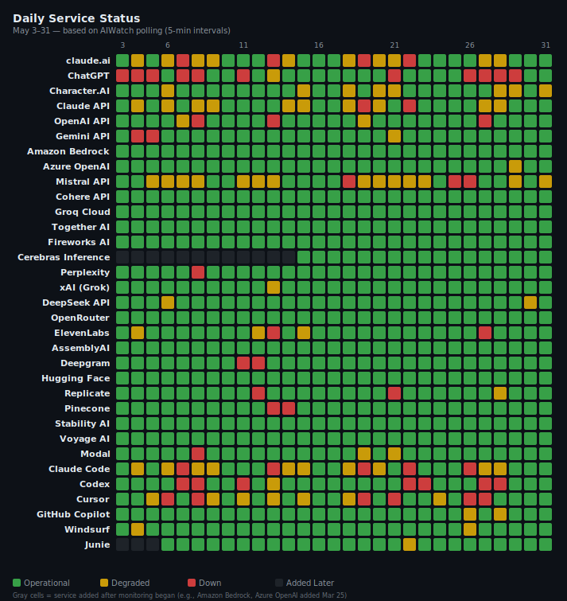
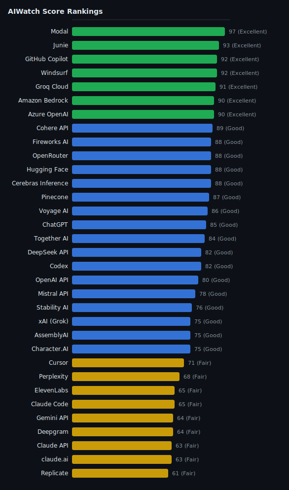

> **Source**: [ai-watch.dev](https://ai-watch.dev) — Real-time AI service status monitoring
> **Period**: May 1–31, 2026
> **Published**: June 2026
> **Services monitored**: 33 — 24 API services, 6 coding agents, 3 AI apps

## Summary

- **Most reliable**: Modal (97/100, Excellent) — the top score of all 33 services, with 99.40% uptime; serverless GPU compute that held steady all month.
- **Riskiest this month**: Replicate (61/100, Fair) — the lowest score, with a 3h 43m average recovery across 4 incidents.
- **High incident count, fast recovery**: Mistral API (155 incidents, 19m avg resolution — up again from April's 97, a new high) and Together AI (133 incidents, 43m avg — roughly flat vs April's 139). The high counts come from per-component reporting plus the micro-incidents surfaced since a probe-filter retune, not from instability (both still scored Good, 78 / 84).
- **Watch out**: Gemini API (only 2 incidents but a 22h 32m average recovery, 45h 4m total downtime) and the Anthropic stack — Claude API / claude.ai / Claude Code all landed Fair (63–65). ChatGPT had the consumer tier's heaviest disruption — 11 incidents, 50h 55m total, longest 15h 16m, 4h 38m average recovery.

<strong>Summary in Korean</strong>

<ul>
<li><strong>가장 안정적</strong>: Modal (97/100, Excellent) — 가동률 99.40%로 전체 1위. 한 달 내내 안정적으로 운영된 서버리스 GPU 컴퓨트입니다.</li>
<li><strong>이번 달 가장 위험</strong>: Replicate (61/100, Fair) — 전체 최저 점수. 장애 4건에 평균 복구 시간이 3h 43m으로 길었습니다.</li>
<li><strong>잦은 장애, 빠른 복구</strong>: Mistral API (155건, 평균 복구 19m — 4월 97건에서 다시 늘어 최고치), Together AI (133건, 평균 43m — 4월 139건과 비슷한 수준). 건수가 많은 것은 컴포넌트별 집계와 probe 필터 재조정 이후 미세 장애가 잡히기 때문이지 서비스가 불안정해서가 아닙니다 (둘 다 Good, 78 / 84).</li>
<li><strong>주의 필요</strong>: Gemini API (장애는 2건뿐이지만 평균 복구 22h 32m, 총 다운타임 45h 4m)와 Anthropic 제품군 — Claude API·claude.ai·Claude Code가 모두 Fair (63–65)에 머물렀습니다. ChatGPT는 소비자용 앱 중 장애가 가장 잦고 길었습니다 — 11건, 총 50h 55m, 최장 15h 16m, 평균 복구 4h 38m.</li>
</ul>

---

## Recommendations

<table class="recommendations">
<thead>
<tr><th>Use Case</th><th>Recommended</th><th>Why</th></tr>
</thead>
<tbody>
<tr><td><strong>Production-critical</strong></td><td>Groq Cloud / Cohere API</td><td>Zero incidents and 100.00% uptime all month (91 / 89)</td></tr>
<tr><td><strong>Low latency / cost</strong></td><td>Groq Cloud / Fireworks AI</td><td>Fast p75 RTT (208 / 216 ms) with zero or 5m-recovery incidents; Gemini is fastest at 63 ms but carries a 22h+ recovery risk</td></tr>
<tr><td><strong>Coding Agents</strong></td><td>Junie / GitHub Copilot</td><td>Most stable agents — 93 / 92, only 2h 1m / 9h 5m total downtime, 30m / 1h 31m avg recovery</td></tr>
<tr><td><strong>Voice / audio</strong></td><td>AssemblyAI</td><td>Best voice score (75, 100.00% uptime); Deepgram lagged (64, 1999 ms p75, 6h 4m recovery)</td></tr>
<tr><td><strong>General purpose</strong></td><td>OpenAI API</td><td>Most reliable of the major general LLMs (80, Good) — 7 incidents, 1h 36m avg recovery, fast 205 ms p75</td></tr>
</tbody>
</table>

---

## Key Insight

Reading beyond the Summary's service-by-service view, three patterns shaped May — how to read incident counts, why recovery speed mattered more than count, and a standout turnaround in the coding-agent tier. Across the board, 26 of 33 services recorded at least one incident, for a combined 611h 4m of downtime.

- **Pattern 1 — Incident count is the most misread metric**: the two highest counts of any service (Mistral 155, Together AI 133) belong to two of the *faster-recovering, Good-tier* services. Because providers report at different granularities (per-component vs service-level), raw counts are not comparable across vendors — adjust for that before ranking. The same caveat held in March and April; it is structural, not a one-month artifact.
- **Pattern 2 — A few long outages hurt more than many short ones**: Gemini API had just 2 incidents but averaged 22h 32m to recover (45h 4m total), dropping it to Fair (64). Codex (7h 48m avg) and Deepgram (6h 4m avg) show the same long-tail-recovery drag, while Fireworks AI (5m) shows the upside.
- **Pattern 3 — Coding agents were the most stable tier, led by a standout turnaround**: Junie (93), GitHub Copilot (92), and Windsurf (92) all scored Excellent. Copilot is the month's biggest reversal — it sat at the bottom of the tier in both March (18 affected days) and April (69, 84h 32m total downtime), but May brought just 6 incidents and 9h 5m total. By contrast the consumer-facing apps were choppy — ChatGPT had the tier's heaviest disruption (11 incidents, longest 15h 16m, 4h 38m avg recovery) and Character.AI logged 29 incidents (though it recovered in ~20m).

<strong>Key Insight in Korean</strong>

Summary가 서비스를 하나하나 짚었다면, 여기서는 5월 전반을 관통한 세 가지 흐름을 봅니다 — 장애 건수를 어떻게 읽어야 하는지, 건수보다 복구 속도가 왜 더 중요했는지, 그리고 코딩 에이전트에서 나온 뚜렷한 반전입니다. 5월에는 33개 중 26개 서비스가 한 건 이상의 장애를 겪었고, 총 다운타임은 611h 4m였습니다.

<ul>
<li><strong>패턴 1 — 장애 건수는 가장 오해하기 쉬운 지표</strong>: 전체에서 건수가 가장 많은 Mistral(155)·Together AI(133)가 오히려 <em>복구가 빠른 Good 등급</em>입니다. 제공사마다 집계 단위(컴포넌트별 vs 서비스별)가 달라 단순 건수로는 제공사끼리 비교할 수 없으니, 순위를 매기기 전에 이를 감안해야 합니다. 이 점은 3월·4월에도 똑같았습니다 — 한 달만의 현상이 아니라 구조적인 문제입니다.</li>
<li><strong>패턴 2 — 오래 지속되는 장애 하나가 짧은 장애 여러 건보다 더 치명적이다</strong>: Gemini API는 장애가 2건뿐이었는데도 평균 복구 시간이 22h 32m(총 45h 4m)이나 걸려 Fair(64)로 내려앉았습니다. Codex(평균 7h 48m)·Deepgram(6h 4m)도 복구가 오래 걸린 반면, Fireworks AI(5m)은 빠른 복구가 얼마나 유리한지 보여줬습니다.</li>
<li><strong>패턴 3 — 코딩 에이전트가 가장 안정적이었고, 그 중심엔 뚜렷한 반전이 있었다</strong>: Junie(93)·GitHub Copilot(92)·Windsurf(92)가 모두 Excellent를 받았습니다. 그중에서도 Copilot의 반전이 가장 두드러집니다 — 3월(18일간 장애 영향)과 4월(69점, 다운타임 84h 32m)까지 코딩 에이전트 중 최하위였는데, 5월에는 장애 6건·총 9h 5m에 그쳤습니다. 반면 소비자용 앱은 기복이 컸습니다 — ChatGPT는 그중 장애가 가장 잦고 길었고(11건·최장 15h 16m·평균 복구 4h 38m), Character.AI는 29건(평균 복구 ~20m)을 기록했습니다.</li>
</ul>

---

## AIWatch Score — May 2026 Reliability Rankings

**AIWatch Score (0–100)** is designed to answer one question:

> *"Which AI service is safest to rely on in production?"*

Combines four components — Uptime (40%), Incident affected days (25%), Recovery speed (15%), Responsiveness (20%, derived from p75 probe RTT). The per-service p75 RTT figures feeding Responsiveness are listed in the [API Response Time — Monthly p75](#api-response-time--monthly-p75) section below; full breakdown of weights, fallbacks, and penalties is in [About This Report](#about-this-report). [How it's calculated →](https://ai-watch.dev/#about-score)

*31 of 33 services ranked. **Amazon Bedrock and Azure OpenAI are excluded from this ranking** — neither publishes an accessible uptime metric, so their Score would inherit an industry-average assumption rather than a measured value, and AIWatch has no reliable incident feed for them (see "No incident feed" under [Incident Summary](#incident-summary)).*

| Rank | Service | Score | Grade | Uptime Source | Why |
|---|---|---|---|---|---|
| 1 | Modal | 97 | Excellent | Official | 5 incidents, avg 1h 5m |
| 2 | Junie | 93 | Excellent | Official | 4 incidents, avg 30m |
| 3= | GitHub Copilot | 92 | Excellent | Official | 6 incidents, avg 1h 31m |
| 3= | Windsurf | 92 | Excellent | Official | 5 incidents, avg 57m |
| 5 | Groq Cloud | 91 | Excellent | Official | Zero incidents, 100.00% uptime |
| 6 | Cohere API | 89 | Good | Official | Zero incidents, 100.00% uptime |
| 7= | Fireworks AI | 88 | Good | Official | 3 incidents, fast recovery (avg 5m) |
| 7= | OpenRouter | 88 | Good | Official | Zero incidents, 100.00% uptime |
| 7= | Hugging Face | 88 | Good | Official | 1 incident, 10m |
| 7= | Cerebras Inference | 88 | Good | Official | 1 incident, 58m |
| 11 | Pinecone | 87 | Good | Official | 4 incidents, avg 47m |
| 12 | Voyage AI | 86 | Good | Official | Zero incidents, 100.00% uptime |
| 13 | ChatGPT | 85 | Good | Estimate | 11 incidents, avg 4h 38m |
| 14 | Together AI | 84 | Good | Official | 133 incidents, avg 43m |
| 15= | DeepSeek API | 82 | Good | Official | 3 incidents through ~May 8 — partial month, see DeepSeek correction note below |
| 15= | Codex | 82 | Good | Official | 7 incidents, avg 7h 48m |
| 17 | OpenAI API | 80 | Good | Official | 7 incidents, avg 1h 36m |
| 18 | Mistral API | 78 | Good | Estimate | 155 incidents, fast recovery (avg 19m) |
| 19 | Stability AI | 76 | Good | Official | Zero incidents, 100.00% uptime |
| 20= | xAI (Grok) | 75 | Good | Estimate | 2 incidents, fast recovery (avg 24m) |
| 20= | AssemblyAI | 75 | Good | Official | 3 incidents, avg 2h 55m |
| 20= | Character.AI | 75 | Good | Official | 29 incidents, fast recovery (avg 20m) |
| 23 | Cursor | 71 | Fair | Official | 25 incidents, avg 1h 29m |
| 24 | Perplexity | 68 | Fair | Estimate | 1 incident, 4h |
| 25= | ElevenLabs | 65 | Fair | Official | 9 incidents, avg 1h 32m |
| 25= | Claude Code | 65 | Fair | Official | 35 incidents, avg 1h 36m |
| 27= | Gemini API | 64 | Fair | Estimate | 2 incidents, avg 22h 32m |
| 27= | Deepgram | 64 | Fair | Estimate | 5 incidents, avg 6h 4m |
| 29= | Claude API | 63 | Fair | Official | 34 incidents, avg 1h 30m |
| 29= | claude.ai | 63 | Fair | Official | 34 incidents, avg 1h 32m |
| 31 | Replicate | 61 | Fair | Official | 4 incidents, avg 3h 43m |

**Grade scale**: Excellent (90+) · Good (75+) · Fair (55+) · Degrading (40+) · Unstable (<40)

<!-- Generate with: node scripts/generate-charts.js 2026-05/index.md -->

> **Uptime Source column**: **Official** (read directly from the service's status page) · **Estimate** (no official metric; only the Score input is computed — the % itself is not surfaced) · **Partial (Nd)** (service newly tracked mid-month). Full definitions: [About This Report → Uptime Source](#about-this-report).

---

## Official Uptime (Primary Component)

> **Reference table.** Official 30-day uptime metrics from each service's status page (where published). The narrative-driven sections below (Incident Summary / Notable Incidents / Observations) cover what these numbers mean for vendor selection.

*Amazon Bedrock, Azure OpenAI, Deepgram, Gemini, Mistral, Perplexity, and xAI do not publish a rolling-30-day uptime percentage on their status pages — they're excluded from this table for that reason. **ChatGPT is also excluded** — AIWatch's own month-measured availability for it (its multi-component status is marked degraded whenever any sub-component has an incident) runs far below the rolling-30-day figure OpenAI's status page publishes (~99.83% on the live status page as of this writing — a current rolling value, **not** a May measurement), and that status-page month-end value wasn't captured for May, so no comparable number is shown here. Reports from June 2026 onward surface the status-page figure directly. (xAI's [status page](https://status.x.ai) does expose per-endpoint live success rates measured since their monitoring system's last restart, but those numbers are not directly comparable to the 30-day figures shown above.)*

<table class="uptime-cols">
<thead><tr><th>Service</th><th>Uptime</th></tr></thead>
<tbody>
<tr><td>Cohere API</td><td>100.00%</td></tr>
<tr><td>Groq Cloud</td><td>100.00%</td></tr>
<tr><td>Fireworks AI</td><td>100.00%</td></tr>
<tr><td>OpenRouter</td><td>100.00%</td></tr>
<tr><td>AssemblyAI</td><td>100.00%</td></tr>
<tr><td>Hugging Face</td><td>100.00%</td></tr>
<tr><td>Stability AI</td><td>100.00%</td></tr>
<tr><td>Voyage AI</td><td>100.00%</td></tr>
<tr><td>Cerebras Inference</td><td>100.00%</td></tr>
<tr><td>Together AI</td><td>99.99%</td></tr>
<tr><td>DeepSeek API</td><td>99.92%</td></tr>
<tr><td>Junie</td><td>99.84%</td></tr>
<tr><td>GitHub Copilot</td><td>99.83%</td></tr>
<tr><td>Windsurf</td><td>99.45%</td></tr>
<tr><td>Modal</td><td>99.40%</td></tr>
<tr><td>Character.AI</td><td>98.71%</td></tr>
<tr><td>OpenAI API</td><td>97.76%</td></tr>
<tr><td>Replicate</td><td>97.48%</td></tr>
<tr><td>ElevenLabs</td><td>97.21%</td></tr>
<tr><td>Pinecone</td><td>96.96%</td></tr>
<tr><td>Claude API</td><td>96.36%</td></tr>
<tr><td>claude.ai</td><td>94.61%</td></tr>
<tr><td>Claude Code</td><td>93.85%</td></tr>
<tr><td>Cursor</td><td>93.46%</td></tr>
<tr><td>Codex</td><td>90.14%</td></tr>
</tbody>
</table>

---

## API Response Time — Monthly p75

These p75 figures are the input to the **Responsiveness** component (20% weight) of [AIWatch Score](#aiwatch-score--may-2026-reliability-rankings). Lower is better. The two tables answer different questions: Score Rankings sorts by *which service is safest to rely on* (combining uptime, incidents, recovery, and responsiveness); this table sorts by *which service is fastest at the network layer*.

<!-- Data source: curl https://api.ai-watch.dev/api/probe/history?days=30 -->
<!-- 20 probe-covered API services. Non-probe services (Bedrock, Azure OpenAI, Pinecone) excluded. -->

| Rank | Service | p75 (ms) |
|---|---|---|
| 1 | Gemini API | 63 |
| 2 | Claude API | 158 |
| 3 | Mistral API | 196 |
| 4 | OpenAI API | 205 |
| 5 | Groq Cloud | 208 |
| 6 | Cohere API | 215 |
| 7 | Fireworks AI | 216 |
| 8 | Together AI | 282 |
| 9 | Hugging Face | 372 |
| 10 | Cerebras Inference | 389 |
| 11 | Perplexity | 429 |
| 12 | Replicate | 443 |
| 13 | OpenRouter | 482 |
| 14 | xAI (Grok) | 489 |
| 15 | ElevenLabs | 498 |
| 16 | DeepSeek API | 576 |
| 17 | Voyage AI | 697 |
| 18 | Stability AI | 711 |
| 19 | AssemblyAI | 844 |
| 20 | Deepgram | 1999 |

> **Note**: Probe RTT measures direct API endpoint response time from Cloudflare Workers edge (5-min intervals). Values reflect network round-trip time, not inference latency. Services without probe coverage (Bedrock, Azure OpenAI, Pinecone) are excluded from rankings.

---

## Incident Summary

> **Reading the count column**: Incident counts reflect all affected components per service, so providers that report per-model (e.g., Anthropic counts Opus / Sonnet / Haiku separately) show inflated totals vs. providers that report at the service level. Higher count ≠ lower reliability — adjust for granularity before comparing across providers. Full provider-by-provider rules: [About This Report → Incident Counting](#about-this-report).
>
> <!-- Cycle-specific data notes (excluded incidents, anomalies) go here. -->

<table>
<thead>
<tr><th>Service</th><th>Inc</th><th>Downtime (longest)</th><th class="hide-mobile">Longest</th><th class="hide-mobile">Avg Resolution</th></tr>
</thead>
<tbody>
<tr><td>Mistral API</td><td>155</td><td>48h 58m (23h 52m)</td><td class="hide-mobile">23h 52m</td><td class="hide-mobile">19m</td></tr>
<tr><td>Together AI</td><td>133</td><td>94h 55m (6h 20m)</td><td class="hide-mobile">6h 20m</td><td class="hide-mobile">43m</td></tr>
<tr><td>Claude Code</td><td>35</td><td>56h 7m (18h 4m)</td><td class="hide-mobile">18h 4m</td><td class="hide-mobile">1h 36m</td></tr>
<tr><td>Claude API</td><td>34</td><td>51h (18h 4m)</td><td class="hide-mobile">18h 4m</td><td class="hide-mobile">1h 30m</td></tr>
<tr><td>claude.ai</td><td>34</td><td>52h 11m (18h 4m)</td><td class="hide-mobile">18h 4m</td><td class="hide-mobile">1h 32m</td></tr>
<tr><td>Character.AI</td><td>29</td><td>9h 40m (1h 55m)</td><td class="hide-mobile">1h 55m</td><td class="hide-mobile">20m</td></tr>
<tr><td>Cursor</td><td>25</td><td>37h 11m (4h 34m)</td><td class="hide-mobile">4h 34m</td><td class="hide-mobile">1h 29m</td></tr>
<tr><td>ChatGPT</td><td>11</td><td>50h 55m (15h 16m)</td><td class="hide-mobile">15h 16m</td><td class="hide-mobile">4h 38m</td></tr>
<tr><td>ElevenLabs</td><td>9</td><td>13h 49m (5h 1m)</td><td class="hide-mobile">5h 1m</td><td class="hide-mobile">1h 32m</td></tr>
<tr><td>OpenAI API</td><td>7</td><td>11h 9m (2h 56m)</td><td class="hide-mobile">2h 56m</td><td class="hide-mobile">1h 36m</td></tr>
<tr><td>Codex</td><td>7</td><td>54h 37m (18h 21m)</td><td class="hide-mobile">18h 21m</td><td class="hide-mobile">7h 48m</td></tr>
<tr><td>GitHub Copilot</td><td>6</td><td>9h 5m (3h 49m)</td><td class="hide-mobile">3h 49m</td><td class="hide-mobile">1h 31m</td></tr>
<tr><td>Deepgram</td><td>5</td><td>30h 20m (24h 20m)</td><td class="hide-mobile">24h 20m</td><td class="hide-mobile">6h 4m</td></tr>
<tr><td>Modal</td><td>5</td><td>5h 25m (2h 28m)</td><td class="hide-mobile">2h 28m</td><td class="hide-mobile">1h 5m</td></tr>
<tr><td>Windsurf</td><td>5</td><td>4h 47m (1h 38m)</td><td class="hide-mobile">1h 38m</td><td class="hide-mobile">57m</td></tr>
<tr><td>Replicate</td><td>4</td><td>14h 53m (6h 57m)</td><td class="hide-mobile">6h 57m</td><td class="hide-mobile">3h 43m</td></tr>
<tr><td>Pinecone</td><td>4</td><td>3h 9m (1h 19m)</td><td class="hide-mobile">1h 19m</td><td class="hide-mobile">47m</td></tr>
<tr><td>Junie</td><td>4</td><td>2h 1m (45m)</td><td class="hide-mobile">45m</td><td class="hide-mobile">30m</td></tr>
<tr><td>Fireworks AI</td><td>3</td><td>15m (9m)</td><td class="hide-mobile">9m</td><td class="hide-mobile">5m</td></tr>
<tr><td>DeepSeek API</td><td>3</td><td>53m (34m)</td><td class="hide-mobile">34m</td><td class="hide-mobile">18m</td></tr>
<tr><td>AssemblyAI</td><td>3</td><td>8h 44m (4h 21m)</td><td class="hide-mobile">4h 21m</td><td class="hide-mobile">2h 55m</td></tr>
<tr><td>Gemini API</td><td>2</td><td>45h 4m (43h 14m)</td><td class="hide-mobile">43h 14m</td><td class="hide-mobile">22h 32m</td></tr>
<tr><td>xAI (Grok)</td><td>2</td><td>48m (47m)</td><td class="hide-mobile">47m</td><td class="hide-mobile">24m</td></tr>
<tr><td>Perplexity</td><td>1</td><td>4h (4h)</td><td class="hide-mobile">4h</td><td class="hide-mobile">4h</td></tr>
<tr><td>Hugging Face</td><td>1</td><td>10m (10m)</td><td class="hide-mobile">10m</td><td class="hide-mobile">10m</td></tr>
<tr><td>Cerebras Inference</td><td>1</td><td>58m (58m)</td><td class="hide-mobile">58m</td><td class="hide-mobile">58m</td></tr>
</tbody>
</table>

**Zero incidents (5 services):** Cohere API, Groq Cloud, OpenRouter, Stability AI, Voyage AI — confirmed via their status-page incident feeds.

**No incident feed (2 services):** Amazon Bedrock, Azure OpenAI — AIWatch has no reliable incident feed for these (RSS / estimate-only), so a blank incident count reflects monitoring coverage, not verified incident-free operation.

**Correction — DeepSeek now fully recoverable (June 2026 update):** When this report was published, DeepSeek's status page had migrated from Atlassian Statuspage to Flashduty mid-month and Flashduty blocked AIWatch's server-side fetches, freezing the feed at **2026-05-08**. So the figures in the tables above — **3 incidents, 99.92% uptime, Score 82** — reflect only ~May 1–8. AIWatch can now read the full Flashduty feed via a browser-rendered fetch, so the complete month is recoverable:

- **DeepSeek API — 7 incidents** (May 6, 6, 8, 21, 24, 28, 28): total **2h 8m**, longest **33m**, median recovery **18m**, ≈**99.78%** uptime (Atlassian-weighted). The four later incidents (5/21, 5/24, 5/28×2) the frozen feed missed are all short API degradations.
- DeepSeek's consumer **Web Chat** surface — now tracked separately as **DeepSeek App** (from June 2026) — saw **6 incidents** over the same period (median recovery 19m).

The ranking, uptime, and incident tables above were **not** retroactively regenerated (the monthly archive's daily counters are immutable once written), so they remain the captured-window snapshot; treat these corrected figures as the verified month. DeepSeek returns to a fully-monitored month from June 2026 onward.

---

## Notable Incidents

### 1. Streaming disruption in Deep Research
**Affected**: Gemini API
**Duration**: 43h 14m

The single longest incident of the month. Gemini API's Deep Research streaming responses failed or stalled for nearly two days, while standard non-streaming calls were less affected. With only two incidents all month, this one event is what pushed Gemini's average recovery to 22h 32m and its score down to Fair (64).

### 2. Voice Agent degraded by an upstream model-provider dependency
**Affected**: Deepgram
**Duration**: 24h 20m

For the third month running, Deepgram's longest incident traced to its Voice Agent's dependency on an upstream third-party LLM provider (reported on the status page as an OpenAI GPT-4o dependency) — the same pattern documented in March (74h) and April (74h 20m). Real-time agent sessions saw elevated errors while core speech-to-text / text-to-speech stayed available; only the Voice Agent surface degraded. One bright spot: at 24h 20m this was roughly a third of the prior two months' worst case, though it still drove Deepgram's 6h 4m average recovery.

### 3. document_library connector degraded · Integrations API
**Affected**: Mistral API
**Duration**: 23h 52m

The document_library connector in Mistral's Integrations API ran degraded for nearly a full day. Mistral logged by far the most incidents this month (155), but they were overwhelmingly brief blips (19m average) — this connector degradation was the notable exception, the longest single Mistral event and the bulk of its 48h 58m monthly downtime.

### 4. Sustained rate limiting from a usage surge
**Affected**: Codex
**Duration**: 18h 21m

A surge in demand pushed a growing share of Codex users into rate limits across an 18-hour window. Requests were throttled rather than hard-down, but the prolonged ceiling — together with the shared transcription incident below — drove up Codex's average recovery to a high 7h 48m.

### 5. Connection failures for IP-restricted GitHub access
**Affected**: Claude API (also Claude Code, claude.ai)
**Duration**: 18h 4m

Organizations that restrict GitHub access by IP address hit connection failures against the Claude API for about 18 hours. The same underlying incident surfaced across Anthropic's stack — Claude Code and claude.ai each recorded the identical 18h 4m peak — a clear illustration of how Anthropic's per-component reporting turns one root event into several separately-counted incidents.

### 6. Elevated transcription failures
**Affected**: ChatGPT & Codex
**Duration**: 15h 16m

Transcription failures rose across both ChatGPT and Codex for over 15 hours. As a shared OpenAI dependency, the single fault surfaced on two products at once — the same shared-infrastructure coupling seen in the Claude entry above. At 15h 16m it was also ChatGPT's single longest incident of the month.

---

## Observations

Actionable takeaways per service. Descriptive context for each event lives in earlier sections — [Summary](#summary), [Incident Summary](#incident-summary), and [Notable Incidents](#notable-incidents). This section is what to *do* with that data — keep each bullet prescriptive, not a recap.

- **If you depend on Gemini for Deep Research or long-running streaming**: build in retries and a non-streaming fallback path. Gemini's incidents were rare but punishingly long (22h 32m avg) — design for graceful degradation, not fast recovery.
- **If you run voice/audio workloads**: the AssemblyAI-over-Deepgram call (75 / 100% uptime vs 64) now holds three months running. The multi-LLM-failover mitigation for Deepgram's Voice Agent still stands from prior reports — the narrower new takeaway is to isolate Voice Agent from your core STT/TTS so an upstream-LLM incident can't take down basic transcription.
- **If you build on the Anthropic stack**: Claude API, Claude Code, and claude.ai are tied to the same Anthropic infrastructure, so they go down together — a single root incident took all three out at once (18h 4m each). You can't fail over from one Anthropic surface to another, so for real redundancy pair Anthropic with a non-Anthropic provider.
- **Quietly reliable picks within their own role**: Fireworks AI (LLM inference — 3 incidents, 5m avg recovery), Junie (coding agent — 4 incidents, 30m avg), and Pinecone (vector DB — 4 incidents, 47m avg) each absorbed real traffic and recovered fast. These are different categories, not interchangeable fallbacks.
- **For mission-critical automation**: Modal (97) and GitHub Copilot (92) held Excellent scores all month — safe defaults where stability outweighs cost.

<strong>Observations in Korean</strong>

<ul>
<li><strong>Gemini로 Deep Research나 장시간 스트리밍을 쓴다면</strong>: 재시도와 비스트리밍 대체 경로를 함께 두세요. Gemini 장애는 드물지만 한 번 나면 오래 지속됩니다(평균 22h 32m) — 복구를 기다리기보다, Gemini가 멈춰도 서비스가 대체 경로로 계속 돌아가도록 설계하는 편이 안전합니다.</li>
<li><strong>음성/오디오 작업이라면</strong>: AssemblyAI를 Deepgram보다 우선하라는 판단(75·가동률 100% vs 64)은 이제 3개월째 그대로입니다. Deepgram Voice Agent에 LLM을 여러 개 두어 장애에 대비하라는 권고는 앞선 리포트에서 이미 다뤘고, 이번에 새로 강조할 점은 외부 LLM 장애가 기본 STT/TTS까지 끌어내리지 않도록 Voice Agent를 따로 떼어 두라는 것입니다.</li>
<li><strong>Anthropic 스택을 기반으로 개발한다면</strong>: Claude API·Claude Code·claude.ai는 Anthropic의 같은 인프라에 묶여 있어 장애도 함께 겪습니다 — 하나의 근본 장애가 세 서비스를 한꺼번에 멈췄습니다(각 18h 4m). 한쪽이 멈췄을 때 다른 Anthropic 서비스로 우회할 수 없으니, 이중화가 필요하면 Anthropic 외의 제공사를 함께 두세요.</li>
<li><strong>각자 영역에서 묵묵히 안정적이었던 선택지</strong>: Fireworks AI(LLM 추론 — 3건, 평균 5m), Junie(코딩 에이전트 — 4건, 평균 30m), Pinecone(벡터 DB — 4건, 평균 47m)는 실제 트래픽을 받으면서도 빠르게 복구했습니다. 다만 서로 범주가 달라 그대로 맞바꿔 쓸 수는 없습니다.</li>
<li><strong>장애가 치명적인 자동화라면</strong>: Modal(97)·GitHub Copilot(92)은 한 달 내내 Excellent를 지켰습니다 — 비용보다 안정성이 우선인 작업의 기본 선택지로 삼기 좋습니다.</li>
</ul>

---

## Security Alerts

> **Note:** Security alerts captured during the month from OSV.dev (AI SDK package vulnerabilities) and Hacker News (security posts mentioning monitored services). Section omitted for months without detections.

**Total alerts:** 18

**By source**

| Source | Count |
|---|---|
| OSV.dev | 18 |

**By severity**

| Critical | High | Medium | Low |
| --- | --- | --- | --- |
| 1 | 3 | 13 | 1 |

**Most affected services**

| Service | Count |
|---|---|
| Hugging Face | 8 |
| LangChain | 5 |
| Anthropic (Claude) | 3 |
| Mistral | 2 |

### Top Findings

#### 1. [Malicious dropper in `mistralai` 2.4.6 PyPI package](https://github.com/mistralai/client-python/security/advisories/GHSA-wx9m-wx4f-4cmg) · `critical`
- **Source:** OSV.dev
- **Affected:** Mistral
- **Detected:** 2026-05-18
- **Fix Version:** — (supply-chain: the malicious 2.4.6 release — pin to a known-good version and audit installs)

#### 2. [LangSmith SDK: public prompt pull deserializes untrusted manifests without a trust-boundary warning](https://github.com/langchain-ai/langsmith-sdk/security/advisories/GHSA-3644-q5cj-c5c7) · `high`
- **Source:** OSV.dev
- **Affected:** LangChain
- **Detected:** 2026-05-13
- **Fix Version:** 0.8.0

#### 3. [LangChain: unsafe deserialization of attacker-controlled objects via overly broad `load()` allowlists](https://github.com/langchain-ai/langchain/security/advisories/GHSA-pjwx-r37v-7724) · `high`
- **Source:** OSV.dev
- **Affected:** LangChain
- **Detected:** 2026-05-09
- **Fix Version:** 1.3.3

#### 4. [LangChain Core: path traversal in legacy `load_prompt` functions](https://github.com/langchain-ai/langchain/security/advisories/GHSA-qh6h-p6c9-ff54) · `high`
- **Source:** OSV.dev
- **Affected:** LangChain
- **Detected:** 2026-05-08
- **Fix Version:** 1.2.22

#### 5. Hugging Face `transformers` — five deserialization / code-execution advisories · `medium`
- **Source:** OSV.dev (Zero Day Initiative — [ZDI-25-1144](https://www.zerodayinitiative.com/advisories/ZDI-25-1144/), [-1150](https://www.zerodayinitiative.com/advisories/ZDI-25-1150/), [-1149](https://www.zerodayinitiative.com/advisories/ZDI-25-1149/), [-1141](https://www.zerodayinitiative.com/advisories/ZDI-25-1141/), [-1147](https://www.zerodayinitiative.com/advisories/ZDI-25-1147/))
- **Affected:** Hugging Face
- **Detected:** 2026-05-20
- **Fix Version:** — (PYSEC-2025-211/212/213/214/217; upgrade `transformers` to the latest patched release)

#### 6. [langchain-community: unsafe pickle deserialization (PYSEC-2024-278)](https://github.com/bayuncao/vul-cve-16/tree/main/PoC.pkl) · `medium`
- **Source:** OSV.dev
- **Affected:** LangChain
- **Detected:** 2026-05-20
- **Fix Version:** —

---

## About This Report

* **Data Sources:** Real-time data is aggregated from official status pages via multiple frameworks, including Atlassian Statuspage, incident.io, Google Cloud Status, Better Stack, Instatus, OnlineOrNot, and RSS feeds (Source: [ai-watch.dev](https://ai-watch.dev)).
* **Monitoring Frequency:** All 33 services are polled every **5 minutes** via Cloudflare Workers. Health check probes measure direct API response times (RTT) at the same interval.
* **AIWatch Score (0–100):** Calculated from four components — **Uptime** (40%), **Incident affected days** (25%), **Recovery speed** (15%), and **Responsiveness** (20%). Services without probe data use 80→100 score redistribution **plus a 5% penalty** to reflect the missing responsiveness signal. Full methodology: [ai-watch.dev/#about-score](https://ai-watch.dev/#about-score)
* **Uptime Source:** *Official* = service publishes a rolling 30-day uptime metric AIWatch reads directly. *Estimate* = no official metric; AIWatch substitutes an industry-average assumption (99.5%) or its own poll-derived figure for the Score's Uptime input. *Partial (Nd)* = an official source exists but AIWatch's measurement window is shorter than the full month (e.g. service newly tracked mid-month). The label only describes the Uptime input quality — the Score itself is computed identically across all services.
* **Incident Counting:** Incident counts reflect all affected components per service. Providers differ in reporting granularity — Anthropic reports per-model incidents (Opus/Sonnet/Haiku each counted separately), while others report at the service level.
* **Uptime Metrics:** Uptime percentages reflect official single-component figures provided by the status pages. Services marked with "—" do not provide a publicly accessible uptime metric.
* **Timezone Standard:** All timestamps are recorded in **UTC**.

**Next report**: June 2026

---

- **Live status** — [ai-watch.dev](https://ai-watch.dev)
- **Slack/Discord alerts** — [ai-watch.dev/#settings](https://ai-watch.dev/#settings)
- **Score methodology** — [ai-watch.dev/#about-score](https://ai-watch.dev/#about-score)
- **All reports** — [ai-watch.dev/reports](https://ai-watch.dev/reports/)

---

- *Have feedback or spotted an error?* [Open an issue](https://github.com/bentleypark/aiwatch/issues/new)
- *Want us to track a service?* [Request here](https://github.com/bentleypark/aiwatch/issues/new?template=service_request.md)
