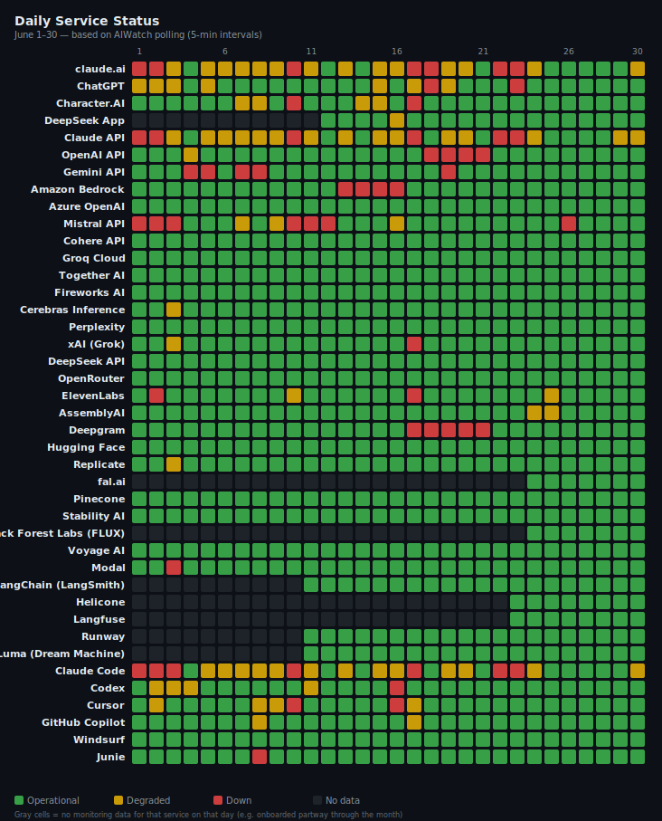
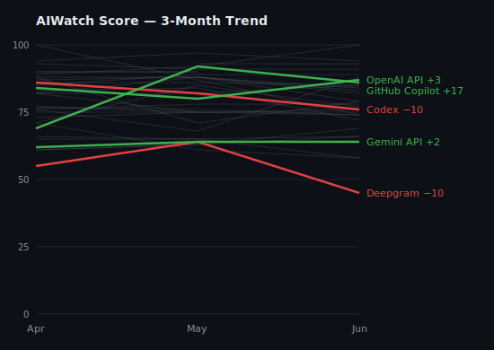
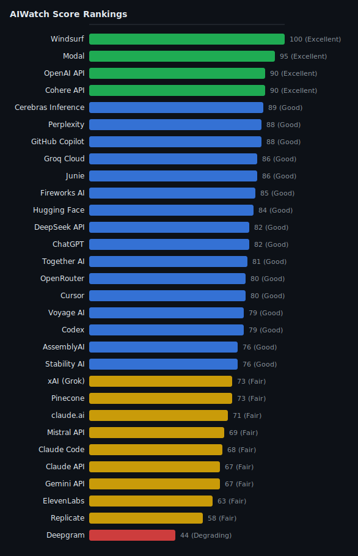

> **Source**: [ai-watch.dev](https://ai-watch.dev) — Real-time AI service status monitoring
> **Period**: June 1–30, 2026
> **Published**: July 2026
> **Services monitored**: 41 — 15 LLM APIs, 6 coding agents, 3 voice, 6 inference & infra, 3 observability, 2 video, 2 image, 4 AI apps

## Summary

> Every score in this report is the **AIWatch Score** (0–100): one number combining uptime, incident load, recovery speed and responsiveness. Higher is better. [How it's built →](#aiwatch-score--june-2026-reliability-rankings)

- **Most reliable**: Windsurf (100 — zero incidents, 99.95% published uptime); Modal a close second (94, 24m average recovery)
- **Riskiest this month**: Deepgram (45) — 45h 33m of downtime across 6 incidents (longest 27h)
- **Biggest improvement**: GitHub Copilot — the biggest Score gain among this quarter's Notable Movers (69 → 86); the metric-by-metric breakdown is in [Notable Movers](#notable-movers)
- **Watch out**: the Anthropic stack stayed Fair (66–69). Codex reads 86 → 76, but that dip is a 72h usage-limits advisory counted as downtime — not an availability drop (see [Notable Incidents](#notable-incidents)).

<strong>Summary in Korean</strong>

<ul>
<li><strong>가장 안정적</strong>: Windsurf (100 — 장애 0건, 공식 업타임 99.95%); Modal이 근소한 차로 2위 (94, 평균 복구 24분)</li>
<li><strong>이번 달 가장 위험</strong>: Deepgram (45) — 장애 6건에 총 다운타임 45시간 33분(최장 27시간)</li>
<li><strong>가장 크게 개선</strong>: GitHub Copilot — 이번 분기 Notable Movers 중 점수 상승 폭이 가장 컸습니다(69 → 86). 지표별 변화는 <a href="#notable-movers">Notable Movers</a>에서 확인하세요.</li>
<li><strong>주의 필요</strong>: Anthropic 계열이 여전히 Fair 등급에 머물렀습니다(66–69). Codex 점수는 86에서 76으로 떨어졌지만, 이 하락은 다운타임으로 집계된 72시간짜리 사용량-한도 공지 탓일 뿐 실제 가용성 저하는 아닙니다(<a href="#notable-incidents">Notable Incidents</a> 참조).</li>
</ul>

---

## Recommendations

<table class="recommendations">
<thead>
<tr><th>Use Case</th><th>Recommended</th><th>Why</th></tr>
</thead>
<tbody>
<tr><td><strong>Production-critical</strong></td><td>Windsurf / Modal</td><td>Windsurf 100 (zero incidents); Modal 94 with a 24m average recovery</td></tr>
<tr><td><strong>Low latency / cost</strong></td><td>Groq Cloud</td><td>91, 100.00% published uptime, 205ms p75 latency — fastest zero-incident inference option</td></tr>
<tr><td><strong>Coding Agents</strong></td><td>GitHub Copilot</td><td>86, most-improved agent over the quarter (69 → 86), 1h 10m average recovery</td></tr>
<tr><td><strong>Voice / audio</strong></td><td>AssemblyAI</td><td>76 — the most reliable voice service this month (vs ElevenLabs 58, Deepgram 45)</td></tr>
<tr><td><strong>General purpose</strong></td><td>OpenAI API</td><td>87, a single 40m incident, fast 178ms p75 latency</td></tr>
</tbody>
</table>

---

## Key Insight

June 2026 showed a clear divide: Windsurf, Modal, and Groq Cloud remained highly stable, while Deepgram (45) struggled the most. 35 out of 41 services recorded at least one incident, with a combined downtime of 712h 26m.

- **Pattern 1 — count and duration each move the Score through a different component — count via incident-affected-days, duration via recovery speed — and here the two effects nearly offset.** Codex took the biggest hit from DURATION: one 72h 3m incident — the month's longest, and a usage-limits advisory counted as downtime — drove 91h 21m of downtime on just 8 incidents, yet that low count kept its incident-affected-days component high, landing it at Good 76. Together AI is the mirror image: the month's highest COUNT (85 incidents, spread across many days) pulled that same component down, even as 27m average recovery held its downtime to 38h — landing it at Fair 72, just below Codex.
- **Pattern 2 — three zero-incident services scored 91, 79 and 74 on the [AIWatch Score](#aiwatch-score--june-2026-reliability-rankings), because they weren't marked on the same scoresheet.** Groq Cloud publishes an official uptime; OpenRouter and Stability AI publish none, so AIWatch drops the 40-point Uptime component and rescales the rest rather than inventing a figure. Responsiveness then carries a **third** of the total instead of a fifth, and that enlarged component amplifies their median probe RTT — roughly 174 ms, 417 ms and 615 ms. Check the **Uptime Source** column before comparing Scores across services ([About This Report → Uptime Source](#about-this-report)).
- **Pattern 3 — AIWatch's probes caught latency the status pages didn't.** Direct RTT probes flagged 102 latency degradations this month, 99 of them absent from the providers' official status pages (Mistral 41, Replicate 25) — the kind of slow-burn regression a binary up/down status page rarely reports. Per-service breakdown in [RTT Degradation Detection](#rtt-degradation-detection).

<strong>Key Insight in Korean</strong>

2026년 6월은 뚜렷한 양극화를 보였습니다. Windsurf·Modal·Groq Cloud는 높은 안정성을 유지한 반면, Deepgram(45)은 가장 고전했습니다. 41개 서비스 중 35개가 최소 1건의 장애를 기록했고, 총 다운타임은 712시간 26분이었습니다.

<ul>
<li><strong>패턴 1 — 건수와 지속 시간은 각각 다른 컴포넌트 — 건수는 인시던트(영향일), 지속 시간은 복구 속도 — 를 통해 점수를 움직이며, 이달엔 두 축의 효과가 서로 거의 상쇄됐다</strong>: Codex는 지속 시간에서 가장 큰 타격을 받았습니다 — 이달 최장인 72시간 3분 단일 인시던트(다운타임으로 집계된 사용량-한도 공지)가 8건만으로 다운타임을 91시간 21분까지 끌어올렸지만, 건수가 적어 인시던트(영향일) 컴포넌트는 높게 유지돼 Good 등급 76점에 안착했습니다. Together AI는 정확히 그 반대 경우입니다: 이달 최다인 85건이 여러 날에 퍼지며 바로 그 컴포넌트를 끌어내렸고, 평균 27분의 빠른 복구로 다운타임이 38시간에 그쳤지만 Fair 등급 72점으로 Codex 바로 아래에 놓였습니다.</li>
<li><strong>패턴 2 — 장애 0건인 세 서비스의 <a href="#aiwatch-score--june-2026-reliability-rankings">AIWatch Score</a>가 91·79·74로 갈린 건, 배점 구성이 서로 달랐기 때문이다</strong>: Groq Cloud는 공식 업타임을 발행하지만 OpenRouter와 Stability AI는 발행하지 않습니다. AIWatch는 업타임을 임의로 추정하지 않고, 그 배점 40점을 뺀 나머지 60점을 100점 만점으로 환산합니다. 그러면 같은 20점짜리 응답 속도 항목이 <strong>5분의 1이 아니라 3분의 1</strong>을 차지하고, 커진 그 항목이 세 서비스의 응답 시간 중앙값(약 174ms·417ms·615ms) 차이를 그대로 증폭합니다. 서비스끼리 점수를 비교하기 전에 <strong>Uptime Source</strong> 열을 먼저 확인하세요(산출 방식: <a href="#about-this-report">About This Report → Uptime Source</a>).</li>
<li><strong>패턴 3 — AIWatch의 직접 측정은 상태 페이지가 놓친 지연을 잡아냈다</strong>: 이달 AIWatch가 직접 측정한 RTT에서 지연 악화 102건이 잡혔고, 그중 99건은 공식 상태 페이지에 아예 없었습니다(Mistral 41건, Replicate 25건). 서비스가 완전히 멈추는 게 아니라 응답이 서서히 느려지는 유형이라, 가동/중단만 표시하는 상태 페이지로는 좀처럼 드러나지 않습니다. 서비스별 상세는 <a href="#rtt-degradation-detection">RTT Degradation Detection</a>에서 확인하세요.</li>
</ul>

---

## 3-Month Trend

AIWatch Score direction over the last 3 months (2026-04 → 2026-06). The lines plot each service's composite Score. **Notable Movers** below are NOT ranked by these lines — a service earns its place, and its order, by the largest change on *any* of three axes (Score, recovery time, or total downtime), which is why one with a small Score move can top the list on a downtime swing the chart cannot show.

### Notable Movers

*The 5 services whose **Score, recovery time (MTTR), or total downtime** changed most over the window (ranked by the largest single change, not a fixed threshold). The metric in **bold** is the change that ranked each service here; 🔺 / 🔻 mark whether that headline metric improved or worsened — so a service can show a small Score gain yet land here, and read 🔻, because its downtime regressed.*

- 🔺 **Gemini API** — Score 62 → 64 (+2) · **MTTR 117h 13m → 11h 46m (−105h 27m)** · downtime 351h 39m → 35h 17m (−316h 22m)
- 🔻 **Codex** — Score 86 → 76 (−10) · **MTTR 1h 23m → 11h 25m (+10h 2m)** · downtime 9h 38m → 91h 21m (+81h 43m)
- 🔺 **Deepgram** — Score 55 → 45 (−10) · **MTTR 16h 15m → 7h 36m (−8h 39m)** · downtime 81h 14m → 45h 33m (−35h 41m)
- 🔺 **GitHub Copilot** — Score 69 → 86 (+17) · MTTR 3h 15m → 1h 10m (−2h 5m) · **downtime 84h 32m → 5h 50m (−78h 42m)**
- 🔺 **OpenAI API** — Score 84 → 87 (+3) · **MTTR 6h 57m → 40m (−6h 17m)** · downtime 41h 42m → 40m (−41h 2m)

> **Scoring-method transition**: Score points before June 2026 predate a methodology change that stopped inventing an uptime figure for services with no official uptime — those months scored such services on an assumed ~99.5% uptime, later dropped. So a Score delta that includes any of those months for a no-official-uptime service (e.g. Deepgram) partly reflects that correction, not a reliability change; the MTTR and total-downtime deltas, measured directly, are unaffected.

---

## AIWatch Score — June 2026 Reliability Rankings

**AIWatch Score (0–100)** is designed to answer one question:

> *"Which AI service is safest to rely on in production?"*

Combines four components — Uptime (40%), Incident affected days (25%), Recovery speed (15%), Responsiveness (20%, derived from each service's median (p50) probe RTT and its RTT stability). The [API Response Time — Monthly p75](#api-response-time--monthly-p75) table below is a separate network-latency reference, not the Responsiveness input; full breakdown of weights, fallbacks, and penalties is in [About This Report](#about-this-report). [How it's calculated →](https://ai-watch.dev/methodology#score)

*30 of 41 services ranked. **Amazon Bedrock, Azure OpenAI, and Character.AI are excluded from this ranking** — no official uptime metric and no direct latency probe, so AIWatch can measure only two of the Score's four components and withholds a Score rather than rank on insufficient signal. Incidents are still tracked (see [Incident Summary](#incident-summary)). **LangChain (LangSmith), Runway, Luma (Dream Machine), DeepSeek App, Helicone, Langfuse, Black Forest Labs (FLUX), fal.ai are excluded from this ranking** — they were added to AIWatch mid-month, so the partial-month Score rests on insufficient coverage; they rejoin once a full month of data accrues.*

| Rank | Service | Score | Grade | Uptime Source | Why |
|---|---|---|---|---|---|
| 1 | Windsurf | 100 | Excellent | Official | Zero incidents, 99.95% uptime |
| 2 | Modal | 94 | Excellent | Official | 11 incidents, fast recovery (avg 24m) |
| 3 | Junie | 93 | Excellent | Official | 5 incidents, avg 2h 11m |
| 4 | Groq Cloud | 91 | Excellent | Official | Zero incidents, 100.00% uptime |
| 5 | Cohere API | 89 | Good | Official | 1 incident, 2h 55m |
| 6 | Perplexity | 88 | Good | Official | 1 incident, 4h 31m |
| 7 | OpenAI API | 87 | Good | Official | 1 incident, 40m |
| 8 | GitHub Copilot | 86 | Good | Official | 5 incidents, avg 1h 10m |
| 9= | DeepSeek API | 85 | Good | Official | 2 incidents, fast recovery (avg 29m) |
| 9= | Voyage AI | 85 | Good | Official | 1 incident, 14m |
| 11 | Hugging Face | 84 | Good | Official | 3 incidents, avg 1h 24m |
| 12 | Cerebras Inference | 83 | Good | Official | 1 incident, 1h 30m |
| 13 | Fireworks AI | 82 | Good | Official | 20 incidents, fast recovery (avg 6m) |
| 14= | OpenRouter | 79 | Good | No official uptime | Zero incidents (no published uptime) |
| 14= | Cursor | 79 | Good | Official | 10 incidents, avg 1h 12m |
| 16 | Mistral API | 78 | Good | Official | 39 incidents, avg 1h 24m |
| 17 | ChatGPT | 77 | Good | Official | 14 incidents, avg 1h 55m |
| 18= | AssemblyAI | 76 | Good | Official | 2 incidents, avg 1h 19m |
| 18= | Codex | 76 | Good | Official | 8 incidents, avg 11h 25m |
| 20= | xAI (Grok) | 74 | Fair | No official uptime | 4 incidents, fast recovery (avg 27m) |
| 20= | Pinecone | 74 | Fair | Official | 5 incidents, avg 3h 50m |
| 20= | Stability AI | 74 | Fair | No official uptime | Zero incidents (no published uptime) |
| 23 | Together AI | 72 | Fair | Official | 85 incidents, fast recovery (avg 27m) |
| 24 | claude.ai | 69 | Fair | Official | 42 incidents, avg 1h 20m |
| 25= | Claude API | 66 | Fair | Official | 45 incidents, avg 1h 21m |
| 25= | Claude Code | 66 | Fair | Official | 42 incidents, avg 1h 27m |
| 27 | Gemini API | 64 | Fair | No official uptime | 3 incidents, avg 11h 46m |
| 28= | ElevenLabs | 58 | Fair | No official uptime | 6 incidents, avg 3h 3m |
| 28= | Replicate | 58 | Fair | No official uptime | 2 incidents, avg 3h 21m |
| 30 | Deepgram | 45 | Degrading | No official uptime | 6 incidents, avg 7h 36m |

**Grade scale**: Excellent (90+) · Good (75+) · Fair (55+) · Degrading (40+) · Unstable (<40)

<!-- Generate with: node scripts/generate-charts.js 2026-06/index.md -->

> **Uptime Source column**: **Official** (read directly from the service's status page) · **No official uptime** (the provider publishes none; the Score is computed from the remaining signals). A service tracked for less than the full month is excluded from the ranking, not labelled — see the note above the table. Full definitions: [About This Report](#about-this-report).
> <!-- Keep this caption short — full definitions live in the About This Report methodology section to avoid duplicating them here. -->

---

## Official Uptime (Primary Component)

> **Reference table.** The uptime percentage each service publishes on its own status page, where it publishes one (the window varies by page — 30 or 90 days). The narrative-driven sections below (Incident Summary / Notable Incidents / Observations) cover what these numbers mean for vendor selection.

*Amazon Bedrock, Azure OpenAI, Character.AI, Deepgram, ElevenLabs, Gemini API, OpenRouter, Replicate, Stability AI, and xAI (Grok) do not publish a comparable uptime percentage on their status pages — they're excluded from this table for that reason. (xAI's [status page](https://status.x.ai) does expose per-endpoint live success rates measured since its monitoring system's last restart, but those numbers are not directly comparable to the figures above.)*

<table class="uptime-cols">
<thead><tr><th>Service</th><th>Uptime</th></tr></thead>
<tbody>
<tr><td>Cohere API</td><td>100.00%</td></tr>
<tr><td>Groq Cloud</td><td>100.00%</td></tr>
<tr><td>Cerebras Inference</td><td>100.00%</td></tr>
<tr><td>Perplexity</td><td>100.00%</td></tr>
<tr><td>Voyage AI</td><td>100.00%</td></tr>
<tr><td>Junie</td><td>100.00%</td></tr>
<tr><td>Black Forest Labs (FLUX)</td><td>100.00%</td></tr>
<tr><td>fal.ai</td><td>100.00%</td></tr>
<tr><td>OpenAI API</td><td>99.99%</td></tr>
<tr><td>Hugging Face</td><td>99.99%</td></tr>
<tr><td>Luma (Dream Machine)</td><td>99.99%</td></tr>
<tr><td>AssemblyAI</td><td>99.97%</td></tr>
<tr><td>Fireworks AI</td><td>99.96%</td></tr>
<tr><td>Pinecone</td><td>99.96%</td></tr>
<tr><td>Codex</td><td>99.96%</td></tr>
<tr><td>Runway</td><td>99.96%</td></tr>
<tr><td>Langfuse</td><td>99.96%</td></tr>
<tr><td>Windsurf</td><td>99.95%</td></tr>
<tr><td>DeepSeek App</td><td>99.94%</td></tr>
<tr><td>Modal</td><td>99.92%</td></tr>
<tr><td>GitHub Copilot</td><td>99.89%</td></tr>
<tr><td>DeepSeek API</td><td>99.88%</td></tr>
<tr><td>Cursor</td><td>99.84%</td></tr>
<tr><td>ChatGPT</td><td>99.80%</td></tr>
<tr><td>Together AI</td><td>99.70%</td></tr>
<tr><td>Mistral API</td><td>99.56%</td></tr>
<tr><td>Claude API</td><td>99.55%</td></tr>
<tr><td>Claude Code</td><td>99.41%</td></tr>
<tr><td>claude.ai</td><td>99.31%</td></tr>
<tr><td>LangChain (LangSmith)</td><td>98.48%</td></tr>
<tr><td>Helicone</td><td>97.95%</td></tr>
</tbody>
</table>

---

## Component Reliability

> AIWatch surfaces a **per-component uptime breakdown** — each multi-surface service's weakest component over the days AIWatch could read its status page, the surface most likely to be your bottleneck that a single service-level uptime number hides. It is a different measurement from the Official Uptime table and **is not a Score input**; see [About This Report → Component Reliability](#about-this-report).

| Service | Weakest Component | Uptime | Components |
|---|---|---|---|
| Deepgram | Voice Agent API: Downstream Providers | 65.81% | 9 |
| Codex | Codex API | 95.17% | 5 |
| ChatGPT | File uploads | 96.64% | 11 |
| Cursor | IDE | 97.43% | 4 |
| Cerebras Inference | ZAI-GLM-4.7 | 99.44% | 3 |
| AssemblyAI | Asynchronous API | 99.50% | 6 |
| OpenAI API | Login | 99.66% | 12 |
| GitHub Copilot | Copilot | 99.84% | 2 |

*Per-component counting began on 12 June 2026, so these figures cover 12–30 June rather than the full month.*

---

## API Response Time — Monthly p75

These p75 figures are a network-latency reference: direct API-endpoint round-trip time, probed from the Cloudflare Workers edge every 5 minutes — not inference latency. Lower is better. They are **not** the Score's Responsiveness input, which reads each service's median (p50) probe RTT and its stability. So this table ranks *which service is fastest on the network*, while [AIWatch Score](#aiwatch-score--june-2026-reliability-rankings) ranks *which is safest to rely on*. A service AIWatch does not probe has no row here; that alone does not drop it from the Score ranking.

<!-- Data source: curl https://api.ai-watch.dev/api/probe/history?days=30 -->
<!-- 32 probe targets: 30 API services (incl. twelvelabs) + cursor (coding agent) + characterai (app). A service AIWatch does not probe has no row here; that alone does not affect its Score. -->
<!-- Extra columns for this table are deferred and already tracked, not an open TODO:
     - a median-p50 / RTT-stability column — aiwatch-reports#76 (p50 is the Score's actual
       Responsiveness input; reframes the older p95/Spikes idea) + aiwatch#1002 (speed/stability sub-score);
     - a vs-last-month delta — aiwatch-reports#41 (month-over-month trend).
     Blocked on the report API serving p50 + stability, and the delta needing the prior month's aggregate.
     Re-add once those land. -->

| Rank | Service | p75 (ms) |
|---|---|---|
| 1 | Gemini API | 54 |
| 2 | Mistral API | 154 |
| 3 | OpenAI API | 178 |
| 4 | Claude API | 192 |
| 5 | Groq Cloud | 205 |
| 6 | Fireworks AI | 214 |
| 7 | Cohere API | 223 |
| 8 | Together AI | 272 |
| 9 | Cerebras Inference | 358 |
| 10 | Hugging Face | 415 |
| 11 | Perplexity | 430 |
| 12 | Replicate | 474 |
| 13 | xAI (Grok) | 497 |
| 14 | OpenRouter | 506 |
| 15 | ElevenLabs | 514 |
| 16 | DeepSeek API | 595 |
| 17 | Voyage AI | 758 |
| 18 | Stability AI | 765 |
| 19 | Pinecone | 844 |
| 20 | AssemblyAI | 901 |
| 21 | LangChain (LangSmith) | 1038 |
| 22 | fal.ai | 1058 |
| 23 | Black Forest Labs (FLUX) | 1134 |
| 24 | Runway | 1376 |
| 25 | Luma (Dream Machine) | 1395 |
| 26 | Langfuse | 1595 |
| 27 | Helicone | 1779 |
| 28 | Deepgram | 2030 |

---

## Detection & RTT Degradation

### Detection Latency

AIWatch independently detects incidents and alerts within **~5 minutes** — the probe/poll cadence, the upper bound on how long an issue can go unnoticed by our monitoring. This is low-latency awareness across all monitored services, not a timing comparison against any provider's status page.

### RTT Degradation Detection

AIWatch's direct RTT probes flagged **102** latency degradations this month, of which **99** were **not reflected on the providers' official status pages** — slowdowns status pages typically don't report, only hard outages.

| Service | RTT Degradations | Not on Status Page |
|---|---|---|
| Mistral API | 41 | 41 |
| Replicate | 25 | 25 |
| Gemini API | 14 | 13 |
| Deepgram | 10 | 8 |
| Cohere API | 3 | 3 |
| Fireworks AI | 3 | 3 |
| Stability AI | 2 | 2 |
| Hugging Face | 1 | 1 |
| Perplexity | 1 | 1 |
| OpenRouter | 1 | 1 |
| Together AI | 1 | 1 |

> **RTT degradation detection** is AIWatch's differentiator: synthetic probes measure real latency degradation that official status pages (which report hard-down, not slowness) often omit entirely.

---

## Incident Summary

> **Reading the count column**: The count is how many incidents a provider published for that service. Granularity differs — Anthropic posts a separate incident per model ("Elevated errors for Claude Opus 4.7", "Degraded performance for Claude Sonnet 4.6"), and Together AI's status page tracks each model as its own resource — so both show higher totals than providers that post one incident per event. Higher count ≠ lower reliability — adjust for granularity before comparing across providers. Full provider-by-provider rules: [About This Report → Incident Counting](#about-this-report).
>
> <!-- Cycle-specific data notes (excluded incidents, anomalies) go here. -->

<table>
<thead>
<tr><th>Service</th><th>Inc</th><th>Downtime (longest)</th><th class="hide-mobile">Longest</th><th class="hide-mobile">Avg Resolution</th></tr>
</thead>
<tbody>
<tr><td>Together AI</td><td>85</td><td>38h 9m (1h 46m)</td><td class="hide-mobile">1h 46m</td><td class="hide-mobile">27m</td></tr>
<tr><td>Claude API</td><td>45</td><td>61h 3m (6h 33m)</td><td class="hide-mobile">6h 33m</td><td class="hide-mobile">1h 21m</td></tr>
<tr><td>claude.ai</td><td>42</td><td>55h 56m (6h 33m)</td><td class="hide-mobile">6h 33m</td><td class="hide-mobile">1h 20m</td></tr>
<tr><td>Claude Code</td><td>42</td><td>61h 8m (6h 33m)</td><td class="hide-mobile">6h 33m</td><td class="hide-mobile">1h 27m</td></tr>
<tr><td>Mistral API</td><td>39</td><td>54h 55m (29h 34m)</td><td class="hide-mobile">29h 34m</td><td class="hide-mobile">1h 24m</td></tr>
<tr><td>Character.AI</td><td>25</td><td>18h 48m (4h 50m)</td><td class="hide-mobile">4h 50m</td><td class="hide-mobile">45m</td></tr>
<tr><td>Fireworks AI</td><td>20</td><td>1h 58m (26m)</td><td class="hide-mobile">26m</td><td class="hide-mobile">6m</td></tr>
<tr><td>ChatGPT</td><td>14</td><td>26h 49m (6h 12m)</td><td class="hide-mobile">6h 12m</td><td class="hide-mobile">1h 55m</td></tr>
<tr><td>Modal</td><td>11</td><td>4h 29m (1h 42m)</td><td class="hide-mobile">1h 42m</td><td class="hide-mobile">24m</td></tr>
<tr><td>Cursor</td><td>10</td><td>12h 2m (2h 26m)</td><td class="hide-mobile">2h 26m</td><td class="hide-mobile">1h 12m</td></tr>
<tr><td>Codex</td><td>8</td><td>91h 21m (72h 3m)</td><td class="hide-mobile">72h 3m</td><td class="hide-mobile">11h 25m</td></tr>
<tr><td>Langfuse</td><td>7</td><td>5h 56m (2h 20m)</td><td class="hide-mobile">2h 20m</td><td class="hide-mobile">51m</td></tr>
<tr><td>ElevenLabs</td><td>6</td><td>18h 17m (7h 24m)</td><td class="hide-mobile">7h 24m</td><td class="hide-mobile">3h 3m</td></tr>
<tr><td>Deepgram</td><td>6</td><td>45h 33m (27h)</td><td class="hide-mobile">27h</td><td class="hide-mobile">7h 36m</td></tr>
<tr><td>Runway</td><td>6</td><td>12h 20m (6h)</td><td class="hide-mobile">6h</td><td class="hide-mobile">2h 3m</td></tr>
<tr><td>Pinecone</td><td>5</td><td>19h 11m (8h 23m)</td><td class="hide-mobile">8h 23m</td><td class="hide-mobile">3h 50m</td></tr>
<tr><td>GitHub Copilot</td><td>5</td><td>5h 50m (1h 57m)</td><td class="hide-mobile">1h 57m</td><td class="hide-mobile">1h 10m</td></tr>
<tr><td>Junie</td><td>5</td><td>10h 56m (8h 4m)</td><td class="hide-mobile">8h 4m</td><td class="hide-mobile">2h 11m</td></tr>
<tr><td>xAI (Grok)</td><td>4</td><td>1h 48m (31m)</td><td class="hide-mobile">31m</td><td class="hide-mobile">27m</td></tr>
<tr><td>Helicone</td><td>4</td><td>23h 4m (18h 34m)</td><td class="hide-mobile">18h 34m</td><td class="hide-mobile">5h 46m</td></tr>
<tr><td>Gemini API</td><td>3</td><td>35h 17m (24h 49m)</td><td class="hide-mobile">24h 49m</td><td class="hide-mobile">11h 46m</td></tr>
<tr><td>Hugging Face</td><td>3</td><td>4h 13m (3h 50m)</td><td class="hide-mobile">3h 50m</td><td class="hide-mobile">1h 24m</td></tr>
<tr><td>LangChain (LangSmith)</td><td>3</td><td>8h 58m (7h 31m)</td><td class="hide-mobile">7h 31m</td><td class="hide-mobile">2h 59m</td></tr>
<tr><td>DeepSeek API</td><td>2</td><td>58m (45m)</td><td class="hide-mobile">45m</td><td class="hide-mobile">29m</td></tr>
<tr><td>AssemblyAI</td><td>2</td><td>2h 38m (1h 27m)</td><td class="hide-mobile">1h 27m</td><td class="hide-mobile">1h 19m</td></tr>
<tr><td>Replicate</td><td>2</td><td>6h 42m (5h 35m)</td><td class="hide-mobile">5h 35m</td><td class="hide-mobile">3h 21m</td></tr>
<tr><td>Luma (Dream Machine)</td><td>2</td><td>7h 54m (7h 30m)</td><td class="hide-mobile">7h 30m</td><td class="hide-mobile">3h 57m</td></tr>
<tr><td>DeepSeek App</td><td>2</td><td>1h 35m (50m)</td><td class="hide-mobile">50m</td><td class="hide-mobile">48m</td></tr>
<tr><td>OpenAI API</td><td>1</td><td>40m (40m)</td><td class="hide-mobile">40m</td><td class="hide-mobile">40m</td></tr>
<tr><td>Amazon Bedrock</td><td>1</td><td>64h 47m (64h 47m)</td><td class="hide-mobile">64h 47m</td><td class="hide-mobile">64h 47m</td></tr>
<tr><td>Cohere API</td><td>1</td><td>2h 55m (2h 55m)</td><td class="hide-mobile">2h 55m</td><td class="hide-mobile">2h 55m</td></tr>
<tr><td>Cerebras Inference</td><td>1</td><td>1h 30m (1h 30m)</td><td class="hide-mobile">1h 30m</td><td class="hide-mobile">1h 30m</td></tr>
<tr><td>Perplexity</td><td>1</td><td>4h 31m (4h 31m)</td><td class="hide-mobile">4h 31m</td><td class="hide-mobile">4h 31m</td></tr>
<tr><td>Voyage AI</td><td>1</td><td>14m (14m)</td><td class="hide-mobile">14m</td><td class="hide-mobile">14m</td></tr>
<tr><td>Black Forest Labs (FLUX)</td><td>1</td><td>1m (1m)</td><td class="hide-mobile">1m</td><td class="hide-mobile">1m</td></tr>
</tbody>
</table>

**Zero incidents (6 services):** Azure OpenAI, Groq Cloud, OpenRouter, Stability AI, Windsurf, fal.ai — confirmed via their status-page incident feeds.

**Stale source (1 service):** Character.AI — AIWatch can no longer read its incident feed, which is frozen at the last reachable fetch. The incident count covers only the window up to that cutoff, not the full month, so treat it as a floor rather than a verified picture.

---

## Notable Incidents

### 1. Deepgram — the month's least reliable service, driven by latency not one outage
**Affected**: Deepgram
**Longest incident**: 27h (of 6 incidents; 45h 33m total downtime)

Deepgram was June's worst-scoring service (45), but not because of one catastrophic outage — it had the highest edge-probe RTT of any probed service (2030 ms p75) combined with 45h 33m of downtime spread across 6 incidents (the longest a 27h Flux streaming-STT degradation, plus a 10h window of elevated errors on the Gemini-backed Voice Agent — the same upstream-LLM dependency). For a real-time transcription dependency the responsiveness alone is a hot-path risk.

### 2. Mistral — a 29h 34m Audio API degradation concentrated its 39-incident load
**Affected**: Mistral API
**Longest incident**: 29h 34m — "Audio API Degraded"

Mistral logged 39 incidents (54h 55m total), but the load was concentrated: a single 29h 34m Audio API degradation accounted for more than half of it, alongside a shorter "Deep Research is down" outage and a run of Completion / Conversations API degradations. Recovery otherwise averaged a fast 1h 24m, keeping Mistral at Good 78 — one genuinely long component degradation against a backdrop of brief blips.

### 3. Codex — its 72h "incident" was a usage-limits advisory, not an outage
**Affected**: Codex
**Longest incident**: 72h 3m — "Usage Limits Depleting Faster Than Expected" (impact: minor)

Codex's longest June "incident" (72h 3m) was **not an availability outage** — it was a *"Usage Limits Depleting Faster Than Expected"* advisory (impact: minor). It was published as a 72h status-page incident, so it counted toward downtime — 79% of Codex's 91h 21m monthly total — and that is what dropped its Score 86 → 76 and pushed its average resolution to 11h 25m. Its largest genuine outage was a 6h 12m elevated-error window on 3 June. Read the Score dip as a classification artifact of a quota notice counted as downtime, not a reliability collapse.

### 4. Anthropic — Claude model-access suspension (advisory)
**Affected**: Claude API, claude.ai, Claude Code
**Type**: advisory — not an availability outage

Anthropic's status feed carried a "suspended access to Claude Mythos 5 and Claude Fable 5" notice — a model-access/policy advisory, not a service outage. The 42–45 incident counts across the three Claude surfaces are largely an artifact of per-model reporting (Opus 4.7 and Sonnet 4.6 each posted separately); recovery averaged a fast ~1h 20m and the surfaces stayed operational for general use — so the high counts reflect reporting granularity more than a proportional availability hit. Its largest genuine availability incident was a 6h 33m Opus 4.8 elevated-errors window.

---

## Observations

Actionable takeaways per service. Descriptive context for each event lives in earlier sections — [Summary](#summary), [Incident Summary](#incident-summary), and [Notable Incidents](#notable-incidents). This section is what to *do* with that data — keep each bullet prescriptive, not a recap, and not a picks list (per-use-case picks live in [Recommendations](#recommendations)).

- **Deepgram exercised the voice hot-path risk this month**: its June degradation plus the worst probe latency of any service (see [Notable Incidents](#notable-incidents)) put real-time transcription on the exposed path — a live instance of the Voice-Agent exposure. Build per [Resilience → Deepgram](../resilience/#deepgram): a degradation-aware fallback to a second provider such as AssemblyAI (76).
- **Treat Character.AI's June as a floor, not a full-month read**: its incident feed stopped on 15 June and its status page stopped publishing component data on 18 June, so the 25 incidents above cover 7–15 June only — don't compare its count against full-month services or read it as complete. Its Score is absent by design: with no official uptime and no latency probe, AIWatch can measure only two of the Score's four components and withholds it rather than rank on insufficient signal.

---

## Security Alerts

> **Note:** Security alerts captured during the month from OSV.dev (AI SDK package vulnerabilities) and Hacker News (security posts mentioning monitored services). Section omitted for months without detections.

**Total alerts:** 33

**By source**

| Source | Count |
|---|---|
| OSV.dev | 33 |

**By severity**

| Critical | High | Medium | Low |
| --- | --- | --- | --- |
| 2 | 2 | 28 | 1 |

**Most affected services**

| Service | Count |
|---|---|
| LangChain | 26 |
| Hugging Face | 7 |

### Top Findings

#### 1. [Langchain SQL Injection vulnerability](https://nvd.nist.gov/vuln/detail/CVE-2023-32785) · `critical`
- **Source:** OSV.dev
- **Affected:** LangChain
- **Detected:** 2026-06-29

#### 2. [LangChain serialization injection vulnerability enables secret extraction in dumps/loads APIs](https://github.com/langchain-ai/langchain/security/advisories/GHSA-c67j-w6g6-q2cm) · `critical`
- **Source:** OSV.dev
- **Affected:** LangChain
- **Detected:** 2026-06-29

#### 3. [LangSmith SDK: Public prompt pull deserializes untrusted manifests without trust boundary warning](https://github.com/langchain-ai/langsmith-sdk/security/advisories/GHSA-3644-q5cj-c5c7) · `high`
- **Source:** OSV.dev
- **Affected:** LangChain
- **Detected:** 2026-06-09

#### 4. [LangChain vulnerable to unsafe deserialization of attacker-controlled objects through overly broad `load()` allowlists](https://github.com/langchain-ai/langchain/security/advisories/GHSA-pjwx-r37v-7724) · `high`
- **Source:** OSV.dev
- **Affected:** LangChain
- **Detected:** 2026-06-03

#### 5. [LangChain: Path traversal and sandbox escape in LangChain file-search middleware and loaders](https://github.com/langchain-ai/langchain/security/advisories/GHSA-gr75-jv2w-4656) · `medium`
- **Source:** OSV.dev
- **Affected:** LangChain
- **Detected:** 2026-06-16

#### 6. [PYSEC-2025-70: PyPI/langchain-community](https://huntr.com/bounties/8f771040-7f34-420a-b96b-5b93d4a99afc) · `medium`
- **Source:** OSV.dev
- **Affected:** LangChain
- **Detected:** 2026-06-10

#### 7. [PYSEC-2024-45: PyPI/langchain-core](https://github.com/PinkDraconian/PoC-Langchain-RCE/blob/main/README.md) · `medium`
- **Source:** OSV.dev
- **Affected:** LangChain
- **Detected:** 2026-06-10

---

## About This Report

* **Data Sources:** Real-time data is aggregated from official status pages via multiple frameworks, including Atlassian Statuspage, incident.io, Google Cloud Status, Better Stack, Instatus, OnlineOrNot, and RSS feeds (Source: [ai-watch.dev](https://ai-watch.dev)).
* **Monitoring Frequency:** All 41 services are polled every **5 minutes** via Cloudflare Workers. Health check probes measure direct API response times (RTT) at the same interval.
* **AIWatch Score (0–100):** Calculated from four components — **Uptime** (40%), **Incident affected days** (25%), **Recovery speed** (15%), and **Responsiveness** (20%). A service with no probe endpoint is scored on the remaining components rescaled to 100, with **no penalty**. A service that has a probe but fewer than 7 days of samples gets that same rescale **plus a 5% penalty** until its probe data matures. Full methodology: [ai-watch.dev/methodology#score](https://ai-watch.dev/methodology#score)
* **Uptime Source:** *Official* = the service publishes a rolling uptime % that AIWatch reads directly from its status page (the window varies by page — 30 or 90 days). *No official uptime* = the provider publishes no comparable figure. AIWatch **invents none**: the Score simply drops its 40-point Uptime component and is rescaled over the remaining signals (incidents, recovery, responsiveness). A service that still has a probe is scored and ranked on what can be measured; one with **neither** uptime **nor** a probe has too little signal, so its Score is withheld and it is not ranked. The note above the Score table names whichever services that is — the membership is read from the data, not fixed here. A service AIWatch tracked for only part of the month is **excluded from the ranking** rather than labelled — its partial-month Score would rest on insufficient coverage. The label describes the Uptime input, not the Score's rigour.
* **Incident Counting:** Counts are the incidents each provider published, attributed to the service they affected. Providers differ in granularity, and in *where* that granularity lives: Anthropic maps to a single status-page component but posts one incident **per model**; Together AI tracks each model as its own **resource**, so one event can surface as several incidents. Others post one incident per event at the service level.
* **Uptime Metrics:** Uptime percentages are the official figure each status page publishes — for some services a single component, for others a worst-of across a component set, for others still an upstream platform average, depending on what the page exposes. Services marked with "—" publish no accessible uptime metric.
* **Component Reliability:** A **different measurement** from every other uptime figure in this report — do not compare them. AIWatch polls each service's status page every 5 minutes and, per component, counts a poll as good **only** when that component reads `operational`; `degraded` and `partial outage` both count against it, with no weighting by incident severity (severity is recorded per *service*, not per component). The percentage is that ratio of good polls, over the days AIWatch could read the page. Only components AIWatch surfaces for that service are counted — billing, docs and compliance surfaces are excluded — and a service needs at least two of them to appear at all. The table lists only each service's **weakest** component, and only when it fell below 99.9%: it is a list of where to look, not a ranking of everything.
* **Timezone Standard:** All timestamps are recorded in **UTC**.

**Next report**: July 2026

---

- **Live status** — [ai-watch.dev](https://ai-watch.dev)
- **Slack/Discord alerts** — [ai-watch.dev/#settings](https://ai-watch.dev/#settings)
- **Score methodology** — [ai-watch.dev/methodology#score](https://ai-watch.dev/methodology#score)
- **All reports** — [ai-watch.dev/reports](https://ai-watch.dev/reports/)

---

- *Have feedback or spotted an error?* [Open an issue](https://github.com/bentleypark/aiwatch/issues/new)
- *Want us to track a service?* [Request here](https://github.com/bentleypark/aiwatch/issues/new?template=service_request.md)
