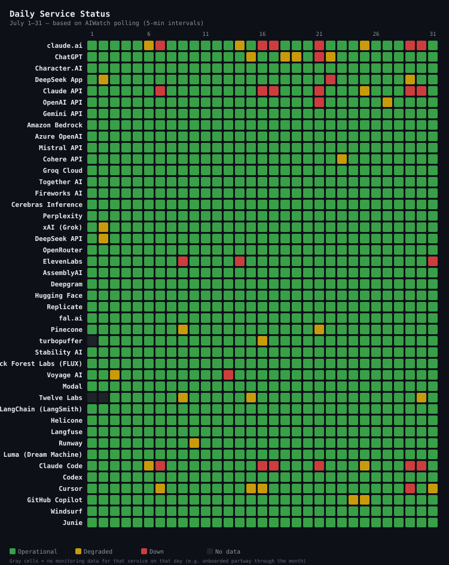
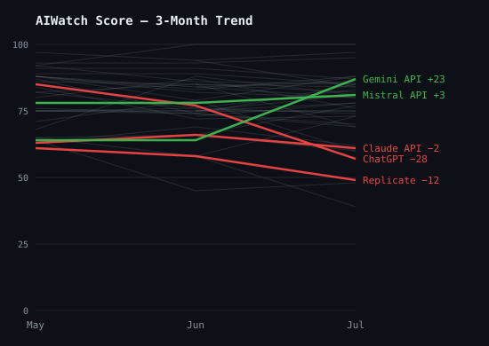
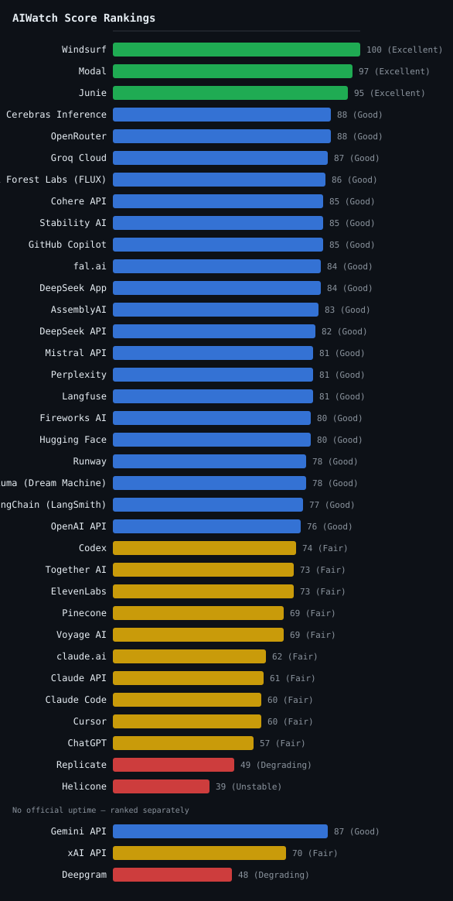

> **Source**: [ai-watch.dev](https://ai-watch.dev) — Real-time AI service status monitoring
> **Period**: July 1–31, 2026
> **Published**: August 2026
> **Services monitored**: 45 — 16 LLM APIs, 8 inference & infra, 6 coding agents, 5 AI apps, 3 voice & transcription, 3 observability, 2 video, 2 image

## Summary

> Every score in this report is the **AIWatch Score** (0–100): one number combining uptime, incident load, recovery speed and responsiveness. Higher is better. [How it's built →](#aiwatch-score--july-2026-reliability-rankings)

- **Most reliable**: Windsurf (100) — zero incidents and 100.00% uptime, the top Score of the month's 35 fully-ranked services; Modal followed at 97 on 99.98% uptime, its three incidents totalling 37m.
- **Riskiest this month**: Helicone (39, Unstable) — the lowest Score of any fully-ranked service. Only two incidents, but both were an API endpoint going hard down (`eu.api.helicone.ai` 59h 53m, `api.hconeai.com` 21h 17m) for 81h 10m of downtime and a 40h 35m average recovery.
- **Falling incident count, still nominally #1**: Together AI's count has dropped for three straight months — 139 in April, 133 in May, 85 in June, 65 in July — more than halving. It's still the month's highest raw count, but that ranking says less each month: its 29h 22m of downtime placed only 11th of the 37 services that had any, and its Score barely moved (72 → 73).
- **Watch out**: OpenAI's three surfaces slid together — several of the incidents behind ChatGPT (77 → 57), the OpenAI API (87 → 76) and Codex (76 → 74) were the same event, published against all three at once (see [Key Insight](#key-insight)). Among the coding agents Cursor dropped furthest (79 → 60 on 32 incidents), with just over a quarter of its downtime logged against upstream Anthropic degradations.

<strong>Summary in Korean</strong>

<ul>
<li><strong>가장 안정적</strong>: Windsurf (100) — 장애 0건에 업타임 100.00%로, 이달 완전 순위에 오른 35개 서비스 중 1위입니다. Modal이 97로 뒤를 이었습니다 — 장애 3건에 업타임 99.98%, 총 다운타임은 37분이었습니다.</li>
<li><strong>이번 달 가장 위험</strong>: Helicone (39, Unstable) — 완전 순위에 오른 서비스 중 최저점입니다. 장애는 2건뿐이지만 둘 다 API 엔드포인트가 완전히 멈춘 경우였고(<code>eu.api.helicone.ai</code> 59시간 53분, <code>api.hconeai.com</code> 21시간 17분), 총 다운타임 81시간 10분에 평균 복구 시간은 40시간 35분이었습니다.</li>
<li><strong>장애 건수는 하락세, 그래도 여전히 1위</strong>: Together AI의 장애 건수는 4월 139건 → 5월 133건 → 6월 85건 → 7월 65건으로 석 달 연속 줄어 반토막 넘게 떨어졌습니다. 여전히 이달 최다 건수이긴 하지만, 그 순위가 갖는 의미는 갈수록 옅어지고 있습니다 — 다운타임 29시간 22분은 장애가 있었던 37개 서비스 중 11위에 그쳤고, 점수는 72에서 73으로 사실상 제자리였습니다.</li>
<li><strong>주의 필요</strong>: OpenAI의 세 서비스가 나란히 내려앉았습니다 — ChatGPT(77 → 57), OpenAI API(87 → 76), Codex(76 → 74) 뒤에 있는 장애 중 여럿은 한 건이 세 곳에 동시에 게시된 같은 사건이었습니다(<a href="#key-insight">Key Insight</a> 참조). 코딩 에이전트 중에서는 Cursor의 낙폭이 가장 컸습니다(79 → 60, 장애 32건). Cursor 다운타임의 4분의 1 남짓은 Cursor가 의존하는 Anthropic 쪽 성능 저하로 기록된 것입니다.</li>
</ul>

---

## Recommendations

<table class="recommendations">
<thead>
<tr><th>Use Case</th><th>Recommended</th><th>Why</th></tr>
</thead>
<tbody>
<tr><td><strong>Production-critical</strong></td><td>Cerebras Inference / OpenRouter</td><td>Both 88 on 100.00% uptime — Cerebras logged a single 1m disruption; OpenRouter's only two entries were scheduled database maintenance and an outage status it published in error</td></tr>
<tr><td><strong>Low latency / cost</strong></td><td>Groq Cloud</td><td>87, 100.00% uptime, 182 ms p75, and the steadiest RTT of any service under 200 ms p50 (CV 0.33); one 1h 34m data-centre capacity incident. Gemini API is far quicker at 62 ms but publishes no uptime to score against</td></tr>
<tr><td><strong>General purpose</strong></td><td>Cohere API</td><td>85 on 100.00% uptime; its one incident (51m) hit dashboard login, not the API. June's pick, OpenAI API, fell to 76 this month</td></tr>
<tr><td><strong>Coding Agents</strong></td><td>Windsurf</td><td>100 — zero incidents and 100.00% uptime, the top Score among fully-ranked services. Junie is the next-safest at 95 (7 incidents, 1h 5m total)</td></tr>
<tr><td><strong>Inference / infra</strong></td><td>Modal</td><td>97, 99.98% uptime — three incidents totalling 37m, and the highest Score of any fully-ranked service outside the coding-agent tier</td></tr>
<tr><td><strong>Voice / audio</strong></td><td>AssemblyAI</td><td>83, 100.00% uptime, 21m of downtime all month; ElevenLabs 73. Deepgram scores 48 but publishes no official uptime, so it isn't on the same scale as the two figures above</td></tr>
<tr><td><strong>Observability</strong></td><td>Langfuse</td><td>81 on 100.00% uptime, two incidents totalling 1h 28m; LangSmith 77 and Helicone 39, the lowest Score among fully-ranked services this month</td></tr>
<tr><td><strong>Video</strong></td><td>Runway</td><td>78, 99.86% uptime across two incidents (avg 42m). Luma ties on Score (78) with one 1h 45m authentication incident traced to an upstream provider</td></tr>
<tr><td><strong>Image</strong></td><td>Black Forest Labs (FLUX) / Stability AI</td><td>FLUX 86 and Stability 85, both on 100.00% uptime; FLUX's only entry was a 5h 9m latency increase on its US3 cluster, and Stability recorded no incidents at all</td></tr>
</tbody>
</table>

---

## Key Insight

July's downtime was concentrated rather than widespread. 37 of 45 services recorded at least one incident, for a combined 1033h 41m. Just nine of those entries ran 24 hours or longer, yet together they account for 403h 32m of it — 39% of that combined downtime. Where those long events landed explains most of the movement in the table.

- **Pattern 1 — one provider event, three of its products.** On 23–24 July a single incident, *"Elevated error rates on ChatGPT"*, ran 27h 58m and was published against ChatGPT, the OpenAI API **and** Codex simultaneously; a 14h 13m enterprise-rollout failure hit ChatGPT and Codex, and a 16h 15m image-generation outage hit ChatGPT and the API. So the three surfaces moved as one: the OpenAI API went from a single 40m incident in June to 11 incidents and 58h 33m, ChatGPT from 26h 49m to 157h 57m, and Codex held its count at 8 while slipping to 74.
- **Pattern 2 — the downtime column and the Score disagreed, and what the hours consisted of is why.** Mistral logged the month's longest single incident (120h 10m of *"Fine Tuning Jobs API Degraded"* — 93% of its 129h 28m total downtime this month) and still finished Good at 81: its computed uptime read 99.92%, so five days of a *degraded* fine-tuning job API barely registered as lost availability — the uptime and incident-total scopes differ (see [About This Report](#about-this-report)). Helicone logged two incidents to Mistral's 28 and finished at 39, the lowest of the fully-ranked services, because both were an endpoint going hard down — 96.24% uptime. The two figures also come from different **Uptime Sources** (Official vs Platform), which measure differently, so the downtime column is best read beside the Score and [Component Reliability](#component-reliability) rather than on its own. Mistral's weakest component in July was its Audio API, at 86.28% on the separate [Component Reliability](#component-reliability) measure — a surface the 129h headline never names.
- **Pattern 3 — AIWatch's probes caught latency the status pages didn't.** Direct RTT probes flagged 194 latency degradations this month, 191 of them absent from the providers' own status pages: Fireworks AI 62 (none of them reported), Mistral 48 of 49, Replicate 28. Fireworks is the sharpest case — it finished Good at 80 with an 8m average recovery, so almost none of the slowdown its probes measured shows up anywhere in its incident record. Replicate's 28 sit alongside the month it had: 59h 45m of H100 capacity and queue-time incidents, where requests get slower rather than fail. Per-service breakdown in [RTT Degradation Detection](#rtt-degradation-detection).

<strong>Key Insight in Korean</strong>

7월의 다운타임은 여기저기 흩어졌다기보다 몇 건에 몰렸습니다. 45개 서비스 중 37개가 최소 1건의 장애를 겪어 총 1033시간 41분을 기록했습니다. 이 중 24시간을 넘긴 기록은 9건에 불과했지만, 이 9건만으로 403시간 32분 — 다운타임 합계의 39%를 차지합니다. 순위표의 움직임도 대부분 이 긴 장애들이 어디를 덮쳤느냐로 설명됩니다.

<ul>
<li><strong>패턴 1 — 하나의 장애가 한 제공사의 세 제품을 동시에 덮쳤다</strong>: 7월 23~24일 <em>"Elevated error rates on ChatGPT"</em> 장애 한 건이 27시간 58분 이어졌는데, 이 건이 ChatGPT·OpenAI API·Codex 세 곳에 동시에 게시됐습니다. Codex 권한이 없는 기업 사용자에게는 신규 ChatGPT 앱 접근이 막혔는데, 이 14시간 13분짜리 장애가 ChatGPT와 Codex를, 16시간 15분짜리 이미지 생성 장애는 ChatGPT와 API를 함께 때렸습니다. 그래서 세 서비스가 한 몸처럼 움직였습니다 — OpenAI API는 6월 40분짜리 1건에서 7월 11건·58시간 33분으로 늘었고, ChatGPT는 26시간 49분에서 157시간 57분으로, Codex는 건수가 8건 그대로였지만 점수는 74로 내려갔습니다.</li>
<li><strong>패턴 2 — 다운타임 수치와 점수가 엇갈렸고, 그 시간이 무엇으로 채워졌는지가 이유였다</strong>: Mistral은 이달 최장 단일 장애(<em>"Fine Tuning Jobs API Degraded"</em> 120시간 10분, 이달 총 다운타임 129시간 28분의 93%)를 기록하고도 Good 81점으로 마무리했습니다. AIWatch가 산출한 업타임이 99.92%로 나왔기 때문입니다 — 닷새간 <em>성능 저하</em> 상태였던 건 파인튜닝 작업 API였고 서빙 경로는 살아 있었던 터라, 가용성 손실로는 거의 잡히지 않았습니다 — 업타임과 인시던트 집계는 애초에 스코프가 다릅니다(<a href="#about-this-report">About This Report</a> 참고). 반면 Helicone은 Mistral의 28건에 견줘 단 2건이었지만 둘 다 엔드포인트가 완전히 멈춘 경우여서 업타임 96.24%, 점수는 완전 순위에 오른 서비스 중 최저인 39점이었습니다. 게다가 두 수치는 <strong>Uptime Source</strong>부터 갈립니다 — Mistral은 Official, Helicone은 Platform이라 측정 방식 자체가 같지 않습니다. 그러니 다운타임 수치는 단독으로 읽지 말고 점수, 그리고 <a href="#component-reliability">Component Reliability</a>와 함께 확인하세요. 7월 Mistral에서 가장 취약했던 컴포넌트는 정작 별도 측정치인 <a href="#component-reliability">Component Reliability</a> 기준 86.28%의 Audio API였는데, 129시간이라는 대표 숫자만으로는 드러나지 않습니다.</li>
<li><strong>패턴 3 — AIWatch의 직접 측정은 상태 페이지가 놓친 지연을 잡아냈다</strong>: 이달 직접 측정한 RTT에서 지연 악화 194건이 잡혔고, 그중 191건은 제공사 공식 상태 페이지에 아예 없었습니다 — Fireworks AI 62건(전부 미게시), Mistral 49건 중 48건, Replicate 28건. Fireworks가 가장 두드러집니다. 평균 복구 8분에 Good 80점으로 한 달을 마쳤으니, 측정된 지연 악화가 장애 기록 어디에도 남지 않은 셈입니다. Replicate의 28건은 이달 상황과 맞아떨어집니다 — H100 용량 부족과 대기열 지연으로만 다운타임 59시간 45분이 쌓였는데, 이런 유형은 요청이 실패하는 게 아니라 느려지기만 합니다. 서비스별 상세는 <a href="#rtt-degradation-detection">RTT Degradation Detection</a>에서 확인하세요.</li>
</ul>

---

## 3-Month Trend

AIWatch Score direction over the last 3 months (2026-05 → 2026-07). The lines plot each service's composite Score. **Notable Movers** below are NOT ranked by these lines — a service earns its place, and its order, by the largest change on *any* of three axes (Score, recovery time, or total downtime), which is why one with a small Score move can top the list on a downtime swing the chart cannot show.

### Notable Movers

*The 5 services whose **Score, recovery time (MTTR), or total downtime** changed most over the window (ranked by the largest single change, not a fixed threshold). The metric in **bold** is the change that ranked each service here; 🔺 / 🔻 mark whether that headline metric improved or worsened — so a service can show a small Score gain yet land here, and read 🔻, because its downtime regressed.*

- 🔻 **ChatGPT** — Score 85 → 57 (−28) · MTTR 4h 38m → 6h 5m (+1h 27m) · **downtime 50h 55m → 157h 57m (+107h 2m)**
- 🔺 **Gemini API** — Score 64 → 87 (+23) · **MTTR 22h 32m → 11h 46m, May→June (−10h 46m)** · downtime 45h 4m → 35h 17m, May→June (−9h 47m) — July itself logged zero incidents, so MTTR/downtime compare the last two months that had any
- 🔻 **Mistral API** — Score 78 → 81 (+3) · MTTR 19m → 4h 37m (+4h 18m) · **downtime 48h 58m → 129h 28m (+80h 30m)**
- 🔻 **Replicate** — Score 61 → 49 (−12) · **MTTR 3h 43m → 13h 55m (+10h 12m)** · downtime 14h 53m → 69h 33m (+54h 40m)
- 🔻 **Claude API** — Score 63 → 61 (−2) · MTTR 1h 30m → 2h 42m (+1h 12m) · **downtime 51h → 121h 51m (+70h 51m)**

> **Scoring-method transition**: Score points before June 2026 were produced two different ways, and both changed at that boundary — so **for every service**, a Score delta spanning it compares two different measurements rather than two months of the same one. First, the earlier points are a snapshot of a rolling 30-day window taken on the day the report was built, whereas June onward scores the report month itself. Where both figures exist for the same month, they agree exactly for about a quarter of services and sit within two points for over half — but reach ten points apart at the extreme. Second, the earlier points predate a change that stopped inventing an uptime figure for services with no official uptime, which had scored those services (e.g. Deepgram) on an assumed ~99.5% uptime, later dropped. Read a Score delta across this boundary as directional, not exact. The MTTR and total-downtime deltas are measured from the incident record throughout and are unaffected.

---

## AIWatch Score — July 2026 Reliability Rankings

**AIWatch Score (0–100)** is designed to answer one question:

> *"Which AI service is safest to rely on in production?"*

Combines four components — Uptime (40%), Incident affected days (25%), Recovery speed (15%), Responsiveness (20%, the p50 RTT + stability figures shown under [Responsiveness Inputs](#responsiveness-inputs-score-component)). The separate [API Response Time — Monthly p75](#api-response-time--monthly-p75) table is a network-latency reference that does *not* feed the Score; full breakdown of weights, fallbacks, and penalties is in [About This Report → AIWatch Score](#about-this-report). [How it's calculated →](https://ai-watch.dev/methodology#score)

*38 of 45 services ranked — 35 in the table below, 3 with no official uptime ranked separately under it. **Amazon Bedrock, Azure OpenAI, Grok are excluded from this ranking** — no official uptime metric and no direct latency probe, so AIWatch can measure only two of the Score's four components and withholds a Score rather than rank on insufficient signal. Incidents are still tracked (see [Incident Summary](#incident-summary)). **Character.AI is excluded from this ranking** — its incident feed is frozen, so the Score would rest on a partial month (see "Stale source" under [Incident Summary](#incident-summary)). **turbopuffer, Twelve Labs, Kimi (Moonshot AI) are excluded from this ranking** — they were added to AIWatch mid-month, so the partial-month Score rests on insufficient coverage; they rejoin once a full month of data accrues.*

| Rank | Service | Score | Grade | Uptime Source | Why |
|---|---|---|---|---|---|
| 1 | Windsurf | 100 | Excellent | Official | Zero incidents, 100.00% uptime |
| 2 | Modal | 97 | Excellent | Platform | 3 incidents, fast recovery (avg 12m) |
| 3 | Junie | 95 | Excellent | Official | 7 incidents, fast recovery (avg 16m) |
| 4= | Cerebras Inference | 88 | Good | Official | 1 incident, 1m |
| 4= | OpenRouter | 88 | Good | Official | 2 incidents, fast recovery (avg 16m) |
| 6 | Groq Cloud | 87 | Good | Official | 1 incident, 1h 34m |
| 7 | Black Forest Labs (FLUX) | 86 | Good | Official | 1 incident, 5h 9m |
| 8= | Cohere API | 85 | Good | Official | 1 incident, 51m |
| 8= | Stability AI | 85 | Good | Official | Zero incidents, 100.00% uptime |
| 8= | GitHub Copilot | 85 | Good | Official | 7 incidents, avg 1h 33m |
| 11= | fal.ai | 84 | Good | Official | Zero incidents, 99.74% uptime |
| 11= | DeepSeek App | 84 | Good | Official | 5 incidents, avg 1h 12m |
| 13 | AssemblyAI | 83 | Good | Official | 2 incidents, fast recovery (avg 11m) |
| 14 | DeepSeek API | 82 | Good | Official | 6 incidents, fast recovery (avg 20m) |
| 15= | Mistral API | 81 | Good | Official | 28 incidents, avg 4h 37m |
| 15= | Perplexity | 81 | Good | Official | 2 incidents, avg 1h 4m |
| 15= | Langfuse | 81 | Good | Official | 2 incidents, avg 44m |
| 18= | Fireworks AI | 80 | Good | Platform | 34 incidents, fast recovery (avg 8m) |
| 18= | Hugging Face | 80 | Good | Platform | 7 incidents, avg 39m |
| 20= | Runway | 78 | Good | Official | 2 incidents, avg 42m |
| 20= | Luma (Dream Machine) | 78 | Good | Platform | 1 incident, 1h 45m |
| 22 | LangChain (LangSmith) | 77 | Good | Official | 5 incidents, avg 32m |
| 23 | OpenAI API | 76 | Good | Official | 11 incidents, avg 5h 19m |
| 24 | Codex | 74 | Fair | Official | 8 incidents, avg 7h 10m |
| 25= | Together AI | 73 | Fair | Platform | 65 incidents, fast recovery (avg 27m) |
| 25= | ElevenLabs | 73 | Fair | Official | 6 incidents, avg 2h 21m |
| 27= | Pinecone | 69 | Fair | Official | 4 incidents, avg 2h 52m |
| 27= | Voyage AI | 69 | Fair | Official | 4 incidents, avg 2h 48m |
| 29 | claude.ai | 62 | Fair | Official | 44 incidents, avg 1h 30m |
| 30 | Claude API | 61 | Fair | Official | 45 incidents, avg 2h 42m |
| 31= | Claude Code | 60 | Fair | Official | 47 incidents, avg 2h 6m |
| 31= | Cursor | 60 | Fair | Official | 32 incidents, avg 1h 28m |
| 33 | ChatGPT | 57 | Fair | Official | 26 incidents, avg 6h 5m |
| 34 | Replicate | 49 | Degrading | Official | 5 incidents, avg 13h 55m |
| 35 | Helicone | 39 | Unstable | Platform | 2 incidents, avg 40h 35m |

**No Official Uptime**

*Scored on Incidents + Recovery + Responsiveness only — no official uptime metric, so these Scores are not on the same scale as a Score built from a measured uptime. Ranked separately rather than merged into one shared rank.*

| Rank | Service | Score | Grade | Why |
|---|---|---|---|---|
| 1 | Gemini API | 87 | Good | Zero incidents |
| 2 | xAI API | 70 | Fair | 2 incidents, avg 45m |
| 3 | Deepgram | 48 | Degrading | 4 incidents, avg 6h 48m |

**Grade scale**: Excellent (90+) · Good (75+) · Fair (55+) · Degrading (40+) · Unstable (<40)

<!-- Generate with: node scripts/generate-charts.js 2026-07/index.md -->

> **Uptime Source column**: **Official** (AIWatch computes the figure from the incident/outage records the provider publishes) · **Platform** (a different computation, built from the status page platform's own monitors — Better Stack — rather than incidents the provider declared; not on the same basis as Official) · **No uptime** (no uptime figure resolved for this row — usually because the status page publishes none, occasionally a figure AIWatch withheld; it may still publish incident records; the Score is built from the remaining signals). A service tracked for less than the full month is excluded from the ranking, not labelled — see the note above the ranking. Full definitions: [About This Report → Uptime Source](#about-this-report).
> <!-- Keep this caption short — full definitions live in the About This Report methodology section to avoid duplicating them here. -->

---

## 30-Day Uptime

Uptime computed by AIWatch — never a copy of the percentage a provider displays on its own page (those use different periods and different definitions of downtime). The exact method differs by source; see [About This Report → Uptime Source](#about-this-report) for what Official vs Platform means. Full method: [ai-watch.dev/methodology](https://ai-watch.dev/methodology#uptime). The narrative-driven sections below (Incident Summary / Notable Incidents / Observations) cover what these numbers mean for vendor selection.

<table class="uptime-cols">
<thead><tr><th>Service</th><th>Uptime</th></tr></thead>
<tbody>
<tr><td>Cohere API</td><td>100.00%</td></tr>
<tr><td>Groq Cloud</td><td>100.00%</td></tr>
<tr><td>Cerebras Inference</td><td>100.00%</td></tr>
<tr><td>OpenRouter</td><td>100.00%</td></tr>
<tr><td>AssemblyAI</td><td>100.00%</td></tr>
<tr><td>Stability AI</td><td>100.00%</td></tr>
<tr><td>Black Forest Labs (FLUX)</td><td>100.00%</td></tr>
<tr><td>Langfuse</td><td>100.00%</td></tr>
<tr><td>Windsurf</td><td>100.00%</td></tr>
<tr><td>turbopuffer</td><td>100.00%</td></tr>
<tr><td>Kimi (Moonshot AI)</td><td>100.00%</td></tr>
<tr><td>ElevenLabs</td><td>99.99%</td></tr>
<tr><td>Modal</td><td>99.98%</td></tr>
<tr><td>GitHub Copilot</td><td>99.98%</td></tr>
<tr><td>LangChain (LangSmith)</td><td>99.97%</td></tr>
<tr><td>Pinecone</td><td>99.96%</td></tr>
<tr><td>Twelve Labs</td><td>99.95%</td></tr>
<tr><td>DeepSeek API</td><td>99.93%</td></tr>
<tr><td>Mistral API</td><td>99.92%</td></tr>
<tr><td>Junie</td><td>99.92%</td></tr>
<tr><td>Fireworks AI</td><td>99.90%</td></tr>
<tr><td>Runway</td><td>99.86%</td></tr>
<tr><td>Hugging Face</td><td>99.85%</td></tr>
<tr><td>Perplexity</td><td>99.82%</td></tr>
<tr><td>Together AI</td><td>99.78%</td></tr>
<tr><td>DeepSeek App</td><td>99.78%</td></tr>
<tr><td>Luma (Dream Machine)</td><td>99.75%</td></tr>
<tr><td>fal.ai</td><td>99.74%</td></tr>
<tr><td>Voyage AI</td><td>99.72%</td></tr>
<tr><td>OpenAI API</td><td>99.60%</td></tr>
<tr><td>Codex</td><td>99.56%</td></tr>
<tr><td>Cursor</td><td>99.12%</td></tr>
<tr><td>Claude API</td><td>99.11%</td></tr>
<tr><td>Claude Code</td><td>99.06%</td></tr>
<tr><td>claude.ai</td><td>98.97%</td></tr>
<tr><td>ChatGPT</td><td>98.40%</td></tr>
<tr><td>Replicate</td><td>97.58%</td></tr>
<tr><td>Helicone</td><td>96.24%</td></tr>
</tbody>
</table>

*Amazon Bedrock, Azure OpenAI, Character.AI, Deepgram, Gemini API, Grok, and xAI API do not publish a comparable uptime percentage on their status pages — they're excluded from this table for that reason. (xAI's [status page](https://status.x.ai) does expose per-endpoint live success rates measured since its monitoring system's last restart, but those numbers are not directly comparable to the figures above.)*

---

## Component Reliability

> AIWatch surfaces a **per-component uptime breakdown** — each multi-surface service's weakest component over the days AIWatch could read its status page, the surface most likely to be your bottleneck that a single service-level uptime number hides. It is a different measurement from the 30-Day Uptime table and **is not a Score input**; see [About This Report → Component Reliability](#about-this-report).

| Service | Weakest Component | Uptime | Components |
|---|---|---|---|
| Mistral API | Audio API | 86.28% | 12 |
| ChatGPT | Image Generation | 94.12% | 13 |
| Cursor | IDE | 94.20% | 4 |
| Replicate | H100 Hardware | 94.58% | 12 |
| Pinecone | Serverless Indexes | 97.70% | 6 |
| ElevenLabs | Telephony | 98.09% | 7 |
| Codex | CLI | 98.18% | 4 |
| GitHub Copilot | Copilot AI Model Providers | 98.45% | 2 |
| OpenAI API | Login | 98.51% | 12 |
| Voyage AI | API | 98.99% | 2 |
| Junie | JetBrains AI | 99.72% | 2 |
| Perplexity | Computer | 99.84% | 3 |
| Cohere API | Playground | 99.88% | 31 |

---

## Responsiveness Inputs (Score Component)

> **This table feeds the Score.** These are the two figures the **Responsiveness** component (20% of
> the AIWatch Score) was computed from this month: each service's median (p50) probe RTT, and the
> combined coefficient of variation (CV) of that RTT — day-to-day movement plus the p95/p50 spread.
> **Lower is better for both**: a fast service still scores poorly here if it is erratic.
>
> Do not confuse it with [API Response Time — Monthly p75](#api-response-time--monthly-p75) further
> down. That table probes the **same endpoints** but its p75 figure is **not part of the Score** —
> it is a network-speed reference only. This one is scored; that one is not.
> [How each figure becomes a sub-score →](https://ai-watch.dev/methodology#score)

| Service | p50 RTT | RTT variation (CV) |
|---|---|---|
| Gemini API | 52 ms | 0.52 |
| Mistral API | 130 ms | 0.42 |
| Fireworks AI | 133 ms | 0.69 |
| Codex | 157 ms | 0.47 |
| Groq Cloud | 157 ms | 0.33 |
| OpenAI API | 157 ms | 0.47 |
| Cohere API | 169 ms | 0.51 |
| Claude API | 170 ms | 0.56 |
| Claude Code | 170 ms | 0.56 |
| Together AI | 221 ms | 0.67 |
| Cerebras Inference | 261 ms | 0.45 |
| Hugging Face | 324 ms | 0.53 |
| Perplexity | 325 ms | 0.45 |
| Replicate | 336 ms | 0.84 |
| OpenRouter | 378 ms | 0.41 |
| ElevenLabs | 413 ms | 0.46 |
| xAI API | 438 ms | 0.40 |
| DeepSeek API | 538 ms | 0.19 |
| Stability AI | 567 ms | 0.68 |
| Voyage AI | 698 ms | 0.37 |
| AssemblyAI | 731 ms | 0.55 |
| Pinecone | 771 ms | 0.41 |
| fal.ai | 835 ms | 0.40 |
| Black Forest Labs (FLUX) | 853 ms | 0.40 |
| LangChain (LangSmith) | 896 ms | 0.39 |
| Runway | 1086 ms | 0.47 |
| Luma (Dream Machine) | 1156 ms | 0.44 |
| Langfuse | 1290 ms | 0.37 |
| Helicone | 1513 ms | 0.34 |
| Cursor | 1586 ms | 0.36 |
| Deepgram | 1599 ms | 0.81 |

---

## API Response Time — Monthly p75

These p75 figures are a network-latency reference: direct API-endpoint round-trip time, probed from the Cloudflare Workers edge every 5 minutes — not inference latency. Lower is better. **This table does not feed the Score** — the Score's Responsiveness component reads the *median* (p50) RTT and its stability instead, shown above under [Responsiveness Inputs](#responsiveness-inputs-score-component). So this table ranks *which service is fastest on the network*, while [AIWatch Score](#aiwatch-score--july-2026-reliability-rankings) ranks *which is safest to rely on*. A service AIWatch does not probe has no row here; that alone does not drop it from the Score ranking.

<!-- Data source: curl https://api.ai-watch.dev/api/probe/history?days=30 -->
<!-- 32 probe targets: 30 API services (incl. twelvelabs) + cursor (coding agent) + characterai (app, detail-card only, aiwatch#921). A service AIWatch does not probe simply has no row here (13 of 41 in June 2026, ten of them ranked); that alone does not affect its Score. -->
<!-- p95 + Spikes are present in probe:daily:{date} (CLAUDE.md KV schema) but not yet
     surfaced by /api/report. vs-Last-Month additionally requires reading the previous
     month's archive:monthly:* and computing deltas. Re-add the columns once the
     report API carries them — file a tracking issue if not already open. -->

| Rank | Service | p75 (ms) |
|---|---|---|
| 1 | Gemini API | 62 |
| 2 | Mistral API | 159 |
| 3 | Fireworks AI | 179 |
| 4 | Groq Cloud | 182 |
| 5 | OpenAI API | 190 |
| 6 | Claude API | 206 |
| 7 | Cohere API | 225 |
| 8 | Together AI | 264 |
| 9 | Cerebras Inference | 324 |
| 10 | Perplexity | 383 |
| 11 | Hugging Face | 387 |
| 12 | Replicate | 432 |
| 13 | OpenRouter | 449 |
| 14 | ElevenLabs | 518 |
| 15 | xAI API | 522 |
| 16 | Kimi (Moonshot AI) | 550 |
| 17 | DeepSeek API | 574 |
| 18 | Stability AI | 699 |
| 19 | Voyage AI | 816 |
| 20 | Pinecone | 925 |
| 21 | AssemblyAI | 943 |
| 22 | fal.ai | 1008 |
| 23 | Black Forest Labs (FLUX) | 1033 |
| 24 | LangChain (LangSmith) | 1076 |
| 25 | Twelve Labs | 1264 |
| 26 | Runway | 1382 |
| 27 | turbopuffer | 1420 |
| 28 | Luma (Dream Machine) | 1452 |
| 29 | Langfuse | 1561 |
| 30 | Character.AI | 1669 |
| 31 | Helicone | 1755 |
| 32 | Cursor | 1904 |
| 33 | Deepgram | 2199 |

---

## Detection & RTT Degradation

### Detection Latency

AIWatch independently detects incidents and alerts within **~5 minutes** — the probe/poll cadence, the upper bound on how long an issue can go unnoticed by our monitoring. This is independent, low-latency awareness across all monitored services, not a timing comparison against any provider's status page.

### RTT Degradation Detection

AIWatch's direct RTT probes flagged **194** latency degradations this month, of which **191** were **not reflected on the providers' official status pages** — slowdowns status pages typically don't report, only hard outages.

| Service | RTT Degradations | Not on Status Page |
|---|---|---|
| Fireworks AI | 62 | 62 |
| Mistral API | 49 | 48 |
| Replicate | 28 | 28 |
| Gemini API | 12 | 12 |
| Hugging Face | 11 | 10 |
| Deepgram | 11 | 11 |
| Cohere API | 5 | 5 |
| OpenAI API | 4 | 4 |
| Helicone | 4 | 3 |
| Stability AI | 2 | 2 |
| Twelve Labs | 2 | 2 |
| OpenRouter | 1 | 1 |
| AssemblyAI | 1 | 1 |
| Cursor | 1 | 1 |
| Together AI | 1 | 1 |

> **RTT degradation detection** is AIWatch's differentiator: synthetic probes measure real latency degradation that official status pages (which report hard-down, not slowness) often omit entirely.

---

## AI Prediction Accuracy

When an incident opens, AIWatch's AI publishes an estimated recovery window. **172** of those estimates could be scored against the incident's actual recovery in July. Median absolute error: **55m**.

| Metric | Value |
|---|---|
| Estimates scored | 172 |
| Median absolute error | 55m |
| Recovered by the estimated time | 121 (70%) |
| Took longer than the estimate | 51 (30%) |

> **How this is scored**: the estimate is the upper bound of the recovery window AIWatch published for that incident, and the error is the gap between that bound and the actual recovery. One provider incident affecting several services is scored once. Not every incident carries an estimate, so this is a sample of the month's incidents — it is not comparable to the incident counts elsewhere in this report.

---

## Incident Summary

> **Reading the count column**: The count is how many incidents a provider published for that service. Granularity differs — Anthropic posts a separate incident per model ("Elevated errors for Claude Opus 4.7", "Degraded performance for Claude Sonnet 4.6"), and Together AI's status page tracks each model as its own resource — so both show higher totals than providers that post one incident per event. Higher count ≠ lower reliability — adjust for granularity before comparing across providers. Full provider-by-provider rules: [About This Report → Incident Counting](#about-this-report).
>
> **Kimi (Moonshot AI)** — 35 of its 40 entries are a single provider event re-published once an hour, which is why the row shows 40 incidents against 47m of downtime. Details in [Observations](#observations).

<table>
<thead>
<tr><th>Service</th><th>Inc</th><th>Downtime (longest)</th><th class="hide-mobile">Longest</th><th class="hide-mobile">Avg Resolution</th></tr>
</thead>
<tbody>
<tr><td>Together AI</td><td>65</td><td>29h 22m (1h 45m)</td><td class="hide-mobile">1h 45m</td><td class="hide-mobile">27m</td></tr>
<tr><td>Claude Code</td><td>47</td><td>98h 39m (18h 3m)</td><td class="hide-mobile">18h 3m</td><td class="hide-mobile">2h 6m</td></tr>
<tr><td>Claude API</td><td>45</td><td>121h 51m (45h 41m)</td><td class="hide-mobile">45h 41m</td><td class="hide-mobile">2h 42m</td></tr>
<tr><td>claude.ai</td><td>44</td><td>66h 11m (5h 34m)</td><td class="hide-mobile">5h 34m</td><td class="hide-mobile">1h 30m</td></tr>
<tr><td>Kimi (Moonshot AI)</td><td>40</td><td>47m (19m)</td><td class="hide-mobile">19m</td><td class="hide-mobile">9m</td></tr>
<tr><td>Fireworks AI</td><td>34</td><td>4h 24m (24m)</td><td class="hide-mobile">24m</td><td class="hide-mobile">8m</td></tr>
<tr><td>Cursor</td><td>32</td><td>46h 46m (9h 30m)</td><td class="hide-mobile">9h 30m</td><td class="hide-mobile">1h 28m</td></tr>
<tr><td>Mistral API</td><td>28</td><td>129h 28m (120h 10m)</td><td class="hide-mobile">120h 10m</td><td class="hide-mobile">4h 37m</td></tr>
<tr><td>ChatGPT</td><td>26</td><td>157h 57m (42h 23m)</td><td class="hide-mobile">42h 23m</td><td class="hide-mobile">6h 5m</td></tr>
<tr><td>Twelve Labs</td><td>12</td><td>2h 13m (42m)</td><td class="hide-mobile">42m</td><td class="hide-mobile">17m</td></tr>
<tr><td>OpenAI API</td><td>11</td><td>58h 33m (27h 58m)</td><td class="hide-mobile">27h 58m</td><td class="hide-mobile">5h 19m</td></tr>
<tr><td>Codex</td><td>8</td><td>57h 21m (27h 58m)</td><td class="hide-mobile">27h 58m</td><td class="hide-mobile">7h 10m</td></tr>
<tr><td>Hugging Face</td><td>7</td><td>4h 36m (1h 37m)</td><td class="hide-mobile">1h 37m</td><td class="hide-mobile">39m</td></tr>
<tr><td>GitHub Copilot</td><td>7</td><td>10h 48m (2h 35m)</td><td class="hide-mobile">2h 35m</td><td class="hide-mobile">1h 33m</td></tr>
<tr><td>Junie</td><td>7</td><td>1h 5m (1h 2m)</td><td class="hide-mobile">1h 2m</td><td class="hide-mobile">16m</td></tr>
<tr><td>DeepSeek API</td><td>6</td><td>1h 57m (1h 10m)</td><td class="hide-mobile">1h 10m</td><td class="hide-mobile">20m</td></tr>
<tr><td>ElevenLabs</td><td>6</td><td>14h 5m (5h 2m)</td><td class="hide-mobile">5h 2m</td><td class="hide-mobile">2h 21m</td></tr>
<tr><td>Replicate</td><td>5</td><td>69h 33m (26h 29m)</td><td class="hide-mobile">26h 29m</td><td class="hide-mobile">13h 55m</td></tr>
<tr><td>LangChain (LangSmith)</td><td>5</td><td>2h 42m (48m)</td><td class="hide-mobile">48m</td><td class="hide-mobile">32m</td></tr>
<tr><td>DeepSeek App</td><td>5</td><td>5h 58m (3h 53m)</td><td class="hide-mobile">3h 53m</td><td class="hide-mobile">1h 12m</td></tr>
<tr><td>Deepgram</td><td>4</td><td>27h 12m (23h 8m)</td><td class="hide-mobile">23h 8m</td><td class="hide-mobile">6h 48m</td></tr>
<tr><td>Pinecone</td><td>4</td><td>11h 29m (4h 55m)</td><td class="hide-mobile">4h 55m</td><td class="hide-mobile">2h 52m</td></tr>
<tr><td>Voyage AI</td><td>4</td><td>11h 10m (7h)</td><td class="hide-mobile">7h</td><td class="hide-mobile">2h 48m</td></tr>
<tr><td>Modal</td><td>3</td><td>37m (31m)</td><td class="hide-mobile">31m</td><td class="hide-mobile">12m</td></tr>
<tr><td>Perplexity</td><td>2</td><td>2h 7m (1h 41m)</td><td class="hide-mobile">1h 41m</td><td class="hide-mobile">1h 4m</td></tr>
<tr><td>xAI API</td><td>2</td><td>1h 29m (1h 3m)</td><td class="hide-mobile">1h 3m</td><td class="hide-mobile">45m</td></tr>
<tr><td>OpenRouter</td><td>2</td><td>31m (30m)</td><td class="hide-mobile">30m</td><td class="hide-mobile">16m</td></tr>
<tr><td>AssemblyAI</td><td>2</td><td>21m (20m)</td><td class="hide-mobile">20m</td><td class="hide-mobile">11m</td></tr>
<tr><td>Helicone</td><td>2</td><td>81h 10m (59h 53m)</td><td class="hide-mobile">59h 53m</td><td class="hide-mobile">40h 35m</td></tr>
<tr><td>Langfuse</td><td>2</td><td>1h 28m (1h 7m)</td><td class="hide-mobile">1h 7m</td><td class="hide-mobile">44m</td></tr>
<tr><td>Runway</td><td>2</td><td>1h 24m (1h 1m)</td><td class="hide-mobile">1h 1m</td><td class="hide-mobile">42m</td></tr>
<tr><td>Cohere API</td><td>1</td><td>51m (51m)</td><td class="hide-mobile">51m</td><td class="hide-mobile">51m</td></tr>
<tr><td>Groq Cloud</td><td>1</td><td>1h 34m (1h 34m)</td><td class="hide-mobile">1h 34m</td><td class="hide-mobile">1h 34m</td></tr>
<tr><td>Cerebras Inference</td><td>1</td><td>1m (1m)</td><td class="hide-mobile">1m</td><td class="hide-mobile">1m</td></tr>
<tr><td>Black Forest Labs (FLUX)</td><td>1</td><td>5h 9m (5h 9m)</td><td class="hide-mobile">5h 9m</td><td class="hide-mobile">5h 9m</td></tr>
<tr><td>Luma (Dream Machine)</td><td>1</td><td>1h 45m (1h 45m)</td><td class="hide-mobile">1h 45m</td><td class="hide-mobile">1h 45m</td></tr>
<tr><td>turbopuffer</td><td>1</td><td>1h 7m (1h 7m)</td><td class="hide-mobile">1h 7m</td><td class="hide-mobile">1h 7m</td></tr>
</tbody>
</table>

**Zero incidents (7 services):** Gemini API, Amazon Bedrock, Azure OpenAI, fal.ai, Stability AI, Windsurf, Grok — confirmed via their status-page incident feeds.

**Stale source (1 service):** Character.AI — AIWatch can no longer read its incident feed, which is frozen at the last reachable fetch. The incident count covers only the window up to that cutoff, not the full month, so treat it as a floor rather than a verified picture. A frozen feed also removes the service from the Score ranking.

---

## Notable Incidents

### 1. Fine-tuning job API degraded for five days
**Affected**: Mistral API — Fine-tuning API
**Duration**: 120h 10m (1 July 15:38 → 6 July 15:47 UTC)

The month's longest single incident, and 93% of Mistral's 129h 28m total downtime this month. The provider held the fine-tuning job API in a *degraded* state for five straight days while the serving path stayed up — which is why Mistral's computed uptime still read 99.92% and its Score rose to 81. Batch and fine-tuning workloads absorbed the whole cost; interactive traffic saw little of it. Mistral's incident count actually fell month over month (39 → 28) even as its recorded downtime more than doubled.

### 2. Both Helicone API endpoints down, on two separate occasions
**Affected**: Helicone — `eu.api.helicone.ai`, then `api.hconeai.com`
**Duration**: 59h 53m (2–5 July) and 21h 17m (24–25 July)

Helicone's entire month is these two incidents, and both were hard endpoint outages rather than degradations — 81h 10m of downtime on a 40h 35m average recovery, an uptime of 96.24%, and the lowest Score of any fully-ranked service this month (39). For an observability layer, an ingest endpoint that is unreachable for two and a half days means the telemetry for that window is simply absent, which is a different kind of loss from a slow one.

### 3. Claude API availability via the Microsoft Office add-in
**Affected**: Claude API — Microsoft Office add-in
**Duration**: 45h 41m (22 July 17:56 → 24 July 15:36 UTC)

Anthropic's longest July entry, and 37% of the Claude API's 121h 51m total downtime this month. Note the scope: this is the Office add-in integration path, not the Messages API, so a direct API integration was not in its blast radius. It is a good illustration of why the Claude API's headline downtime doubled (61h 3m → 121h 51m) on an unchanged incident count of 45.

### 4. Elevated errors in ChatGPT conversations
**Affected**: ChatGPT
**Duration**: 42h 23m (25 July 22:09 → 27 July 16:32 UTC)

The largest contributor to the month's single highest downtime total (157h 57m across 26 incidents, up from 14 incidents and 26h 49m in June). Together with the shared OpenAI incidents below and a 16h 15m image-generation outage, it took ChatGPT from 77 to 57 — the steepest Score drop of any fully-ranked service this month.

### 5. One OpenAI incident, three OpenAI products
**Affected**: ChatGPT, OpenAI API, and Codex simultaneously
**Duration**: 27h 58m (23 July 15:36 → 24 July 19:33 UTC)

OpenAI published *"Elevated error rates on ChatGPT"* against all three surfaces at once, and it is the longest incident on record for both the API and Codex this month. A second event on 17–18 July — new ChatGPT app access blocked for enterprise users without Codex permissions, 14h 13m — hit ChatGPT and Codex together.

### 6. H100 capacity shortfalls driving queue times
**Affected**: Replicate — H100 GPU hardware
**Duration**: 26h 29m (22–23 July) and 25h 2m (13–14 July), plus 8h 14m of contention

Three capacity incidents account for 59h 45m of Replicate's 69h 33m, taking it to 49 (Degrading) on a 13h 55m average recovery — from 58 and 6h 42m of downtime in June. Note the Score isn't purely apples-to-apples across that comparison: June's 58 was rescaled over three components (Replicate published no official uptime yet), while July's 49 is a full four-component Score against a newly published 97.58% official uptime. That new component actually cushions the drop rather than deepening it — on June's same three-component basis, July would score closer to 47 — so the incidents alone account for a steeper decline than the printed 58 → 49 shows. The failure mode itself was queue depth rather than errors: requests were accepted and served slowly. AIWatch's probes flagged 28 latency degradations for Replicate over the month, none of which appeared on its status page, and Component Reliability put its H100 hardware at 94.58%.

---

## Observations

**This month's** per-service resilience deltas — what each service's data *newly* argues for. The evergreen, month-to-month-stable patterns (per-model monitoring, Voice-Agent isolation, key rotation, retry-timeout tuning, failover mechanics) live once in **[Resilience Patterns](../resilience/)** — link there, don't re-explain them. Each bullet ties THIS month's failure mode to the relevant pattern and adds only what's new.

- **Replicate's July failure mode was capacity, not faults** (see [Notable Incidents](#notable-incidents)) — error-rate alarms do not fire on backpressure. Size client timeouts against the *Longest* column (26h 29m here, not the 13h 55m average) per [Resilience → Retry / timeout tuning](../resilience/#retry--timeout-tuning-general), and treat sustained queue growth as its own alert.
- **Read Mistral's 129h 28m by component, not as a service-wide figure.** If you only call the chat completions endpoint, almost none of the fine-tuning degradation applies to you; if you run fine-tuning jobs, effectively all of it does (see [Key Insight](#key-insight) for the breakdown). Check [Component Reliability](#component-reliability) for the specific surface you depend on before reading the headline number as your risk.
- **Kimi's 40-incident count is a feed artifact, not 40 outages.** 35 of the 40 are the same "Agentic model error alert" re-published once an hour from 10 July 18:22 through 12 July 04:29 UTC, every copy closing together at 12 July 05:05 UTC — one provider event recorded 35 times. AIWatch's downtime aggregation excluded those records, which is why the row reads 40 incidents but only 47m of downtime; the 47m is the five short search-error incidents. Kimi is separately excluded from the ranking as a mid-month addition, so treat the row as an incomplete first look rather than a July result.

---

## Security Alerts

> **Note:** Security alerts captured during the month from OSV.dev (AI SDK package vulnerabilities), Hacker News (security posts mentioning monitored services), and NVD (first-party product CVEs). Section omitted for months without detections.

**Total alerts:** 65

**By source**

| Source | Count |
|---|---|
| OSV.dev | 59 |
| Hacker News | 3 |
| nvd | 3 |

**By severity**

| Critical | High | Medium | Low |
| --- | --- | --- | --- |
| 1 | 6 | 52 | 3 |

**Most affected services**

| Service | Count |
|---|---|
| LangChain | 32 |
| Hugging Face | 23 |
| Anthropic (Claude) | 4 |
| Claude Code | 2 |
| OpenAI Codex | 1 |

### Top Findings

*Two entries below were excluded after verification against their CVE source (NVD) found the "Affected" service wrong — a third-party tool (AgenticMail; a Vercel AI SDK adapter) misidentified as Claude Code / OpenAI Codex respectively — so this list runs 8, not the usual 10. The By-severity / By-source / Most-affected-services counts above are the unedited archive figures and still include both excluded entries, plus a third `nvd`-sourced alert (also counted toward Claude Code above) that was not individually checked — root cause tracked at aiwatch#1336.*

#### 1. [langchain vulnerable to arbitrary code execution](https://nvd.nist.gov/vuln/detail/CVE-2023-36188) · `critical`
- **Source:** OSV.dev
- **Affected:** LangChain
- **Detected:** 2026-07-06

#### 2. [huggingface/transformers: Arbitrary Code Execution During Model Initialization in the LightGlue Model Loading Path](https://nvd.nist.gov/vuln/detail/CVE-2026-5241) · `high`
- **Source:** OSV.dev
- **Affected:** Hugging Face
- **Detected:** 2026-07-13

#### 3. [LangSmith SDK: Public prompt pull deserializes untrusted manifests without trust boundary warning](https://github.com/langchain-ai/langsmith-sdk/security/advisories/GHSA-3644-q5cj-c5c7) · `high`
- **Source:** OSV.dev
- **Affected:** LangChain
- **Detected:** 2026-07-13

#### 4. [LangChain vulnerable to unsafe deserialization of attacker-controlled objects through overly broad `load()` allowlists](https://github.com/langchain-ai/langchain/security/advisories/GHSA-pjwx-r37v-7724) · `high`
- **Source:** OSV.dev
- **Affected:** LangChain
- **Detected:** 2026-07-13

#### 5. [LangChain Core has Path Traversal vulnerabilites in legacy `load_prompt` functions](https://github.com/langchain-ai/langchain/security/advisories/GHSA-qh6h-p6c9-ff54) · `high`
- **Source:** OSV.dev
- **Affected:** LangChain
- **Detected:** 2026-07-13

#### 6. [HuggingFace transformers vulnerable to remote code execution](https://nvd.nist.gov/vuln/detail/CVE-2026-4372) · `high`
- **Source:** OSV.dev
- **Affected:** Hugging Face
- **Detected:** 2026-07-01

#### 7. [PYSEC-2026-2288: PyPI/transformers](https://github.com/advisories/GHSA-69w3-r845-3855) · `medium`
- **Source:** OSV.dev
- **Affected:** Hugging Face
- **Detected:** 2026-07-20

#### 8. [PYSEC-2026-2289: PyPI/transformers](https://github.com/advisories/GHSA-29pf-2h5f-8g72) · `medium`
- **Source:** OSV.dev
- **Affected:** Hugging Face
- **Detected:** 2026-07-20

---

## About This Report

* **Data Sources:** Real-time data is aggregated from official status pages via multiple frameworks, including Atlassian Statuspage, incident.io, Google Cloud Status, Better Stack, Instatus, OnlineOrNot, and RSS feeds (Source: [ai-watch.dev](https://ai-watch.dev)).
* **Monitoring Frequency:** All 45 services are polled every **5 minutes** via Cloudflare Workers. Those with a probeable API endpoint also get a direct response-time (RTT) health-check at the same interval.
* **AIWatch Score (0–100):** Calculated from four components — **Uptime** (40%), **Incident affected days** (25%), **Recovery speed** (15%), and **Responsiveness** (20%). A service with no probe endpoint is scored on the remaining components rescaled to 100, with **no penalty**. A service that has a probe but fewer than 7 days of samples gets that same rescale **plus a 5% penalty** until its probe data matures. Full methodology: [ai-watch.dev/methodology#score](https://ai-watch.dev/methodology#score)
* **Uptime Source:** *Official* = AIWatch computes an uptime figure from the incident and outage records the provider publishes on its status page. *Platform* = a different computation built from the status-page platform's own monitors (Better Stack) rather than incidents the provider declared. *No uptime* = no uptime figure resolved for this row — usually because the status page publishes none, occasionally a figure AIWatch computed but withheld; a service in this tier may still publish incident records, which is what drives the MTTR/downtime figures elsewhere in this report. The exact window and weighting behind each figure varies by status-page platform; full source-by-source method: [ai-watch.dev/methodology](https://ai-watch.dev/methodology#uptime). The Score then drops its 40-point Uptime component and is rescaled over the remaining signals (incidents, recovery, responsiveness), so the result is **not** on the same scale as a Score built from a measured uptime. Where this report knows which services those are, they are **ranked in their own table**, never merged into a single rank sequence. A service with **neither** uptime **nor** a probe has too little signal, so its Score is withheld and it is not ranked at all. The note above the Score table names whichever services that is — the membership is read from the data, not fixed here. A service AIWatch tracked for only part of the month is **excluded from the ranking** rather than labelled — its partial-month Score would rest on insufficient coverage. The label describes the Uptime input, not the Score's rigour.
* **Incident Counting:** Counts are the incidents each provider published, attributed to the service they affected. Providers differ in granularity, and in *where* that granularity lives: Anthropic maps to a single status-page component but posts one incident **per model**; Together AI tracks each model as its own **resource**, so one event can surface as several incidents. Others post one incident per event at the service level. Compare counts only across providers with comparable granularity.
* **Uptime Metrics:** Every percentage in the 30-Day Uptime table is computed by AIWatch from the outage records the status page publishes — never copied from the figure a provider displays on its own page, and computed by a different method depending on the Uptime Source (see *Uptime Source* above). Its **scope** depends on what the page exposes: a single component for some services, a worst-of across a component set for others, an upstream platform monitor for others still. A service with no resolved uptime figure (see *No uptime* under *Uptime Source* above) doesn't get a row in this table at all. A service's **Incident Summary** count and total downtime are not limited to that same scope, though — an incident on a component outside it still adds to those totals without moving the uptime percentage, which is why the two can diverge sharply for one long incident on a narrower surface.
* **Component Reliability:** A **different measurement** from every other uptime figure in this report — do not compare them. AIWatch polls each service's status page every 5 minutes and, per component, counts a poll as good **only** when that component reads `operational`; `degraded` and `partial outage` both count against it, with no weighting by incident severity (severity is recorded per *service*, not per component). The percentage is that ratio of good polls, over the days AIWatch could read the page. Only components AIWatch surfaces for that service are counted — billing, docs and compliance surfaces are excluded — and a service needs at least two of them to appear at all. The table lists only each service's **weakest** component, and only when it fell below 99.9%: it is a list of where to look, not a ranking of everything.
* **Timezone Standard:** All timestamps are recorded in **UTC**.

**Next report**: August 2026

---

- **Live status** — [ai-watch.dev](https://ai-watch.dev)
- **Slack/Discord alerts** — [ai-watch.dev/#settings](https://ai-watch.dev/#settings)
- **Score methodology** — [ai-watch.dev/methodology#score](https://ai-watch.dev/methodology#score)
- **All reports** — [ai-watch.dev/reports](https://ai-watch.dev/reports/)

---

- *Have feedback or spotted an error?* [Open an issue](https://github.com/bentleypark/aiwatch/issues/new)
- *Want us to track a service?* [Request here](https://github.com/bentleypark/aiwatch/issues/new?template=service_request.md)
