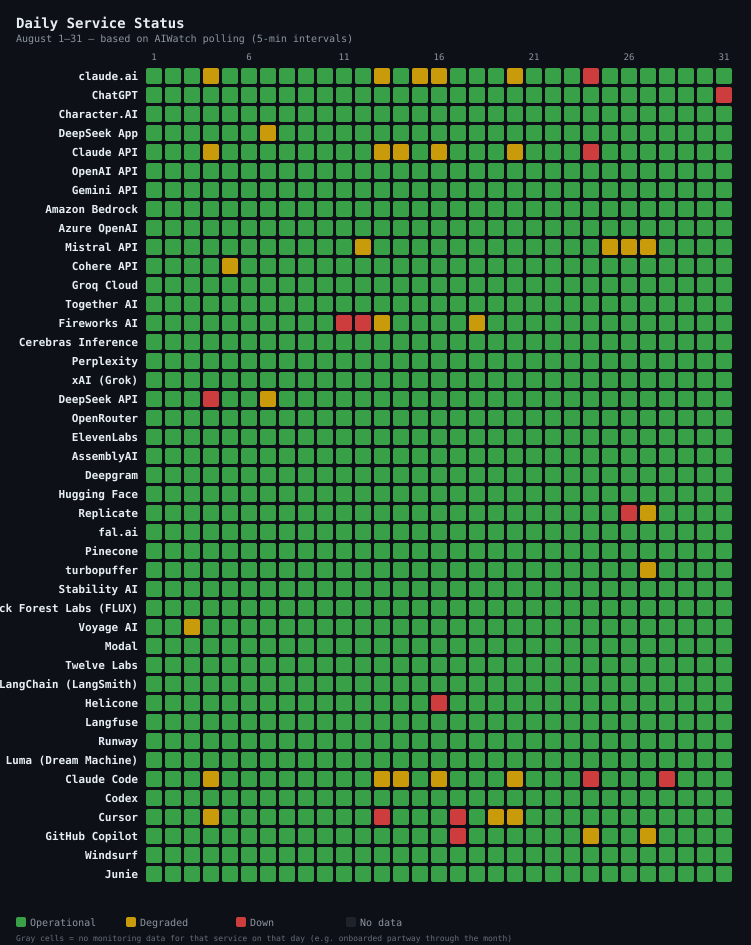
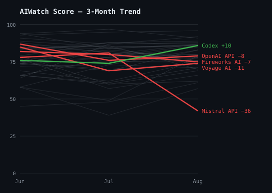
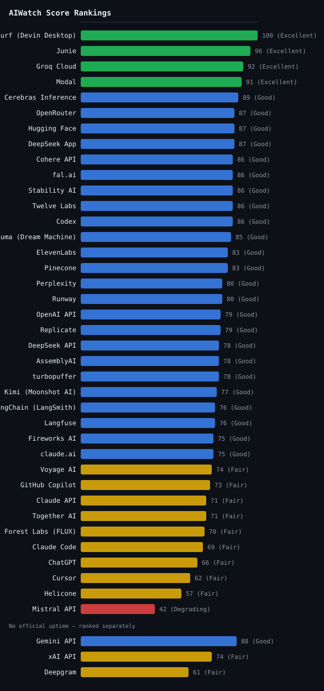

> **Source**: [ai-watch.dev](https://ai-watch.dev) — Real-time AI service status monitoring
> **Period**: August 1–31, 2026
> **Published**: September 2026
> **Services monitored**: 45 — 16 LLM APIs, 8 inference & infra, 6 coding agents, 5 AI apps, 3 voice & transcription, 3 observability, 2 video, 2 image

## Summary
> Every score in this report is the **AIWatch Score** (0–100): one number combining uptime, incident load, recovery speed and responsiveness. Higher is better. [How it's built →](#aiwatch-score--august-2026-reliability-rankings)

- **Most reliable**: Windsurf (Devin Desktop) takes the top Score for a third straight month, again at 100 on zero incidents and 100.00% uptime. Junie followed at 96 on a single 10m incident and Groq Cloud at 92 with none at all. Groq is the only one of the three whose latency AIWatch probes, and the 8 points it gave up are all on [Responsiveness](#responsiveness-inputs-score-component).
- **Riskiest this month**: Mistral API — down from 81 in July to 42, the month's only Degrading grade, on a single multi-day Embeddings API degradation. See [Notable Incidents](#notable-incidents).
- **Biggest improvement**: Replicate — from Degrading 49 to Good 79, the largest month-over-month rise of any ranked service. Its downtime fell 69h 33m → 6h 2m and its average recovery 13h 55m → 1h 31m as the H100 capacity shortfalls that filled July (59h 45m of that month's 69h 33m total downtime) cleared. Notable Movers below measures over three months, so a one-month rebound like this does not surface there.
- **Watch out**: this month's incident counts for Together AI, Helicone and Modal include reconstructed rows and are not comparable to their July rows — Helicone's rises 2 → 5 on a month that improved — all five are reconstructed, and its grade left the bottom two tiers. See [Key Insight](#key-insight).

<strong>Summary in Korean</strong>

<ul>
<li><strong>가장 안정적</strong>: Windsurf (Devin Desktop)가 석 달 연속 1위입니다. 이번에도 100점을 받았고, 장애 0건에 업타임 100.00%를 기록했습니다. Junie가 10분짜리 장애 1건으로 96점, Groq Cloud가 장애 없이 92점으로 뒤를 이었습니다. 셋 중 AIWatch가 응답 속도를 직접 측정하는 서비스는 Groq뿐이며, Groq는 8점을 모두 <a href="#responsiveness-inputs-score-component">응답성</a> 항목에서 잃었습니다.</li>
<li><strong>이번 달 가장 위험</strong>: Mistral API — 7월 81점에서 42점으로 떨어져 이달 유일하게 Degrading 등급을 받았습니다. 원인은 여러 날에 걸친 Embeddings API 장애 한 건입니다. <a href="#notable-incidents">Notable Incidents</a>에서 자세히 다룹니다.</li>
<li><strong>가장 크게 개선</strong>: Replicate — Degrading 49에서 Good 79로 올랐습니다. 순위에 오른 서비스 중 전월 대비 상승 폭이 가장 큽니다. 7월 다운타임 69시간 33분 가운데 대부분은 H100 용량 부족(59시간 45분)이었는데, 이 문제가 해소되면서 다운타임은 6시간 2분으로 줄었고 평균 복구 시간도 13시간 55분에서 1시간 31분으로 짧아졌습니다. 아래 Notable Movers는 최근 3개월간의 변화를 기준으로 하기 때문에, 이처럼 한 달 만의 반등은 그 표에 드러나지 않습니다.</li>
<li><strong>주의 필요</strong>: 이달 Together AI, Helicone, Modal의 장애 건수에는 재구성된 기록이 섞여 있어 7월 수치와 그대로 비교할 수 없습니다. Helicone은 장애가 2건에서 5건으로 늘었지만 5건 모두 재구성된 기록이고, 등급은 하위 두 등급에서 벗어나 오히려 나아졌습니다. 자세한 내용은 <a href="#key-insight">Key Insight</a>를 참고하세요.</li>
</ul>

---

## Recommendations

<table class="recommendations">
<thead>
<tr><th>Use Case</th><th>Recommended</th><th>Why</th></tr>
</thead>
<tbody>
<tr><td><strong>Production-critical</strong></td><td>Groq Cloud</td><td>92 on 100.00% uptime with no incidents at all, and the steadiest RTT of any service under 200 ms p50 (CV 0.34). Modal is the alternative at 91 — 12 incidents, but 3h 41m of downtime across the whole month and a 19m average recovery</td></tr>
<tr><td><strong>Low latency / cost</strong></td><td>Cohere API</td><td>86, 100.00% uptime, 130 ms p50, and its single incident lasted 58m. Gemini API is quicker still at 58 ms but publishes no uptime to score against, so it is ranked separately</td></tr>
<tr><td><strong>General purpose</strong></td><td>OpenRouter</td><td>87 on 99.99% uptime; two incidents averaging 1h 22m. July's pick, Cohere API, moves to the latency row this month</td></tr>
<tr><td><strong>Coding Agents</strong></td><td>Windsurf (Devin Desktop)</td><td>100 — zero incidents and 100.00% uptime, the top Score in the report for a third straight month. Junie is next at 96 on one 10m incident; the rest of the category sits at 86 and below</td></tr>
<tr><td><strong>Inference / infra</strong></td><td>Modal</td><td>91 — 12 incidents but only 3h 41m in total, longest 1h 26m. Its uptime is Platform-sourced, so read it beside the Official-source figures rather than against them</td></tr>
<tr><td><strong>Voice / audio</strong></td><td>ElevenLabs</td><td>83, six incidents averaging 3h 24m. AssemblyAI is close at 78 and recovers faster (39m avg); Deepgram publishes no official uptime and is ranked separately at 61</td></tr>
<tr><td><strong>Observability</strong></td><td>Langfuse</td><td>76 across eight incidents averaging 1h 39m. LangSmith ties on Score but takes 5h 51m to recover on average; Helicone is the category's lowest and the month's second-lowest at 57</td></tr>
<tr><td><strong>Video</strong></td><td>Luma (Dream Machine)</td><td>85 — zero incidents and 100.00% uptime, after one incident in July. Runway is close behind at 80 with four incidents averaging 57m</td></tr>
<tr><td><strong>Image</strong></td><td>Stability AI</td><td>86 on 100.00% uptime with no incidents recorded. Black Forest Labs (FLUX) fell to 70 on seven incidents, including a 17h 44m Flux 3 launch-traffic event</td></tr>
</tbody>
</table>

---

## Key Insight

August's worst grades thinned while its single longest entry got longer. 35 of 45 services recorded at least one incident, for a combined 929h 6m of downtime.

- **Pattern 1 — small moves in the grade tallies hid eleven grade changes.** July's one Unstable grade is gone, Degrading fell 2 → 1 and Fair held at 11 — but eleven services changed grade underneath those totals. Replicate, Helicone and Deepgram climbed out of the bottom two tiers while Mistral API fell into Degrading, now the only one. Of the other seven, four moved Fair → Good, two Good → Fair, and Groq Cloud rose to Excellent.
- **Pattern 2 — a count that reads flat because two different things are being counted.** From August, a Better Stack-sourced service whose feed stopped publishing monitor events has those days reconstructed from the page's daily availability record — one entry per component-day rather than one per event (see [How AIWatch Works → Incident counting](https://ai-watch.dev/methodology#incidents)). Together AI shows the effect at its most misleading: 65 → 64 rows looks like a quiet month, but 24 of the 64 are reconstructed, so its published-event count fell by nearly 40% while downtime went 29h 22m → 80h 31m and its longest single event went 1h 45m → 21h 49m. Helicone is the extreme case: every one of its August rows is reconstructed.
- **Pattern 3 — AIWatch's probes caught degradations the status pages weren't showing at the time.** Direct RTT probes flagged 508 RTT degradations this month, 469 of them not reflected on the providers' own status pages at the time of detection. Cerebras Inference is the sharpest case this month: 69 flagged, 68 not on its status page when flagged — the most of any service — while its incident record for August contains exactly one entry lasting 1m, and it ranks 5th overall at 89. Replicate follows at 65 (59 not on its status page), up from 28 in July, and xAI API at 43 (41); none of Hugging Face's 30 was on its status page when flagged. Per-service breakdown in [RTT Degradation Detection](#rtt-degradation-detection).

<strong>Key Insight in Korean</strong>

8월은 하위 두 등급(Unstable·Degrading) 서비스가 줄어든 달이지만, 가장 긴 단일 장애는 오히려 더 길어졌습니다. 45개 서비스 중 35개가 한 건 이상 장애를 겪었고, 다운타임 합계는 929시간 6분이었습니다.

<ul>
<li><strong>패턴 1 — 등급별 분포는 비슷해 보여도 11개 서비스의 등급이 바뀌었다</strong>: 7월에 하나 있던 Unstable은 없어졌고, Degrading은 2개에서 1개로 줄었으며, Fair는 11개 그대로입니다. Replicate, Helicone, Deepgram은 하위 두 등급에서 벗어났고, 대신 Mistral API가 Degrading으로 떨어져 이 등급의 유일한 서비스가 됐습니다. 나머지 7개 중 4개는 Fair에서 Good으로 올랐고, 2개는 Good에서 Fair로 내려갔으며, Groq Cloud는 Excellent로 올라섰습니다.</li>
<li><strong>패턴 2 — 집계 기준이 바뀌어 건수가 제자리처럼 보인다</strong>: 8월부터 Better Stack을 출처로 쓰는 서비스의 경우, 그 피드가 모니터 이벤트 게시를 멈춘 기간의 장애를 AIWatch가 상태 페이지의 일별 가용성 기록으로 재구성합니다 — 장애 하나당 1건이 아니라, 컴포넌트별로 다운타임이 있던 날을 하루 1건으로 셉니다(<a href="https://ai-watch.dev/methodology#incidents">측정 방법론</a> 참고). Together AI가 가장 오해하기 쉬운 사례입니다. 건수만 보면 65건에서 64건이라 조용한 달처럼 보이지만, 64건 중 24건이 재구성된 기록입니다. 제공사가 실제로 게시한 건수는 40% 가까이 줄었고, 다운타임은 29시간 22분에서 80시간 31분으로, 최장 장애는 1시간 45분에서 21시간 49분으로 늘었습니다. Helicone은 더 극단적인 경우로, 이달 장애 기록은 전부 재구성된 것입니다.</li>
<li><strong>패턴 3 — 직접 측정이 그 시점 상태 페이지에 없던 악화를 잡아냈다</strong>: 이달 RTT 직접 측정에서 악화 508건이 감지됐고, 그중 469건은 감지 시점에 제공사 공식 상태 페이지에 반영되지 않은 건(이하 미반영)이었습니다. 서비스별로는 Cerebras Inference가 가장 두드러집니다 — 69건 중 68건이 미반영으로 전 서비스 중 가장 많았습니다. 그런데도 8월 장애 기록에는 1분짜리 1건뿐이고, 종합 점수 89점으로 5위입니다. Replicate는 65건(59건 미반영)으로 뒤를 이었고 7월 28건보다 늘었습니다. xAI API는 43건(41건 미반영)이었고, Hugging Face는 30건 모두 미반영이었습니다. 서비스별 상세는 <a href="#rtt-degradation-detection">RTT Degradation Detection</a>에서 확인하세요.</li>
</ul>

---

## 3-Month Trend

AIWatch Score direction over the last 3 months (2026-06 → 2026-08). The lines plot each service's composite Score. **Notable Movers** below are NOT ranked by these lines — a service earns its place, and its order, by the largest change on *any* of three axes (Score, recovery time, or total downtime), which is why one with a small Score move can top the list on a downtime swing the chart cannot show.

### Notable Movers

*The 5 services whose **Score, recovery time (MTTR), or total downtime** changed most over the window (ranked by the largest single change, not a fixed threshold). The metric in **bold** is the change that ranked each service here; 🔺 / 🔻 mark whether that headline metric improved or worsened — so a service can show a small Score gain yet land here, and read 🔻, because its downtime regressed.*

- 🔻 **Fireworks AI** — Score 82 → 75 (−7) · MTTR 6m → 58m (+52m) · **downtime 1h 58m → 133h 48m (+131h 50m)**
- 🔻 **Voyage AI** — Score 85 → 74 (−11) · **MTTR 14m → 11h 20m (+11h 6m)** · downtime 14m → 11h 20m (+11h 6m)
- 🔺 **Codex** — Score 76 → 86 (+10) · **MTTR 11h 25m → 1h 1m (−10h 24m)** · downtime 91h 21m → 2h 2m (−89h 19m)
- 🔻 **Mistral API** — Score 78 → 42 (−36) · MTTR 1h 24m → 2h 11m (+47m) · **downtime 54h 55m → 138h 3m (+83h 8m)**
- 🔻 **OpenAI API** — Score 87 → 79 (−8) · **MTTR 40m → 8h 27m (+7h 47m)** · downtime 40m → 8h 27m (+7h 47m)

---

## AIWatch Score — August 2026 Reliability Rankings

**AIWatch Score (0–100)** is designed to answer one question:

> *"Which AI service is safest to rely on in production?"*

Combines four components — Uptime (40%), Incident affected days (25%), Recovery speed (15%), Responsiveness (20%, the p50 RTT + stability figures shown under [Responsiveness Inputs](#responsiveness-inputs-score-component)). The separate [API Response Time — Monthly p75](#api-response-time--monthly-p75) table is a network-latency reference that does *not* feed the Score; full breakdown of weights, fallbacks, and penalties is in [About This Report → AIWatch Score](#about-this-report). [How it's calculated →](https://ai-watch.dev/methodology#score)

*41 of 45 services ranked — 38 in the table below, 3 with no official uptime ranked separately under it. **Amazon Bedrock, Azure OpenAI, Grok are excluded from this ranking** — no official uptime metric and no direct latency probe, so AIWatch can measure only two of the Score's four components and withholds a Score rather than rank on insufficient signal. Incidents are still tracked (see [Incident Summary](#incident-summary)). **Character.AI is excluded from this ranking** — its incident feed is frozen, so the Score would rest on a partial month (see "Stale source" under [Incident Summary](#incident-summary)).*

| Rank | Service | Score | Grade | Uptime Source | Why |
|---|---|---|---|---|---|
| 1 | Windsurf (Devin Desktop) | 100 | Excellent | Official | Zero incidents, 100.00% uptime |
| 2 | Junie | 96 | Excellent | Official | 1 incident, 10m |
| 3 | Groq Cloud | 92 | Excellent | Official | Zero incidents, 100.00% uptime |
| 4 | Modal | 91 | Excellent | Platform | 12 incidents, fast recovery (avg 19m over 11) |
| 5 | Cerebras Inference | 89 | Good | Official | 1 incident, 1m |
| 6= | OpenRouter | 87 | Good | Official | 2 incidents, avg 1h 22m |
| 6= | Hugging Face | 87 | Good | Platform | 3 incidents, avg 2h 42m |
| 6= | DeepSeek App | 87 | Good | Official | 7 incidents, fast recovery (avg 26m) |
| 9= | Cohere API | 86 | Good | Official | 1 incident, 58m |
| 9= | fal.ai | 86 | Good | Official | Zero incidents, 100.00% uptime |
| 9= | Stability AI | 86 | Good | Official | Zero incidents, 100.00% uptime |
| 9= | Twelve Labs | 86 | Good | Official | 3 incidents |
| 9= | Codex | 86 | Good | Official | 2 incidents, avg 1h 1m |
| 14 | Luma (Dream Machine) | 85 | Good | Platform | Zero incidents, 100.00% uptime |
| 15= | ElevenLabs | 83 | Good | Official | 6 incidents, avg 3h 24m |
| 15= | Pinecone | 83 | Good | Official | 1 incident, 22m |
| 17= | Perplexity | 80 | Good | Official | 3 incidents, avg 1h 52m |
| 17= | Runway | 80 | Good | Official | 4 incidents, avg 57m |
| 19= | OpenAI API | 79 | Good | Official | 2 incidents, avg 8h 27m over 1 |
| 19= | Replicate | 79 | Good | Official | 4 incidents, avg 1h 31m |
| 21= | DeepSeek API | 78 | Good | Official | 14 incidents, avg 4h 44m |
| 21= | AssemblyAI | 78 | Good | Official | 6 incidents, avg 39m |
| 21= | turbopuffer | 78 | Good | Official | 1 incident, 1h 38m |
| 24 | Kimi (Moonshot AI) | 77 | Good | Official | 44 incidents, avg 1h 26m over 21 |
| 25= | LangChain (LangSmith) | 76 | Good | Official | 5 incidents, avg 5h 51m |
| 25= | Langfuse | 76 | Good | Official | 8 incidents, avg 1h 39m |
| 27= | Fireworks AI | 75 | Good | Official | 138 incidents, avg 58m |
| 27= | claude.ai | 75 | Good | Official | 21 incidents, avg 1h 28m |
| 29 | Voyage AI | 74 | Fair | Official | 1 incident, 11h 20m |
| 30 | GitHub Copilot | 73 | Fair | Official | 10 incidents, avg 1h 51m |
| 31= | Claude API | 71 | Fair | Official | 18 incidents, avg 1h 49m |
| 31= | Together AI | 71 | Fair | Platform | 64 incidents, avg 1h 21m over 39 |
| 33 | Black Forest Labs (FLUX) | 70 | Fair | Official | 7 incidents, avg 5h 2m |
| 34 | Claude Code | 69 | Fair | Official | 21 incidents, avg 1h 38m |
| 35 | ChatGPT | 66 | Fair | Official | 17 incidents, avg 3h 42m |
| 36 | Cursor | 62 | Fair | Official | 27 incidents, avg 2h 20m |
| 37 | Helicone | 57 | Fair | Platform | 5 incidents |
| 38 | Mistral API | 42 | Degrading | Official | 63 incidents, avg 2h 11m |

**No Official Uptime**

*Scored on Incidents + Recovery + Responsiveness only — no official uptime metric, so these Scores are not on the same scale as a Score built from a measured uptime. Ranked separately rather than merged into one shared rank.*

| Rank | Service | Score | Grade | Why |
|---|---|---|---|---|
| 1 | Gemini API | 88 | Good | Zero incidents |
| 2 | xAI API | 74 | Fair | 1 incident, 1h 31m |
| 3 | Deepgram | 61 | Fair | 5 incidents, avg 1h 1m |

**Grade scale**: Excellent (90+) · Good (75+) · Fair (55+) · Degrading (40+) · Unstable (<40)

<!-- Generate with: node scripts/generate-charts.js 2026-08/index.md -->

> **Uptime Source column**: **Official** (AIWatch computes the figure from the incident/outage records the provider publishes) · **Platform** (a different computation, built from the status page platform's own monitors — Better Stack — rather than incidents the provider declared; not on the same basis as Official) · **No uptime** (no uptime figure resolved for this row — usually because the status page publishes none, occasionally a figure AIWatch withheld; it may still publish incident records; the Score is built from the remaining signals). A service tracked for less than the full month is excluded from the ranking, not labelled — see the note above the ranking. Full definitions: [About This Report → Uptime Source](#about-this-report).
> <!-- Keep this caption short — full definitions live in the About This Report methodology section to avoid duplicating them here. -->

---

## 30-Day Uptime

Uptime computed by AIWatch — never a copy of the percentage a provider displays on its own page (those use different periods and different definitions of downtime). The exact method differs by source; see [About This Report → Uptime Source](#about-this-report) for what Official vs Platform means. Full method: [ai-watch.dev/methodology](https://ai-watch.dev/methodology#uptime). The narrative-driven sections below (Incident Summary / Notable Incidents / Observations) cover what these numbers mean for vendor selection.

<table class="uptime-cols">
<thead><tr><th>Service</th><th>Uptime</th></tr></thead>
<tbody>
<tr><td>Cohere API</td><td>100.00%</td></tr>
<tr><td>Groq Cloud</td><td>100.00%</td></tr>
<tr><td>Cerebras Inference</td><td>100.00%</td></tr>
<tr><td>fal.ai</td><td>100.00%</td></tr>
<tr><td>Stability AI</td><td>100.00%</td></tr>
<tr><td>Black Forest Labs (FLUX)</td><td>100.00%</td></tr>
<tr><td>LangChain (LangSmith)</td><td>100.00%</td></tr>
<tr><td>Runway</td><td>100.00%</td></tr>
<tr><td>Luma (Dream Machine)</td><td>100.00%</td></tr>
<tr><td>Windsurf (Devin Desktop)</td><td>100.00%</td></tr>
<tr><td>Junie</td><td>100.00%</td></tr>
<tr><td>OpenRouter</td><td>99.99%</td></tr>
<tr><td>AssemblyAI</td><td>99.99%</td></tr>
<tr><td>Pinecone</td><td>99.99%</td></tr>
<tr><td>Twelve Labs</td><td>99.99%</td></tr>
<tr><td>Codex</td><td>99.98%</td></tr>
<tr><td>Modal</td><td>99.95%</td></tr>
<tr><td>DeepSeek App</td><td>99.95%</td></tr>
<tr><td>Kimi (Moonshot AI)</td><td>99.94%</td></tr>
<tr><td>Langfuse</td><td>99.94%</td></tr>
<tr><td>OpenAI API</td><td>99.90%</td></tr>
<tr><td>turbopuffer</td><td>99.87%</td></tr>
<tr><td>ElevenLabs</td><td>99.86%</td></tr>
<tr><td>Hugging Face</td><td>99.85%</td></tr>
<tr><td>Replicate</td><td>99.85%</td></tr>
<tr><td>Voyage AI</td><td>99.83%</td></tr>
<tr><td>Perplexity</td><td>99.81%</td></tr>
<tr><td>DeepSeek API</td><td>99.80%</td></tr>
<tr><td>Fireworks AI</td><td>99.77%</td></tr>
<tr><td>Claude API</td><td>99.71%</td></tr>
<tr><td>claude.ai</td><td>99.58%</td></tr>
<tr><td>Claude Code</td><td>99.58%</td></tr>
<tr><td>Cursor</td><td>99.55%</td></tr>
<tr><td>Together AI</td><td>99.47%</td></tr>
<tr><td>GitHub Copilot</td><td>99.06%</td></tr>
<tr><td>ChatGPT</td><td>98.62%</td></tr>
<tr><td>Helicone</td><td>96.68%</td></tr>
<tr><td>Mistral API</td><td>94.90%</td></tr>
</tbody>
</table>

*Amazon Bedrock, Azure OpenAI, Character.AI, Deepgram, Gemini API, Grok, and xAI API do not publish a comparable uptime percentage on their status pages — they're excluded from this table for that reason. (xAI's [status page](https://status.x.ai) does expose per-endpoint live success rates measured since its monitoring system's last restart, but those numbers are not directly comparable to the figures above.)*

---

## Component Reliability

> AIWatch surfaces a **per-component uptime breakdown** — each multi-surface service's weakest component over the days AIWatch could read its status page, the surface most likely to be your bottleneck that a single service-level uptime number hides. It is a different measurement from the 30-Day Uptime table and **is not a Score input**; see [About This Report → Component Reliability](#about-this-report).

| Service | Weakest Component | Uptime | Components |
|---|---|---|---|
| Mistral API | Conversations API | 89.86% | 12 |
| Cursor | Cloud Agents | 91.70% | 4 |
| ChatGPT | Conversations | 93.64% | 15 |
| ElevenLabs | ElevenCreative | 96.87% | 7 |
| Fireworks AI | Kimi K3 US | 97.37% | 21 |
| LangChain (LangSmith) | LangSmith Fleet | 98.75% | 10 |
| GitHub Copilot | Copilot AI Model Providers | 98.78% | 2 |
| Black Forest Labs (FLUX) | API (api.bfl.ai) | 99.03% | 13 |
| OpenAI API | Responses | 99.31% | 12 |
| Runway | Backend | 99.33% | 3 |
| AssemblyAI | Asynchronous API | 99.60% | 6 |
| Voyage AI | API | 99.69% | 2 |
| Twelve Labs | Video Indexing Task API - Marengo3.0 | 99.70% | 9 |
| Replicate | A100 Hardware | 99.71% | 12 |
| Perplexity | Computer | 99.72% | 3 |
| Langfuse | Ingestion API | 99.79% | 3 |

---

## Responsiveness Inputs (Score Component)

> **This table feeds the Score.** These are the two figures the **Responsiveness** component (20% of
> the AIWatch Score) was computed from this month: each service's median (p50) probe RTT, and the
> combined coefficient of variation (CV) of that RTT — day-to-day movement plus the p95/p50 spread.
> **Lower is better for both**: a fast service still scores poorly here if it is erratic.
>
> Do not confuse it with [API Response Time — Monthly p75](#api-response-time--monthly-p75) further
> down. That table probes the **same endpoints** but its p75 figure is **not part of the Score** —
> it is a network-speed reference only. This one is scored; that one is not.
> [How each figure becomes a sub-score →](https://ai-watch.dev/methodology#score)

| Service | p50 RTT | RTT variation (CV) |
|---|---|---|
| Gemini API | 58 ms | 0.44 |
| Claude API | 109 ms | 0.54 |
| Claude Code | 109 ms | 0.54 |
| Fireworks AI | 116 ms | 0.49 |
| Mistral API | 122 ms | 0.35 |
| Codex | 125 ms | 0.62 |
| OpenAI API | 125 ms | 0.62 |
| Cohere API | 130 ms | 0.47 |
| Groq Cloud | 135 ms | 0.34 |
| Together AI | 185 ms | 0.54 |
| Cerebras Inference | 190 ms | 0.48 |
| Perplexity | 222 ms | 0.53 |
| Hugging Face | 237 ms | 0.41 |
| Replicate | 245 ms | 0.76 |
| OpenRouter | 288 ms | 0.43 |
| ElevenLabs | 317 ms | 0.50 |
| xAI API | 325 ms | 0.39 |
| Stability AI | 444 ms | 0.59 |
| Kimi (Moonshot AI) | 457 ms | 0.38 |
| DeepSeek API | 523 ms | 0.17 |
| fal.ai | 609 ms | 0.44 |
| Voyage AI | 613 ms | 0.32 |
| AssemblyAI | 638 ms | 0.54 |
| Pinecone | 686 ms | 0.35 |
| Black Forest Labs (FLUX) | 693 ms | 0.43 |
| LangChain (LangSmith) | 766 ms | 0.35 |
| Runway | 885 ms | 0.42 |
| Twelve Labs | 892 ms | 0.38 |
| Luma (Dream Machine) | 929 ms | 0.41 |
| turbopuffer | 943 ms | 0.38 |
| Langfuse | 1136 ms | 0.31 |
| Cursor | 1171 ms | 0.41 |
| Helicone | 1252 ms | 0.34 |
| Deepgram | 1526 ms | 0.73 |

---

## API Response Time — Monthly p75

These p75 figures are a network-latency reference: direct API-endpoint round-trip time, probed from the Cloudflare Workers edge every 5 minutes — not inference latency. Lower is better. **This table does not feed the Score** — the Score's Responsiveness component reads the *median* (p50) RTT and its stability instead, shown above under [Responsiveness Inputs](#responsiveness-inputs-score-component). So this table ranks *which service is fastest on the network*, while [AIWatch Score](#aiwatch-score--august-2026-reliability-rankings) ranks *which is safest to rely on*. A service AIWatch does not probe has no row here; that alone does not drop it from the Score ranking.

<!-- Data source: curl https://api.ai-watch.dev/api/probe/history?days=30 -->
<!-- 32 probe targets: 30 API services (incl. twelvelabs) + cursor (coding agent) + characterai (app, detail-card only, aiwatch#921). A service AIWatch does not probe simply has no row here (13 of 41 in June 2026, ten of them ranked); that alone does not affect its Score. -->
<!-- p95 + Spikes are present in probe:daily:{date} (CLAUDE.md KV schema) but not yet
     surfaced by /api/report. vs-Last-Month additionally requires reading the previous
     month's archive:monthly:* and computing deltas. Re-add the columns once the
     report API carries them — file a tracking issue if not already open. -->

| Rank | Service | p75 (ms) |
|---|---|---|
| 1 | Gemini API | 64 |
| 2 | Claude API | 127 |
| 3 | Mistral API | 132 |
| 4 | Fireworks AI | 140 |
| 5= | OpenAI API | 150 |
| 5= | Cohere API | 150 |
| 7 | Groq Cloud | 152 |
| 8 | Together AI | 216 |
| 9 | Cerebras Inference | 224 |
| 10 | Perplexity | 261 |
| 11 | Hugging Face | 276 |
| 12 | Replicate | 326 |
| 13 | OpenRouter | 336 |
| 14 | xAI API | 376 |
| 15 | ElevenLabs | 379 |
| 16 | Kimi (Moonshot AI) | 511 |
| 17 | Stability AI | 541 |
| 18 | DeepSeek API | 556 |
| 19 | Voyage AI | 699 |
| 20 | fal.ai | 715 |
| 21 | Pinecone | 787 |
| 22 | AssemblyAI | 804 |
| 23 | Black Forest Labs (FLUX) | 846 |
| 24 | LangChain (LangSmith) | 887 |
| 25 | Runway | 1022 |
| 26 | Twelve Labs | 1031 |
| 27 | Luma (Dream Machine) | 1077 |
| 28 | turbopuffer | 1081 |
| 29 | Character.AI | 1206 |
| 30 | Langfuse | 1280 |
| 31 | Cursor | 1359 |
| 32 | Helicone | 1449 |
| 33 | Deepgram | 2059 |

---

## Detection & RTT Degradation

### Detection Latency

AIWatch independently detects incidents and alerts within **~5 minutes** — the probe/poll cadence, the upper bound on how long an issue can go unnoticed by our monitoring. This is independent, low-latency awareness across all monitored services, not a timing comparison against any provider's status page.

### RTT Degradation Detection

AIWatch's direct RTT probes flagged **508** RTT degradations this month, of which **469** were **not reflected on the providers' official status pages at the time of detection**.

| Service | RTT Degradations | Not on Status Page |
|---|---|---|
| Cerebras Inference | 69 | 68 |
| Replicate | 65 | 59 |
| Fireworks AI | 43 | 37 |
| xAI API | 43 | 41 |
| Claude API | 40 | 26 |
| Perplexity | 33 | 32 |
| Hugging Face | 30 | 30 |
| OpenAI API | 24 | 21 |
| Luma (Dream Machine) | 23 | 22 |
| Cohere API | 19 | 19 |
| Mistral API | 18 | 17 |
| Deepgram | 14 | 14 |
| Runway | 13 | 13 |
| ElevenLabs | 12 | 12 |
| OpenRouter | 12 | 12 |
| Cursor | 11 | 8 |
| Gemini API | 7 | 7 |
| turbopuffer | 6 | 6 |
| Stability AI | 5 | 4 |
| Character.AI | 5 | 5 |
| fal.ai | 4 | 4 |
| Together AI | 3 | 3 |
| Twelve Labs | 3 | 3 |
| Helicone | 3 | 3 |
| AssemblyAI | 3 | 3 |

> **RTT degradation detection** is AIWatch's differentiator: synthetic probes measure real latency degradation that official status pages often omit.

---

## AI Prediction Accuracy

When an incident opens, AIWatch's AI publishes an estimated recovery window. **160** of those estimates could be scored against the incident's actual recovery in August. Median absolute error: **46m**.

| Metric | Value |
|---|---|
| Estimates scored | 160 |
| Median absolute error | 46m |
| Recovered by the estimated time | 120 (75%) |
| Took longer than the estimate | 40 (25%) |

> **How this is scored**: the estimate is the upper bound of the recovery window AIWatch published for that incident, and the error is the gap between that bound and the actual recovery. One provider incident affecting several services is scored once. Not every incident carries an estimate, so this is a sample of the month's incidents — it is not comparable to the incident counts elsewhere in this report.

---

## Incident Summary

> **Reading the count column**: The count is how many incidents a provider published for that service. Granularity differs — Anthropic posts a separate incident per model ("Elevated errors for Claude Opus 4.7"), and Together AI's status page tracks each model as its own component — so both show higher totals than providers that post one incident per event. Higher count ≠ lower reliability; adjust for granularity before comparing across providers. A Platform-source service can also carry **reconstructed** entries, counted one per (component, downtime day) instead of one per event. They count toward Inc and Downtime, but carry no recovery time, so they are left out of the Longest and Avg Resolution columns. A month mixing the two is not continuous with earlier months. Where Avg Resolution reads "… over N", the average is taken over N of the service's entries, not all of them. Full rules: [How AIWatch Works → Incident counting](https://ai-watch.dev/methodology#incidents).
>
> **Downtime** is a sum of record durations, not the time a service was impaired: where a provider's records for one event overlap, those minutes can be counted more than once.
>
> **OpenAI API** — one of its two entries, "Elevated latency in the Responses API", began 2026-08-31 22:27 UTC and was still open when the month closed; the provider resolved it 2026-09-01 19:05 UTC. It is counted here, but its duration is in neither the downtime nor the recovery figures, which is why its average reads "over 1".
>
> **Twelve Labs** — its three entries carry a title AIWatch registers as an automated-monitor title, and entries with a registered title are left out of downtime, recovery and the Score's incident and recovery components, which is why the row shows no downtime. Kimi (Moonshot AI)'s re-published entries this month carry a title that is not registered, so they are counted, with repeats of one event merged — the two rows are not on the same basis.

<table>
<thead>
<tr><th>Service</th><th>Inc</th><th>Downtime (longest)</th><th class="hide-mobile">Longest</th><th class="hide-mobile">Avg Resolution</th></tr>
</thead>
<tbody>
<tr><td>Fireworks AI</td><td>138</td><td>133h 48m (46h 36m)</td><td class="hide-mobile">46h 36m</td><td class="hide-mobile">58m</td></tr>
<tr><td>Together AI</td><td>64</td><td>80h 31m (21h 49m)</td><td class="hide-mobile">21h 49m</td><td class="hide-mobile">1h 21m over 39</td></tr>
<tr><td>Mistral API</td><td>63</td><td>138h 3m (122h 14m)</td><td class="hide-mobile">122h 14m</td><td class="hide-mobile">2h 11m</td></tr>
<tr><td>Kimi (Moonshot AI)</td><td>44</td><td>30h 8m (9h 26m)</td><td class="hide-mobile">9h 26m</td><td class="hide-mobile">1h 26m over 21</td></tr>
<tr><td>Cursor</td><td>27</td><td>63h 13m (6h 57m)</td><td class="hide-mobile">6h 57m</td><td class="hide-mobile">2h 20m</td></tr>
<tr><td>claude.ai</td><td>21</td><td>30h 49m (7h 9m)</td><td class="hide-mobile">7h 9m</td><td class="hide-mobile">1h 28m</td></tr>
<tr><td>Claude Code</td><td>21</td><td>34h 27m (7h 9m)</td><td class="hide-mobile">7h 9m</td><td class="hide-mobile">1h 38m</td></tr>
<tr><td>Claude API</td><td>18</td><td>32h 38m (7h 9m)</td><td class="hide-mobile">7h 9m</td><td class="hide-mobile">1h 49m</td></tr>
<tr><td>ChatGPT</td><td>17</td><td>62h 46m (12h 44m)</td><td class="hide-mobile">12h 44m</td><td class="hide-mobile">3h 42m</td></tr>
<tr><td>DeepSeek API</td><td>14</td><td>66h 9m (60h 33m)</td><td class="hide-mobile">60h 33m</td><td class="hide-mobile">4h 44m</td></tr>
<tr><td>Modal</td><td>12</td><td>3h 41m (1h 26m)</td><td class="hide-mobile">1h 26m</td><td class="hide-mobile">19m over 11</td></tr>
<tr><td>GitHub Copilot</td><td>10</td><td>18h 33m (7h 36m)</td><td class="hide-mobile">7h 36m</td><td class="hide-mobile">1h 51m</td></tr>
<tr><td>Langfuse</td><td>8</td><td>13h 11m (3h 27m)</td><td class="hide-mobile">3h 27m</td><td class="hide-mobile">1h 39m</td></tr>
<tr><td>Black Forest Labs (FLUX)</td><td>7</td><td>35h 16m (17h 44m)</td><td class="hide-mobile">17h 44m</td><td class="hide-mobile">5h 2m</td></tr>
<tr><td>DeepSeek App</td><td>7</td><td>3h 3m (1h 19m)</td><td class="hide-mobile">1h 19m</td><td class="hide-mobile">26m</td></tr>
<tr><td>ElevenLabs</td><td>6</td><td>20h 26m (9h 54m)</td><td class="hide-mobile">9h 54m</td><td class="hide-mobile">3h 24m</td></tr>
<tr><td>AssemblyAI</td><td>6</td><td>3h 53m (1h 48m)</td><td class="hide-mobile">1h 48m</td><td class="hide-mobile">39m</td></tr>
<tr><td>Deepgram</td><td>5</td><td>5h 4m (3h 40m)</td><td class="hide-mobile">3h 40m</td><td class="hide-mobile">1h 1m</td></tr>
<tr><td>LangChain (LangSmith)</td><td>5</td><td>29h 17m (16h 38m)</td><td class="hide-mobile">16h 38m</td><td class="hide-mobile">5h 51m</td></tr>
<tr><td>Helicone</td><td>5</td><td>71h 26m</td><td class="hide-mobile">—</td><td class="hide-mobile">—</td></tr>
<tr><td>Replicate</td><td>4</td><td>6h 2m (3h 8m)</td><td class="hide-mobile">3h 8m</td><td class="hide-mobile">1h 31m</td></tr>
<tr><td>Runway</td><td>4</td><td>3h 47m (1h 24m)</td><td class="hide-mobile">1h 24m</td><td class="hide-mobile">57m</td></tr>
<tr><td>Perplexity</td><td>3</td><td>5h 35m (3h 33m)</td><td class="hide-mobile">3h 33m</td><td class="hide-mobile">1h 52m</td></tr>
<tr><td>Hugging Face</td><td>3</td><td>8h 7m (8h)</td><td class="hide-mobile">8h</td><td class="hide-mobile">2h 42m</td></tr>
<tr><td>Twelve Labs</td><td>3</td><td>—</td><td class="hide-mobile">—</td><td class="hide-mobile">—</td></tr>
<tr><td>OpenAI API</td><td>2</td><td>8h 27m (8h 27m)</td><td class="hide-mobile">8h 27m</td><td class="hide-mobile">8h 27m over 1</td></tr>
<tr><td>OpenRouter</td><td>2</td><td>2h 44m (2h 43m)</td><td class="hide-mobile">2h 43m</td><td class="hide-mobile">1h 22m</td></tr>
<tr><td>Codex</td><td>2</td><td>2h 2m (1h 8m)</td><td class="hide-mobile">1h 8m</td><td class="hide-mobile">1h 1m</td></tr>
<tr><td>Cohere API</td><td>1</td><td>58m (58m)</td><td class="hide-mobile">58m</td><td class="hide-mobile">58m</td></tr>
<tr><td>Cerebras Inference</td><td>1</td><td>1m (1m)</td><td class="hide-mobile">1m</td><td class="hide-mobile">1m</td></tr>
<tr><td>xAI API</td><td>1</td><td>1h 31m (1h 31m)</td><td class="hide-mobile">1h 31m</td><td class="hide-mobile">1h 31m</td></tr>
<tr><td>Pinecone</td><td>1</td><td>22m (22m)</td><td class="hide-mobile">22m</td><td class="hide-mobile">22m</td></tr>
<tr><td>turbopuffer</td><td>1</td><td>1h 38m (1h 38m)</td><td class="hide-mobile">1h 38m</td><td class="hide-mobile">1h 38m</td></tr>
<tr><td>Voyage AI</td><td>1</td><td>11h 20m (11h 20m)</td><td class="hide-mobile">11h 20m</td><td class="hide-mobile">11h 20m</td></tr>
<tr><td>Junie</td><td>1</td><td>10m (10m)</td><td class="hide-mobile">10m</td><td class="hide-mobile">10m</td></tr>
</tbody>
</table>

**Zero incidents (9 services):** Gemini API, Amazon Bedrock, Azure OpenAI, Groq Cloud, fal.ai, Stability AI, Luma (Dream Machine), Grok, Windsurf (Devin Desktop) — confirmed via their status-page incident feeds.

**Stale source (1 service):** Character.AI — AIWatch can no longer read its incident feed, which is frozen at the last reachable fetch. The incident count covers only the window up to that cutoff, not the full month, so treat it as a floor rather than a verified picture. A frozen feed also removes the service from the Score ranking.

---

## Notable Incidents

### 1. Embeddings API degraded for five days
**Affected**: Mistral API — Embeddings API
**Duration**: 122h 14m

The month's longest single entry and 88% of Mistral's 138h 3m total downtime. The provider held the Embeddings API in a *degraded* state, filed at minor impact, while the serving path stayed reachable — the same shape as July's 120h 10m fine-tuning degradation, and the second consecutive month in which one multi-day auxiliary-API degradation accounts for most of Mistral's recorded hours. The two months differ on the computed uptime rather than on the ledger: July's 28 entries were all minor and August's 63 are 62 minor and one major, while the uptime figure went 99.92% → 94.90%.

### 2. DeepSeek API degraded performance
**Affected**: DeepSeek API
**Duration**: 60h 33m

Filed by the provider in Chinese as *"DeepSeek API 性能下降"*, at minor impact, and running two and a half days — 92% of DeepSeek's 66h 9m total downtime for the month. Despite the length the service finished Good at 78.

### 3. Outage in BC Clusters
**Affected**: Fireworks AI — BC Clusters
**Duration**: 46h 36m

The longer of Fireworks' two major-impact entries this month, and over a third of its 133h 48m total downtime. It sits oddly against the rest of its ledger: 138 incidents is the month's highest count by a wide margin, up from 34 in July, yet the other 137 average under an hour and the service still finished Good at 75.

### 4. Inkling Small — down
**Affected**: Together AI — Inkling Small
**Duration**: 21h 49m

Together's longest single event, against a longest of 1h 45m in July. It is a published feed entry rather than a reconstructed day, so it is directly comparable to July's figure.

### 5. Flux 3 launch traffic
**Affected**: Black Forest Labs (FLUX)
**Duration**: 17h 44m

A major-impact window the provider filed as *"Flux 3 Launch Traffic"*, half of FLUX's 35h 16m total downtime across seven incidents, with a second 7h 42m entry for a downed cluster affecting FLUX.2 [flex]. FLUX finished at 70, the lower of the two image services this month.

---

## Observations

**This month's** per-service resilience deltas — what each service's data *newly* argues for. The evergreen, month-to-month-stable patterns (per-model monitoring, Voice-Agent isolation, key rotation, retry-timeout tuning, failover mechanics) live once in **[Resilience Patterns](../resilience/)** — link there, don't re-explain them. Each bullet ties THIS month's failure mode to the relevant pattern and adds only what's new.

- **If you build on Mistral's auxiliary APIs (Embeddings, fine-tuning), plan for a degraded window that lasts days, not hours.** Two months running, one of them stayed *degraded* for about five days while Mistral's average recovery read 4h 37m (July) and 2h 11m (August) — see [Notable Incidents](#notable-incidents); set the switch point per [Resilience → Retry / timeout tuning](../resilience/#retry--timeout-tuning-general).
- **Drive no alerting or vendor scorecard off "incidents this month vs last" for Together AI, Helicone or Modal this month** — their counts include reconstructed rows. Compare downtime and uptime instead, until their feeds resume publishing events — see [Key Insight](#key-insight) for what changed.
- **If latency is part of your SLO rather than just availability, measure it yourself — a provider is not obliged to file it.** Cerebras Inference is this month's sharpest illustration (see [Key Insight](#key-insight)): a status-page-only view of it in August would have shown a nearly perfect month.

---

## Security Alerts

> **Note:** Security alerts captured during the month from OSV.dev (AI SDK package vulnerabilities), Hacker News (security posts mentioning monitored services), and NVD (first-party product CVEs). Section omitted for months without detections.

**Total alerts:** 9

**By source**

| Source | Count |
|---|---|
| NVD | 5 |
| OSV.dev | 4 |

**By severity**

| Critical | High | Medium | Low |
| --- | --- | --- | --- |
| 0 | 4 | 5 | 0 |

**Most affected services**

| Service | Count |
|---|---|
| Claude Code | 3 |
| LangChain | 2 |
| Hugging Face | 2 |
| Gemini | 1 |
| OpenAI Codex | 1 |

### Top Findings

#### 1. [Transformers Regular Expression Denial of Service (ReDoS) vulnerability](https://nvd.nist.gov/vuln/detail/CVE-2024-12720) · `medium`
- **Source:** OSV.dev
- **Affected:** Hugging Face
- **Detected:** 2026-08-13

#### 2. [Transformers Regular Expression Denial of Service (ReDoS) vulnerability](https://nvd.nist.gov/vuln/detail/CVE-2025-1194) · `medium`
- **Source:** OSV.dev
- **Affected:** Hugging Face
- **Detected:** 2026-08-13

#### 3. [LangChain: Path traversal and sandbox escape in LangChain file-search middleware and loaders](https://github.com/langchain-ai/langchain/security/advisories/GHSA-gr75-jv2w-4656) · `medium`
- **Source:** OSV.dev
- **Affected:** LangChain
- **Detected:** 2026-08-07

---

## About This Report

* **Data Sources:** Real-time data is aggregated from official status pages via multiple frameworks, including Atlassian Statuspage, incident.io, Google Cloud Status, Better Stack, Instatus, OnlineOrNot, and RSS feeds (Source: [ai-watch.dev](https://ai-watch.dev)).
* **Monitoring Frequency:** All 45 services are polled every **5 minutes** via Cloudflare Workers. Those with a probeable API endpoint also get a direct response-time (RTT) health-check at the same interval.
* **AIWatch Score (0–100):** Calculated from four components — **Uptime** (40%), **Incident affected days** (25%), **Recovery speed** (15%), and **Responsiveness** (20%). A service with no probe endpoint is scored on the remaining components rescaled to 100, with **no penalty**. A service that has a probe but fewer than 7 days of samples gets that same rescale **plus a 5% penalty** until its probe data matures. Full methodology: [ai-watch.dev/methodology#score](https://ai-watch.dev/methodology#score)
* **Uptime Source:** *Official* = AIWatch computes an uptime figure from the incident and outage records the provider publishes on its status page. *Platform* = a different computation built from the status-page platform's own monitors (Better Stack) rather than incidents the provider declared. *No uptime* = no uptime figure resolved for this row — usually because the status page publishes none, occasionally a figure AIWatch computed but withheld; a service in this tier may still publish incident records, which is what drives the MTTR/downtime figures elsewhere in this report. The exact window and weighting behind each figure varies by status-page platform; full source-by-source method: [ai-watch.dev/methodology](https://ai-watch.dev/methodology#uptime). The Score then drops its 40-point Uptime component and is rescaled over the remaining signals (incidents, recovery, responsiveness), so the result is **not** on the same scale as a Score built from a measured uptime. Where this report knows which services those are, they are **ranked in their own table**, never merged into a single rank sequence. A service with **neither** uptime **nor** a probe has too little signal, so its Score is withheld and it is not ranked at all. The note above the Score table names whichever services that is — the membership is read from the data, not fixed here. A service AIWatch tracked for only part of the month is **excluded from the ranking** rather than labelled — its partial-month Score would rest on insufficient coverage. The label describes the Uptime input, not the Score's rigour.
* **Uptime Metrics:** Every percentage in the 30-Day Uptime table is computed by AIWatch from the outage records the status page publishes — never copied from the figure a provider displays on its own page, and computed by a different method depending on the Uptime Source (see *Uptime Source* above). Its **scope** depends on what the page exposes: a single component for some services, a worst-of across a component set for others, an upstream platform monitor for others still. A service with no resolved uptime figure (see *No uptime* under *Uptime Source* above) doesn't get a row in this table at all. A service's **Incident Summary** count and total downtime are not limited to that same scope, though — an incident on a component outside it still adds to those totals without moving the uptime percentage, which is why the two can diverge sharply for one long incident on a narrower surface.
* **Component Reliability:** A **different measurement** from every other uptime figure in this report — do not compare them. AIWatch polls each service's status page every 5 minutes and, per component, counts a poll as good **only** when that component reads `operational`; `degraded` and `partial outage` both count against it, with no weighting by incident severity (severity is recorded per *service*, not per component). The percentage is that ratio of good polls, over the days AIWatch could read the page. Only components AIWatch surfaces for that service are counted — billing, docs and compliance surfaces are excluded — and a service needs at least two of them to appear at all. The table lists only each service's **weakest** component, and only when it fell below 99.9%: it is a list of where to look, not a ranking of everything.
* **Timezone Standard:** All timestamps are recorded in **UTC**.

**Next report**: September 2026

---

- **Live status** — [ai-watch.dev](https://ai-watch.dev)
- **Slack/Discord alerts** — [ai-watch.dev/#settings](https://ai-watch.dev/#settings)
- **Score methodology** — [ai-watch.dev/methodology#score](https://ai-watch.dev/methodology#score)
- **All reports** — [ai-watch.dev/reports](https://ai-watch.dev/reports/)

---

- *Have feedback or spotted an error?* [Open an issue](https://github.com/bentleypark/aiwatch/issues/new)
- *Want us to track a service?* [Request here](https://github.com/bentleypark/aiwatch/issues/new?template=service_request.md)
