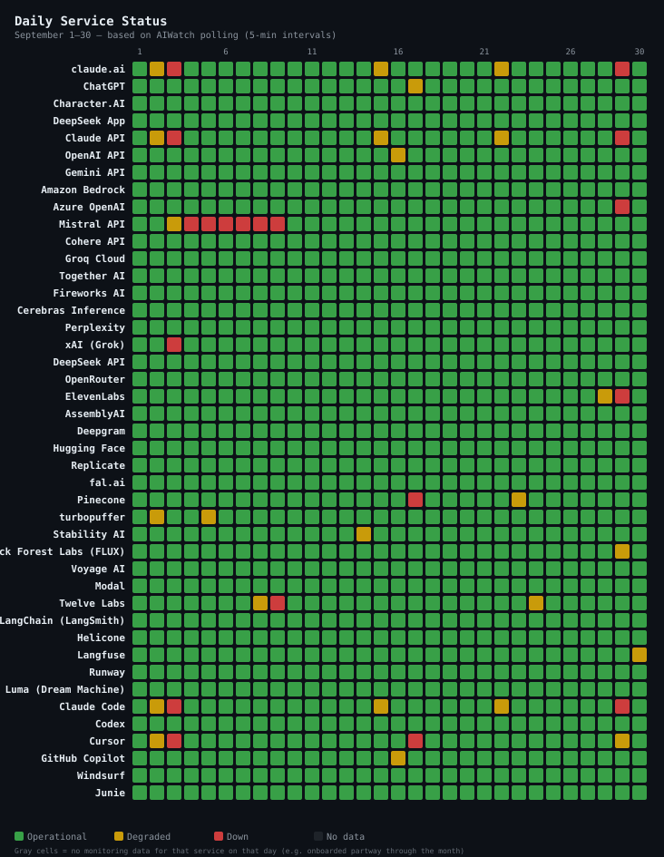
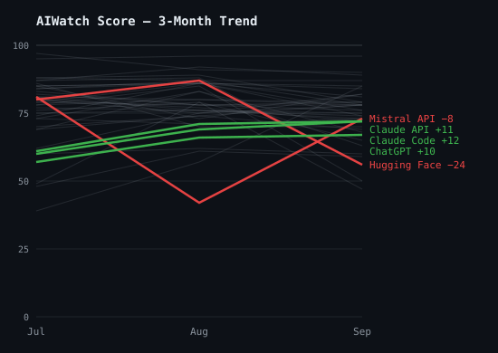
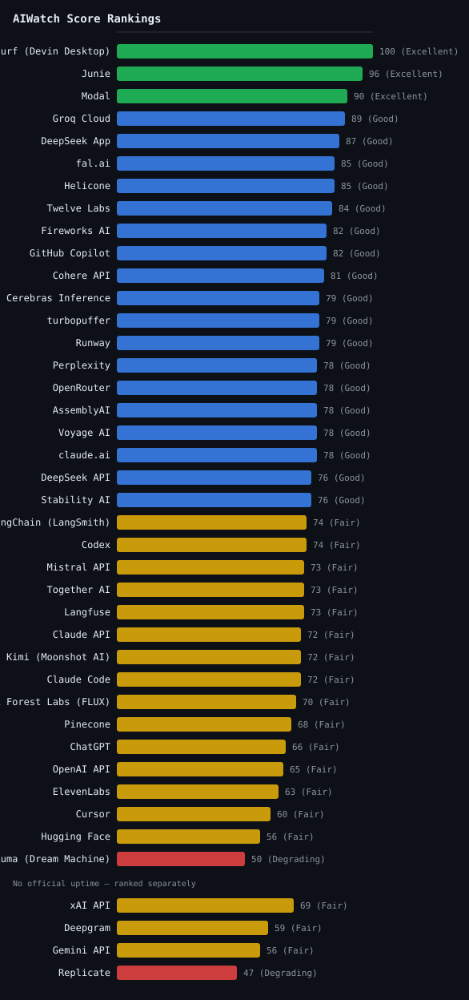

> **Source**: [ai-watch.dev](https://ai-watch.dev) — Real-time AI service status monitoring
> **Period**: September 1–30, 2026
> **Published**: October 2026
> **Services monitored**: 46 — 16 LLM APIs, 8 inference & infra, 6 coding agents, 5 AI apps, 4 voice & transcription, 3 observability, 2 video, 2 image

<!-- AUTHORING SELF-CHECK — read before writing prose; these are the recurring misses:
     1. CLAIMS BACKED BY DATA, AT THE RIGHT SCOPE. Every superlative/absolute ("the slowest", "the most",
        "worst month", "the only", "never") must be TRUE over the scope you state. Qualify to what the
        measurement supports: p75 is an edge-RTT probe to ONE endpoint, not "the slowest SERVICE"; a
        "worst month" must hold on the metric you mean (Score? downtime?) and beat EVERY peer — check the
        data, a lower-scoring sibling breaks "worst coding agent". Prefer "highest edge-probe RTT among
        probed services" / "most downtime of any coding agent" to a bare superlative. Soften unprovable
        absolutes ("never" -> "rarely").
     2. ONE HOME PER FACT — don't over-emphasise. A specific figure/superlative (e.g. one service's p75)
        belongs in ONE analytical home (its Notable Incident, or the data table), not restated across
        Summary + Notable Incidents + Observations. Weight a factor by its real contribution, not by how
        many times you can repeat it.
     3. ADVISORY != OUTAGE. Before calling something an outage, read the incident TITLE + impact, not just
        its duration. A usage-limits / billing / model-access / policy notice (often impact:minor) is an
        ADVISORY, not downtime — label it so (as the Anthropic entries do). If the archive counted such a
        notice as downtime it inflates the Score drop (a worker-side classification bug, cf. aiwatch#707);
        flag it. A long duration alone does not make an availability incident. -->

<!-- BEGIN RECURRENCE CHECK — review, reframe around the change, then DELETE this entire block before merge -->
_Narrative repeated vs prior months — lead with the month-over-month change or a fresh lens, then delete this block._

- ⚠️ **Together AI** — led a Key Insight pattern in 2 of the last 3 published months (2026-06, 2026-08) + this month (2026-09). (last month 64 → this month 49) → Reframe around the change or pick a fresh lens.

<!-- END RECURRENCE CHECK -->

## Summary
<!-- BEGIN AUTO-DRAFT — review, then DELETE this entire block before merge -->
_Auto-generated narrative draft — English only; translate for the KO `
` block below._

- **Most reliable**: Windsurf (Devin Desktop) (100 — zero incidents, perfect uptime)
- **Riskiest this month**: Luma (Dream Machine) (50)
- **Most incidents**: Mistral API (75 incidents, 35h 17m downtime — 63 last month (+12))

**Recommendations**
- **Primary**: Windsurf (Devin Desktop) or Junie
- **Fallback**: Modal (1h 11m avg resolution) or Groq Cloud

**Recovery performance**: Fastest — Windsurf (Devin Desktop) (1m avg). Slowest — Gemini API (45h 11m avg).

> _Ranking language above excludes Gemini API, xAI API, Deepgram, Replicate — no official uptime, so their Score is not on the same scale and they are ranked in their own table (aiwatch-reports#106). Services excluded from the ranking entirely are named in the note above the Score table. Name any of them by hand if the month warrants it._

<!-- END AUTO-DRAFT -->

> Every score in this report is the **AIWatch Score** (0–100): one number combining uptime, incident load, recovery speed and responsiveness. Higher is better. [How it's built →](#aiwatch-score--september-2026-reliability-rankings)

- **Most reliable**:
- **Riskiest this month**:
- **High incident count, fast recovery**:
- **Watch out**:

<strong>Summary in Korean</strong>

<ul>
<li><strong>가장 안정적</strong>: </li>
<li><strong>이번 달 가장 위험</strong>: </li>
<li><strong>잦은 장애, 빠른 복구</strong>: </li>
<li><strong>주의 필요</strong>: </li>
</ul>

---

## Recommendations

<table class="recommendations">
<thead>
<tr><th>Use Case</th><th>Recommended</th><th>Why</th></tr>
</thead>
<tbody>
<tr><td><strong>Production-critical</strong></td><td><em>(service)</em></td><td><em>(why)</em></td></tr>
<tr><td><strong>Low latency / cost</strong></td><td><em>(service)</em></td><td><em>(why)</em></td></tr>
<tr><td><strong>Coding Agents</strong></td><td><em>(service)</em></td><td><em>(why)</em></td></tr>
<tr><td><strong>Voice / audio</strong></td><td><em>(service)</em></td><td><em>(why)</em></td></tr>
<tr><td><strong>General purpose</strong></td><td><em>(service)</em></td><td><em>(why)</em></td></tr>
</tbody>
</table>

---

## Key Insight

September 2026 showed a clear divide: Windsurf (Devin Desktop), Junie, and Modal remained highly stable, while Luma (Dream Machine) (50) experienced the most challenges. 40 out of 46 services recorded at least one incident, with a combined downtime of 808h 23m.

- **Pattern 1**:
- **Pattern 2**:
- **Pattern 3**:

<strong>Key Insight in Korean</strong>

<!-- Opening narrative in Korean -->

<ul>
<li><strong>패턴 1</strong>: </li>
<li><strong>패턴 2</strong>: </li>
<li><strong>패턴 3</strong>: </li>
</ul>

---

## 3-Month Trend

AIWatch Score direction over the last 3 months (2026-07 → 2026-09). The lines plot each service's composite Score. **Notable Movers** below are NOT ranked by these lines — a service earns its place, and its order, by the largest change on *any* of three axes (Score, recovery time, or total downtime), which is why one with a small Score move can top the list on a downtime swing the chart cannot show.

### Notable Movers

*The 5 services whose **Score, recovery time (MTTR), or total downtime** changed most over the window (ranked by the largest single change, not a fixed threshold). The metric in **bold** is the change that ranked each service here; 🔺 / 🔻 mark whether that headline metric improved or worsened — so a service can show a small Score gain yet land here, and read 🔻, because its downtime regressed.*

- 🔻 **Hugging Face** — Score 80 → 56 (−24) · **MTTR 39m → 43h 56m (+43h 17m)** · downtime 4h 36m → 165h 3m (+160h 27m)
- 🔺 **Claude API** — Score 61 → 72 (+11) · MTTR 2h 42m → 1h 16m (−1h 26m) · **downtime 121h 51m → 11h 27m (−110h 24m)**
- 🔺 **Mistral API** — Score 81 → 73 (−8) · MTTR 4h 37m → 38m (−3h 59m) · **downtime 129h 28m → 35h 17m (−94h 11m)**
- 🔺 **Claude Code** — Score 60 → 72 (+12) · MTTR 2h 6m → 1h 19m (−47m) · **downtime 98h 39m → 9h 13m (−89h 26m)**
- 🔺 **ChatGPT** — Score 57 → 66 (+9) · MTTR 6h 5m → 3h 6m (−2h 59m) · **downtime 157h 57m → 77h 35m (−80h 22m)**

---

## AIWatch Score — September 2026 Reliability Rankings

**AIWatch Score (0–100)** is designed to answer one question:

> *"Which AI service is safest to rely on in production?"*

Combines four components — Uptime (40%), Incident affected days (25%), Recovery speed (15%), Responsiveness (20%, the p50 RTT + stability figures shown under [Responsiveness Inputs](#responsiveness-inputs-score-component)). The separate [API Response Time — Monthly p75](#api-response-time--monthly-p75) table is a network-latency reference that does *not* feed the Score; full breakdown of weights, fallbacks, and penalties is in [About This Report → AIWatch Score](#about-this-report). [How it's calculated →](https://ai-watch.dev/methodology#score)

*41 of 46 services ranked — 37 in the table below, 4 with no official uptime ranked separately under it. **Amazon Bedrock, Azure OpenAI, Grok are excluded from this ranking** — no official uptime metric and no direct latency probe, so AIWatch can measure only two of the Score's four components and withholds a Score rather than rank on insufficient signal. Incidents are still tracked (see [Incident Summary](#incident-summary)). **Character.AI is excluded from this ranking** — its incident feed is frozen, so the Score would rest on a partial month (see "Stale source" under [Incident Summary](#incident-summary)). **Fish Audio is excluded from this ranking** — it was added to AIWatch mid-month, so the partial-month Score rests on insufficient coverage; it rejoins once a full month of data accrues.*

| Rank | Service | Score | Grade | Uptime Source | Why |
|---|---|---|---|---|---|
| 1 | Windsurf (Devin Desktop) | 100 | Excellent | Official | 1 incident, 1m |
| 2 | Junie | 96 | Excellent | Official | 1 incident, 8m |
| 3 | Modal | 90 | Excellent | Platform | 8 incidents, avg 1h 11m over 2 |
| 4 | Groq Cloud | 89 | Good | Official | Zero incidents, 100.00% uptime |
| 5 | DeepSeek App | 87 | Good | Official | 8 incidents, avg 38m |
| 6= | fal.ai | 85 | Good | Official | Zero incidents, 99.89% uptime |
| 6= | Helicone | 85 | Good | Platform | Zero incidents, 99.99% uptime |
| 8 | Twelve Labs | 84 | Good | Official | 11 incidents |
| 9= | Fireworks AI | 82 | Good | Official | 36 incidents, avg 37m |
| 9= | GitHub Copilot | 82 | Good | Official | 6 incidents, avg 3h 4m |
| 11 | Cohere API | 81 | Good | Official | 1 incident, 4h 23m |
| 12= | Cerebras Inference | 79 | Good | Official | 1 incident, 4h 59m |
| 12= | turbopuffer | 79 | Good | Official | 2 incidents, fast recovery (avg 20m) |
| 12= | Runway | 79 | Good | Official | 1 incident, 2h 22m |
| 15= | Perplexity | 78 | Good | Official | 4 incidents, avg 2h 20m over 2 |
| 15= | OpenRouter | 78 | Good | Official | 3 incidents, avg 1h 37m |
| 15= | AssemblyAI | 78 | Good | Official | 3 incidents, avg 53m over 2 |
| 15= | Voyage AI | 78 | Good | Official | 4 incidents, fast recovery (avg 22m) |
| 15= | claude.ai | 78 | Good | Official | 9 incidents, avg 1h 11m |
| 20= | DeepSeek API | 76 | Good | Official | 9 incidents, avg 38m |
| 20= | Stability AI | 76 | Good | Official | 1 incident, 4h 8m |
| 22= | LangChain (LangSmith) | 74 | Fair | Official | 3 incidents, avg 1h 57m |
| 22= | Codex | 74 | Fair | Official | 6 incidents, avg 2h 17m |
| 24= | Mistral API | 73 | Fair | Official | 75 incidents, avg 38m over 55 |
| 24= | Together AI | 73 | Fair | Platform | 49 incidents |
| 24= | Langfuse | 73 | Fair | Official | 6 incidents, avg 2h 15m |
| 27= | Claude API | 72 | Fair | Official | 9 incidents, avg 1h 16m |
| 27= | Kimi (Moonshot AI) | 72 | Fair | Official | 13 incidents, fast recovery (avg 7m) |
| 27= | Claude Code | 72 | Fair | Official | 7 incidents, avg 1h 19m |
| 30 | Black Forest Labs (FLUX) | 70 | Fair | Official | 2 incidents, avg 13h 23m |
| 31 | Pinecone | 68 | Fair | Official | 4 incidents, avg 4h 14m |
| 32 | ChatGPT | 66 | Fair | Official | 26 incidents, avg 3h 6m over 25 |
| 33 | OpenAI API | 65 | Fair | Official | 8 incidents, avg 2h 51m over 7 |
| 34 | ElevenLabs | 63 | Fair | Official | 10 incidents, avg 5h 46m |
| 35 | Cursor | 60 | Fair | Official | 32 incidents, avg 1h 42m over 31 |
| 36 | Hugging Face | 56 | Fair | Platform | 7 incidents, avg 43h 56m over 2 |
| 37 | Luma (Dream Machine) | 50 | Degrading | Platform | 13 incidents, avg 8h over 3 |

**No Official Uptime**

*Scored on Incidents + Recovery + Responsiveness only — no official uptime metric, so these Scores are not on the same scale as a Score built from a measured uptime. Ranked separately rather than merged into one shared rank.*

| Rank | Service | Score | Grade | Why |
|---|---|---|---|---|
| 1 | xAI API | 69 | Fair | 3 incidents, avg 1h 26m |
| 2 | Deepgram | 59 | Fair | 6 incidents, avg 1h 37m over 5 |
| 3 | Gemini API | 56 | Fair | 1 incident, 45h 11m |
| 4 | Replicate | 47 | Degrading | 4 incidents, avg 9h 39m |

**Grade scale**: Excellent (90+) · Good (75+) · Fair (55+) · Degrading (40+) · Unstable (<40)

<!-- Generate with: node scripts/generate-charts.js 2026-09/index.md -->

> **Uptime Source column**: **Official** (AIWatch computes the figure from the incident/outage records the provider publishes) · **Platform** (a different computation, built from the status page platform's own monitors — Better Stack — rather than incidents the provider declared; not on the same basis as Official) · **No uptime** (no uptime figure resolved for this row — usually because the status page publishes none, occasionally a figure AIWatch withheld; it may still publish incident records; the Score is built from the remaining signals). A service tracked for less than the full month is excluded from the ranking, not labelled — see the note above the ranking. Full definitions: [About This Report → Uptime Source](#about-this-report).
> <!-- Keep this caption short — full definitions live in the About This Report methodology section to avoid duplicating them here. -->

---

## 30-Day Uptime

Uptime computed by AIWatch — never a copy of the percentage a provider displays on its own page (those use different periods and different definitions of downtime). The exact method differs by source; see [About This Report → Uptime Source](#about-this-report) for what Official vs Platform means. Full method: [ai-watch.dev/methodology](https://ai-watch.dev/methodology#uptime). The narrative-driven sections below (Incident Summary / Notable Incidents / Observations) cover what these numbers mean for vendor selection.

<table class="uptime-cols">
<thead><tr><th>Service</th><th>Uptime</th></tr></thead>
<tbody>
<tr><td>Groq Cloud</td><td>100.00%</td></tr>
<tr><td>Cerebras Inference</td><td>100.00%</td></tr>
<tr><td>Black Forest Labs (FLUX)</td><td>100.00%</td></tr>
<tr><td>LangChain (LangSmith)</td><td>100.00%</td></tr>
<tr><td>Runway</td><td>100.00%</td></tr>
<tr><td>Windsurf (Devin Desktop)</td><td>100.00%</td></tr>
<tr><td>Helicone</td><td>99.99%</td></tr>
<tr><td>Junie</td><td>99.99%</td></tr>
<tr><td>Fish Audio</td><td>99.99%</td></tr>
<tr><td>turbopuffer</td><td>99.98%</td></tr>
<tr><td>Fireworks AI</td><td>99.97%</td></tr>
<tr><td>AssemblyAI</td><td>99.96%</td></tr>
<tr><td>Modal</td><td>99.95%</td></tr>
<tr><td>Stability AI</td><td>99.94%</td></tr>
<tr><td>Voyage AI</td><td>99.94%</td></tr>
<tr><td>Twelve Labs</td><td>99.92%</td></tr>
<tr><td>Kimi (Moonshot AI)</td><td>99.91%</td></tr>
<tr><td>Pinecone</td><td>99.91%</td></tr>
<tr><td>fal.ai</td><td>99.89%</td></tr>
<tr><td>OpenRouter</td><td>99.88%</td></tr>
<tr><td>Cohere API</td><td>99.85%</td></tr>
<tr><td>GitHub Copilot</td><td>99.84%</td></tr>
<tr><td>DeepSeek App</td><td>99.82%</td></tr>
<tr><td>Perplexity</td><td>99.81%</td></tr>
<tr><td>DeepSeek API</td><td>99.80%</td></tr>
<tr><td>Langfuse</td><td>99.80%</td></tr>
<tr><td>Together AI</td><td>99.78%</td></tr>
<tr><td>Claude API</td><td>99.73%</td></tr>
<tr><td>claude.ai</td><td>99.69%</td></tr>
<tr><td>Claude Code</td><td>99.69%</td></tr>
<tr><td>Mistral API</td><td>99.45%</td></tr>
<tr><td>Codex</td><td>99.40%</td></tr>
<tr><td>Cursor</td><td>99.39%</td></tr>
<tr><td>ElevenLabs</td><td>98.74%</td></tr>
<tr><td>OpenAI API</td><td>98.69%</td></tr>
<tr><td>ChatGPT</td><td>98.62%</td></tr>
<tr><td>Hugging Face</td><td>98.19%</td></tr>
<tr><td>Luma (Dream Machine)</td><td>97.77%</td></tr>
</tbody>
</table>

*Amazon Bedrock, Azure OpenAI, Character.AI, Deepgram, Gemini API, Grok, Replicate, and xAI API do not publish a comparable uptime percentage on their status pages — they're excluded from this table for that reason. (xAI's [status page](https://status.x.ai) does expose per-endpoint live success rates measured since its monitoring system's last restart, but those numbers are not directly comparable to the figures above.)*

---

## Component Reliability

> AIWatch surfaces a **per-component uptime breakdown** — each multi-surface service's weakest component over the days AIWatch could read its status page, the surface most likely to be your bottleneck that a single service-level uptime number hides. It is a different measurement from the 30-Day Uptime table and **is not a Score input**; see [About This Report → Component Reliability](#about-this-report).

| Service | Weakest Component | Uptime | Components |
|---|---|---|---|
| Black Forest Labs (FLUX) | API EU (api.eu.bfl.ai) | 91.44% | 18 |
| ChatGPT | Conversations | 92.75% | 14 |
| Cursor | Grok Bot | 94.01% | 7 |
| OpenAI API | Responses | 95.78% | 11 |
| ElevenLabs | Speech to Text | 96.26% | 7 |
| Codex | Codex Web | 96.31% | 4 |
| GitHub Copilot | Copilot AI Model Providers | 98.21% | 2 |
| LangChain (LangSmith) | LangSmith Fleet | 98.81% | 11 |
| Fireworks AI | GLM 5.2 US | 99.37% | 29 |
| Pinecone | Serverless Indexes | 99.51% | 6 |
| Langfuse | Ingestion API | 99.60% | 3 |
| Cohere API | embed-v4.0 | 99.62% | 30 |
| Twelve Labs | Analyze API - Pegasus1.5 (Segment Based Metadata) | 99.78% | 11 |
| Voyage AI | API | 99.88% | 2 |

---

## Responsiveness Inputs (Score Component)

> **This table feeds the Score.** These are the two figures the **Responsiveness** component (20% of
> the AIWatch Score) was computed from this month: each service's median (p50) probe RTT, and the
> combined coefficient of variation (CV) of that RTT — day-to-day movement plus the p95/p50 spread.
> **Lower is better for both**: a fast service still scores poorly here if it is erratic.
>
> Do not confuse it with [API Response Time — Monthly p75](#api-response-time--monthly-p75) further
> down. That table probes the **same endpoints** but its p75 figure is **not part of the Score** —
> it is a network-speed reference only. This one is scored; that one is not.
> [How each figure becomes a sub-score →](https://ai-watch.dev/methodology#score)

| Service | p50 RTT | RTT variation (CV) |
|---|---|---|
| Gemini API | 120 ms | 0.89 |
| Claude API | 172 ms | 0.45 |
| Claude Code | 172 ms | 0.45 |
| Codex | 179 ms | 0.62 |
| OpenAI API | 179 ms | 0.62 |
| Mistral API | 204 ms | 0.49 |
| Cohere API | 227 ms | 0.57 |
| Fireworks AI | 247 ms | 0.55 |
| Groq Cloud | 251 ms | 0.51 |
| Together AI | 317 ms | 0.63 |
| Cerebras Inference | 354 ms | 0.50 |
| Perplexity | 391 ms | 0.50 |
| Hugging Face | 421 ms | 0.49 |
| Replicate | 501 ms | 0.62 |
| OpenRouter | 531 ms | 0.49 |
| xAI API | 541 ms | 0.48 |
| ElevenLabs | 554 ms | 0.47 |
| fal.ai | 595 ms | 0.45 |
| Kimi (Moonshot AI) | 662 ms | 0.38 |
| DeepSeek API | 713 ms | 0.31 |
| Stability AI | 725 ms | 0.54 |
| Voyage AI | 887 ms | 0.35 |
| AssemblyAI | 912 ms | 0.50 |
| Pinecone | 962 ms | 0.36 |
| Black Forest Labs (FLUX) | 1060 ms | 0.42 |
| LangChain (LangSmith) | 1086 ms | 0.35 |
| Twelve Labs | 1154 ms | 0.41 |
| Runway | 1267 ms | 0.44 |
| turbopuffer | 1360 ms | 0.38 |
| Luma (Dream Machine) | 1412 ms | 0.44 |
| Helicone | 1617 ms | 0.34 |
| Langfuse | 1673 ms | 0.36 |
| Cursor | 1675 ms | 0.40 |
| Deepgram | 1991 ms | 0.75 |

---

## API Response Time — Monthly p75

These p75 figures are a network-latency reference: direct API-endpoint round-trip time, probed from the Cloudflare Workers edge every 5 minutes — not inference latency. Lower is better. **This table does not feed the Score** — the Score's Responsiveness component reads the *median* (p50) RTT and its stability instead, shown above under [Responsiveness Inputs](#responsiveness-inputs-score-component). So this table ranks *which service is fastest on the network*, while [AIWatch Score](#aiwatch-score--september-2026-reliability-rankings) ranks *which is safest to rely on*. A service AIWatch does not probe has no row here; that alone does not drop it from the Score ranking.

<!-- Data source: curl https://api.ai-watch.dev/api/probe/history?days=30 -->
<!-- 32 probe targets: 30 API services (incl. twelvelabs) + cursor (coding agent) + characterai (app, detail-card only, aiwatch#921). A service AIWatch does not probe simply has no row here (13 of 41 in June 2026, ten of them ranked); that alone does not affect its Score. -->
<!-- p95 + Spikes are present in probe:daily:{date} (CLAUDE.md KV schema) but not yet
     surfaced by /api/report. vs-Last-Month additionally requires reading the previous
     month's archive:monthly:* and computing deltas. Re-add the columns once the
     report API carries them — file a tracking issue if not already open. -->

| Rank | Service | p75 (ms) |
|---|---|---|
| 1 | Gemini API | 146 |
| 2 | Claude API | 210 |
| 3 | OpenAI API | 220 |
| 4 | Mistral API | 246 |
| 5 | Cohere API | 296 |
| 6 | Fireworks AI | 307 |
| 7 | Groq Cloud | 315 |
| 8 | Together AI | 388 |
| 9 | Cerebras Inference | 434 |
| 10 | Perplexity | 479 |
| 11 | Hugging Face | 527 |
| 12 | Replicate | 634 |
| 13 | OpenRouter | 644 |
| 14 | xAI API | 657 |
| 15 | ElevenLabs | 675 |
| 16 | fal.ai | 719 |
| 17 | Kimi (Moonshot AI) | 767 |
| 18 | DeepSeek API | 810 |
| 19 | Stability AI | 908 |
| 20 | Voyage AI | 1039 |
| 21 | Pinecone | 1120 |
| 22 | AssemblyAI | 1123 |
| 23 | LangChain (LangSmith) | 1272 |
| 24 | Black Forest Labs (FLUX) | 1287 |
| 25 | Twelve Labs | 1383 |
| 26 | Runway | 1534 |
| 27 | turbopuffer | 1606 |
| 28 | Fish Audio | 1637 |
| 29 | Luma (Dream Machine) | 1721 |
| 30 | Character.AI | 1812 |
| 31 | Helicone | 1899 |
| 32 | Langfuse | 1957 |
| 33 | Cursor | 1998 |
| 34 | Deepgram | 2798 |

---

## Detection & RTT Degradation

### Detection Latency

AIWatch independently detects incidents and alerts within **~5 minutes** — the probe/poll cadence, the upper bound on how long an issue can go unnoticed by our monitoring. This is independent, low-latency awareness across all monitored services, not a timing comparison against any provider's status page.

### RTT Degradation Detection

AIWatch's direct RTT probes flagged **230** RTT degradations this month, of which **208** were **not reflected on the providers' official status pages at the time of detection**.

| Service | RTT Degradations | Not on Status Page |
|---|---|---|
| Deepgram | 94 | 93 |
| Gemini API | 64 | 49 |
| Replicate | 42 | 36 |
| Helicone | 7 | 7 |
| AssemblyAI | 6 | 6 |
| Twelve Labs | 5 | 5 |
| Together AI | 4 | 4 |
| Stability AI | 1 | 1 |
| OpenAI API | 1 | 1 |
| Cerebras Inference | 1 | 1 |
| Langfuse | 1 | 1 |
| Luma (Dream Machine) | 1 | 1 |
| Cursor | 1 | 1 |
| Mistral API | 1 | 1 |
| Fireworks AI | 1 | 1 |

> **RTT degradation detection** is AIWatch's differentiator: synthetic probes measure real latency degradation that official status pages often omit.

---

## AI Prediction Accuracy

When an incident opens, AIWatch's AI publishes an estimated recovery window. **119** of those estimates could be scored against the incident's actual recovery in September. Median absolute error: **44m**.

| Metric | Value |
|---|---|
| Estimates scored | 119 |
| Median absolute error | 44m |
| Recovered by the estimated time | 90 (76%) |
| Took longer than the estimate | 29 (24%) |

> **How this is scored**: the estimate is the upper bound of the recovery window AIWatch published for that incident, and the error is the gap between that bound and the actual recovery. One provider incident affecting several services is scored once. Not every incident carries an estimate, so this is a sample of the month's incidents — it is not comparable to the incident counts elsewhere in this report.

---

## Incident Summary

> **Reading the count column**: The count is how many incidents a provider published for that service. Granularity differs — Anthropic posts a separate incident per model ("Elevated errors for Claude Opus 4.7"), and Together AI's status page tracks each model as its own component — so both show higher totals than providers that post one incident per event. Higher count ≠ lower reliability; adjust for granularity before comparing across providers. A Platform-source service can also carry **reconstructed** entries, counted one per (component, downtime day) instead of one per event. They count toward Inc and Downtime, but carry no recovery time, so they are left out of the Longest and Avg Resolution columns. A month mixing the two is not continuous with earlier months. Where Avg Resolution reads "… over N", the average is taken over N of the service's entries, not all of them. Full rules: [How AIWatch Works → Incident counting](https://ai-watch.dev/methodology#incidents).
>
> <!-- Cycle-specific data notes (excluded incidents, anomalies) go here. -->

<table>
<thead>
<tr><th>Service</th><th>Inc</th><th>Downtime (longest)</th><th class="hide-mobile">Longest</th><th class="hide-mobile">Avg Resolution</th></tr>
</thead>
<tbody>
<tr><td>Mistral API</td><td>75</td><td>35h 17m (7h 49m)</td><td class="hide-mobile">7h 49m</td><td class="hide-mobile">38m over 55</td></tr>
<tr><td>Together AI</td><td>49</td><td>32h 30m</td><td class="hide-mobile">—</td><td class="hide-mobile">—</td></tr>
<tr><td>Fireworks AI</td><td>36</td><td>22h 13m (5h 38m)</td><td class="hide-mobile">5h 38m</td><td class="hide-mobile">37m</td></tr>
<tr><td>Cursor</td><td>32</td><td>52h 33m (6h 30m)</td><td class="hide-mobile">6h 30m</td><td class="hide-mobile">1h 42m over 31</td></tr>
<tr><td>ChatGPT</td><td>26</td><td>77h 35m (12h 7m)</td><td class="hide-mobile">12h 7m</td><td class="hide-mobile">3h 6m over 25</td></tr>
<tr><td>Kimi (Moonshot AI)</td><td>13</td><td>1h 30m (27m)</td><td class="hide-mobile">27m</td><td class="hide-mobile">7m</td></tr>
<tr><td>Luma (Dream Machine)</td><td>13</td><td>72h (13h)</td><td class="hide-mobile">13h</td><td class="hide-mobile">8h over 3</td></tr>
<tr><td>Twelve Labs</td><td>11</td><td>—</td><td class="hide-mobile">—</td><td class="hide-mobile">—</td></tr>
<tr><td>ElevenLabs</td><td>10</td><td>57h 35m (26h 18m)</td><td class="hide-mobile">26h 18m</td><td class="hide-mobile">5h 46m</td></tr>
<tr><td>Claude API</td><td>9</td><td>11h 27m (2h 58m)</td><td class="hide-mobile">2h 58m</td><td class="hide-mobile">1h 16m</td></tr>
<tr><td>DeepSeek API</td><td>9</td><td>5h 40m (3h)</td><td class="hide-mobile">3h</td><td class="hide-mobile">38m</td></tr>
<tr><td>claude.ai</td><td>9</td><td>10h 35m (2h 58m)</td><td class="hide-mobile">2h 58m</td><td class="hide-mobile">1h 11m</td></tr>
<tr><td>OpenAI API</td><td>8</td><td>19h 55m (7h 27m)</td><td class="hide-mobile">7h 27m</td><td class="hide-mobile">2h 51m over 7</td></tr>
<tr><td>Modal</td><td>8</td><td>5h 53m (2h 8m)</td><td class="hide-mobile">2h 8m</td><td class="hide-mobile">1h 11m over 2</td></tr>
<tr><td>DeepSeek App</td><td>8</td><td>5h 6m (3h)</td><td class="hide-mobile">3h</td><td class="hide-mobile">38m</td></tr>
<tr><td>Hugging Face</td><td>7</td><td>165h 3m (71h 54m)</td><td class="hide-mobile">71h 54m</td><td class="hide-mobile">43h 56m over 2</td></tr>
<tr><td>Claude Code</td><td>7</td><td>9h 13m (2h 58m)</td><td class="hide-mobile">2h 58m</td><td class="hide-mobile">1h 19m</td></tr>
<tr><td>Deepgram</td><td>6</td><td>8h 3m (4h)</td><td class="hide-mobile">4h</td><td class="hide-mobile">1h 37m over 5</td></tr>
<tr><td>Langfuse</td><td>6</td><td>13h 28m (6h 21m)</td><td class="hide-mobile">6h 21m</td><td class="hide-mobile">2h 15m</td></tr>
<tr><td>Codex</td><td>6</td><td>13h 42m (5h 22m)</td><td class="hide-mobile">5h 22m</td><td class="hide-mobile">2h 17m</td></tr>
<tr><td>GitHub Copilot</td><td>6</td><td>18h 24m (10h 28m)</td><td class="hide-mobile">10h 28m</td><td class="hide-mobile">3h 4m</td></tr>
<tr><td>Perplexity</td><td>4</td><td>4h 40m (2h 20m)</td><td class="hide-mobile">2h 20m</td><td class="hide-mobile">2h 20m over 2</td></tr>
<tr><td>Replicate</td><td>4</td><td>38h 37m (20h 43m)</td><td class="hide-mobile">20h 43m</td><td class="hide-mobile">9h 39m</td></tr>
<tr><td>Pinecone</td><td>4</td><td>16h 57m (11h 8m)</td><td class="hide-mobile">11h 8m</td><td class="hide-mobile">4h 14m</td></tr>
<tr><td>Voyage AI</td><td>4</td><td>1h 26m (29m)</td><td class="hide-mobile">29m</td><td class="hide-mobile">22m</td></tr>
<tr><td>Azure OpenAI</td><td>3</td><td>—</td><td class="hide-mobile">—</td><td class="hide-mobile">—</td></tr>
<tr><td>xAI API</td><td>3</td><td>4h 18m (3h 40m)</td><td class="hide-mobile">3h 40m</td><td class="hide-mobile">1h 26m</td></tr>
<tr><td>OpenRouter</td><td>3</td><td>4h 50m (2h 45m)</td><td class="hide-mobile">2h 45m</td><td class="hide-mobile">1h 37m</td></tr>
<tr><td>AssemblyAI</td><td>3</td><td>1h 46m (1h 15m)</td><td class="hide-mobile">1h 15m</td><td class="hide-mobile">53m over 2</td></tr>
<tr><td>LangChain (LangSmith)</td><td>3</td><td>5h 50m (3h 28m)</td><td class="hide-mobile">3h 28m</td><td class="hide-mobile">1h 57m</td></tr>
<tr><td>turbopuffer</td><td>2</td><td>40m (27m)</td><td class="hide-mobile">27m</td><td class="hide-mobile">20m</td></tr>
<tr><td>Black Forest Labs (FLUX)</td><td>2</td><td>26h 46m (20h 15m)</td><td class="hide-mobile">20h 15m</td><td class="hide-mobile">13h 23m</td></tr>
<tr><td>Gemini API</td><td>1</td><td>45h 11m (45h 11m)</td><td class="hide-mobile">45h 11m</td><td class="hide-mobile">45h 11m</td></tr>
<tr><td>Cohere API</td><td>1</td><td>4h 23m (4h 23m)</td><td class="hide-mobile">4h 23m</td><td class="hide-mobile">4h 23m</td></tr>
<tr><td>Cerebras Inference</td><td>1</td><td>4h 59m (4h 59m)</td><td class="hide-mobile">4h 59m</td><td class="hide-mobile">4h 59m</td></tr>
<tr><td>Stability AI</td><td>1</td><td>4h 8m (4h 8m)</td><td class="hide-mobile">4h 8m</td><td class="hide-mobile">4h 8m</td></tr>
<tr><td>Runway</td><td>1</td><td>2h 22m (2h 22m)</td><td class="hide-mobile">2h 22m</td><td class="hide-mobile">2h 22m</td></tr>
<tr><td>Grok</td><td>1</td><td>3h 39m (3h 39m)</td><td class="hide-mobile">3h 39m</td><td class="hide-mobile">3h 39m</td></tr>
<tr><td>Windsurf (Devin Desktop)</td><td>1</td><td>1m (1m)</td><td class="hide-mobile">1m</td><td class="hide-mobile">1m</td></tr>
<tr><td>Junie</td><td>1</td><td>8m (8m)</td><td class="hide-mobile">8m</td><td class="hide-mobile">8m</td></tr>
</tbody>
</table>

**Zero incidents (5 services):** Amazon Bedrock, Groq Cloud, fal.ai, Helicone, Fish Audio — confirmed via their status-page incident feeds.

**Stale source (1 service):** Character.AI — AIWatch can no longer read its incident feed, which is frozen at the last reachable fetch. The incident count covers only the window up to that cutoff, not the full month, so treat it as a floor rather than a verified picture. A frozen feed also removes the service from the Score ranking.

---

## Notable Incidents

<!-- BEGIN AUTO-DRAFT (Notable Incidents) — review, adapt into the entries below, then DELETE this entire block before merge -->
_Auto-generated retrospective draft (gemma) — review for accuracy, adapt, then delete this block._

### 1. Intermittent request failures and increased latency across Azure OpenAI, Azure AI Foundry, and Cognitive Services
**Affected**: Azure OpenAI, Azure AI Foundry, and Cognitive Services
**Duration**: ongoing

Users experienced widespread request failures and latency spikes across several interconnected services. The issue remains under investigation.

### 2. Slower downloads in the Asia-Pacific region — down
**Affected**: Hugging Face Asia-Pacific
**Duration**: 2d 24h

Download speeds were significantly degraded for users in the Asia-Pacific region. The service was later restored to normal operation.

### 3. Gemini API Batch requests not finishing in 24 hours
**Affected**: Gemini API
**Duration**: 1d 21h

Batch processing requests failed to complete within the expected 24-hour window. The issue was successfully resolved.

### 4. Claude MCP connection not working
**Affected**: ElevenLabs
**Duration**: 1d 2h

Connections via Claude MCP were non-functional for a period of over 24 hours. Service was restored following remediation.

### 5. Elevated errors in ChatGPT Space Pages
**Affected**: ChatGPT
**Duration**: ongoing

Increased error rates were observed specifically within ChatGPT Space Pages. The incident is currently in the monitoring phase.

### 6. Some GPU Jobs and Spaces failing to start — down
**Affected**: Hugging Face
**Duration**: 15h 57m

A subset of GPU-based jobs and Spaces failed to initialize. The service recovered after approximately 16 hours.

<!-- END AUTO-DRAFT (Notable Incidents) -->

<!-- Top 5-6 notable incidents — the report's main narrative content. Place this
     section in the narrative cluster (Incident Summary → Notable Incidents →
     Observations) that follows the metrics cluster (Score → 30-Day Uptime →
     API Response Time → Detection & RTT Degradation). Each entry: title with key duration,
     affected component(s), and a short prose paragraph that explains scope +
     remediation/mitigation.
     Each entry must describe the ACTUAL EVENT — pull the real title / root cause from the archive's
     incidentList (what broke, which component, the provider's own wording), NOT just "downtime was N
     hours". And verify it is a genuine availability incident (see AUTHORING SELF-CHECK #3): if the
     longest "incident" is a usage-limits / policy advisory, say so and do not frame it as an outage. -->

### 1. [Title]
**Affected**: <!-- Include region if applicable: e.g., "xAI API — EU (eu-west-1)" -->
**Duration**:

<!-- Description -->

---

## Observations

<!-- BEGIN AUTO-DRAFT (Observations) — review, adapt into the bullets below, then DELETE this entire block before merge -->
_Auto-generated retrospective draft (gemma) — review, adapt into prescriptive bullets, then delete this block._

- Treat Luma (Dream Machine) as a high-risk service for time-sensitive tasks due to its degrading score and extremely long recovery times.
- Exercise caution with Hugging Face for production workloads given its high average recovery duration and significant regional outages.
- Limit reliance on ChatGPT for mission-critical workflows until the frequency of elevated error incidents decreases.
- Prefer Modal or Twelve Labs for high-reliability requirements as they demonstrate superior stability scores and more consistent performance.

<!-- END AUTO-DRAFT (Observations) -->

**This month's** per-service resilience deltas — what each service's data *newly* argues for. The evergreen, month-to-month-stable patterns (per-model monitoring, Voice-Agent isolation, key rotation, retry-timeout tuning, failover mechanics) live once in **[Resilience Patterns](../resilience/)** — link there, don't re-explain them. Each bullet ties THIS month's failure mode to the relevant pattern and adds only what's new.

<!-- ROLE BOUNDARY — this section vs its neighbours (they blur; keep each to its ONE job):
     • Recommendations   = the PICKS TABLE — WHO to use per use case. Only place for picks.
     • Notable Incidents = the EVENT — what happened + why it mattered. DESCRIBE; do not prescribe.
     • Incident Summary note = how to READ the counts (granularity; count ≠ reliability). Only home for that.
     • ../resilience/ (Resilience Patterns) = the EVERGREEN, structural how-to-build guidance that holds
       every month (per-model monitoring, Voice-Agent isolation, Gemini key rotation + dual monitoring,
       fail over on your own tolerance, not the average recovery, coding-agent auto-failover). Stated ONCE there — do NOT re-lecture
       it monthly; that cross-month repetition is exactly what this split fixes. New evergreen pattern? Add it
       to that page, not here — following the MAINTENANCE curation rules at the top of ../resilience/
       (evergreen + high-value only, one pattern per failure-mode, prune stale bullets on edit).
     • Observations (here) = THIS MONTH'S DELTA only — the specific failure mode the month surfaced, tied to
       the relevant Resilience pattern with a link. The only home for the month's actionable advice, so Notable
       Incidents stays descriptive (don't end an incident with "keep a fallback" — put the delta here + link).
     THE TEST for a bullet: would it read identically next month? If yes, it's evergreen — move it to
     ../resilience/ and link. Every bullet must carry a DATE-TIED fact (this month X's worst was a 27h Y; a
     single 72h Z) and point at the pattern, not restate the architecture. A partial-month / withheld-Score
     CAVEAT (e.g. Character.AI) is a legitimate month-specific bullet too. -->

- **[Service]**: <!-- THIS month's date-tied failure fact (e.g. "its worst incident was a 27h streaming-STT degradation; p75 the highest probed"), DEEP-linked to the relevant Resilience pattern ([Resilience → Deepgram](../resilience/#deepgram)). Do NOT re-explain the evergreen pattern — link it. -->
- **[Service]**: <!-- 2-4 bullets total; only services whose THIS-MONTH data yields a new lesson. If a service's story is unchanged from a prior report, omit it (the pattern already lives in ../resilience/). -->
<!-- A partial-month / withheld-Score CAVEAT bullet (e.g. Character.AI: why its Score is absent + how to read
     its half-month counts) belongs here too — it's month-specific and not an evergreen pattern. -->

---

## Security Alerts

> **Note:** Security alerts captured during the month from OSV.dev (AI SDK package vulnerabilities), Hacker News (security posts mentioning monitored services), and NVD (first-party product CVEs). Section omitted for months without detections.

**Total alerts:** 30

**By source**

| Source | Count |
|---|---|
| OSV.dev | 25 |
| NVD | 5 |

**By severity**

| Critical | High | Medium | Low |
| --- | --- | --- | --- |
| 2 | 13 | 11 | 3 |

**Most affected services**

| Service | Count |
|---|---|
| Hugging Face | 13 |
| LangChain | 10 |
| Gemini | 3 |
| Anthropic (Claude) | 2 |
| OpenAI Codex | 1 |

### Top Findings

#### 1. [CVE-2026-13745: A vulnerability in the Gemini CLI and associated GitHub Action allowed an unprivileged attacker to achieve an arbitrary code execution in...](https://nvd.nist.gov/vuln/detail/CVE-2026-13745) · `critical`
- **Source:** NVD
- **Affected:** Gemini
- **Detected:** 2026-09-10

#### 2. [LangChain serialization injection vulnerability enables secret extraction in dumps/loads APIs](https://github.com/langchain-ai/langchain/security/advisories/GHSA-c67j-w6g6-q2cm) · `critical`
- **Source:** OSV.dev
- **Affected:** LangChain
- **Detected:** 2026-09-10

#### 3. [CVE-2026-19407: Bucket Squatting in Google Cloud Gemini Enterprise Agent Platform SDK for Python versions prior to 1.166.1 allows an attacker to achieve ...](https://nvd.nist.gov/vuln/detail/CVE-2026-19407) · `high`
- **Source:** NVD
- **Affected:** Gemini
- **Detected:** 2026-09-15

#### 4. [CVE-2026-19486: A Server-Side Request Forgery (SSRF) vulnerability in Google Cloud Gemini Enterprise Agent Platform App Builder versions prior to 2026-06...](https://nvd.nist.gov/vuln/detail/CVE-2026-19486) · `high`
- **Source:** NVD
- **Affected:** Gemini
- **Detected:** 2026-09-11

#### 5. [huggingface/transformers: Arbitrary Code Execution During Model Initialization in the LightGlue Model Loading Path](https://nvd.nist.gov/vuln/detail/CVE-2026-5241) · `high`
- **Source:** OSV.dev
- **Affected:** Hugging Face
- **Detected:** 2026-09-10

#### 6. [Deserialization of Untrusted Data in Hugging Face Transformers](https://nvd.nist.gov/vuln/detail/CVE-2024-11394) · `high`
- **Source:** OSV.dev
- **Affected:** Hugging Face
- **Detected:** 2026-09-10

#### 7. [Deserialization of Untrusted Data in Hugging Face Transformers](https://nvd.nist.gov/vuln/detail/CVE-2024-11392) · `high`
- **Source:** OSV.dev
- **Affected:** Hugging Face
- **Detected:** 2026-09-10

#### 8. [Deserialization of Untrusted Data in Hugging Face Transformers](https://nvd.nist.gov/vuln/detail/CVE-2024-11393) · `high`
- **Source:** OSV.dev
- **Affected:** Hugging Face
- **Detected:** 2026-09-10

#### 9. [LangSmith SDK: Public prompt pull deserializes untrusted manifests without trust boundary warning](https://github.com/langchain-ai/langsmith-sdk/security/advisories/GHSA-3644-q5cj-c5c7) · `high`
- **Source:** OSV.dev
- **Affected:** LangChain
- **Detected:** 2026-09-10

#### 10. [Langchain Community Vulnerable to XML External Entity (XXE) Attacks](https://nvd.nist.gov/vuln/detail/CVE-2025-6984) · `high`
- **Source:** OSV.dev
- **Affected:** LangChain
- **Detected:** 2026-09-10

---

## About This Report

* **Data Sources:** Real-time data is aggregated from official status pages via multiple frameworks, including Atlassian Statuspage, incident.io, Google Cloud Status, Better Stack, Instatus, OnlineOrNot, and RSS feeds (Source: [ai-watch.dev](https://ai-watch.dev)).
* **Monitoring Frequency:** All 46 services are polled every **5 minutes** via Cloudflare Workers. Those with a probeable API endpoint also get a direct response-time (RTT) health-check at the same interval.
* **AIWatch Score (0–100):** Calculated from four components — **Uptime** (40%), **Incident affected days** (25%), **Recovery speed** (15%), and **Responsiveness** (20%). A service with no probe endpoint is scored on the remaining components rescaled to 100, with **no penalty**. A service that has a probe but fewer than 7 days of samples gets that same rescale **plus a 5% penalty** until its probe data matures. Full methodology: [ai-watch.dev/methodology#score](https://ai-watch.dev/methodology#score)
* **Uptime Source:** *Official* = AIWatch computes an uptime figure from the incident and outage records the provider publishes on its status page. *Platform* = a different computation built from the status-page platform's own monitors (Better Stack) rather than incidents the provider declared. *No uptime* = no uptime figure resolved for this row — usually because the status page publishes none, occasionally a figure AIWatch computed but withheld; a service in this tier may still publish incident records, which is what drives the MTTR/downtime figures elsewhere in this report. The exact window and weighting behind each figure varies by status-page platform; full source-by-source method: [ai-watch.dev/methodology](https://ai-watch.dev/methodology#uptime). The Score then drops its 40-point Uptime component and is rescaled over the remaining signals (incidents, recovery, responsiveness), so the result is **not** on the same scale as a Score built from a measured uptime. Where this report knows which services those are, they are **ranked in their own table**, never merged into a single rank sequence. A service with **neither** uptime **nor** a probe has too little signal, so its Score is withheld and it is not ranked at all. The note above the Score table names whichever services that is — the membership is read from the data, not fixed here. A service AIWatch tracked for only part of the month is **excluded from the ranking** rather than labelled — its partial-month Score would rest on insufficient coverage. The label describes the Uptime input, not the Score's rigour.
* **Uptime Metrics:** Every percentage in the 30-Day Uptime table is computed by AIWatch from the outage records the status page publishes — never copied from the figure a provider displays on its own page, and computed by a different method depending on the Uptime Source (see *Uptime Source* above). Its **scope** depends on what the page exposes: a single component for some services, a worst-of across a component set for others, an upstream platform monitor for others still. A service with no resolved uptime figure (see *No uptime* under *Uptime Source* above) doesn't get a row in this table at all. A service's **Incident Summary** count and total downtime are not limited to that same scope, though — an incident on a component outside it still adds to those totals without moving the uptime percentage, which is why the two can diverge sharply for one long incident on a narrower surface.
* **Component Reliability:** A **different measurement** from every other uptime figure in this report — do not compare them. AIWatch polls each service's status page every 5 minutes and, per component, counts a poll as good **only** when that component reads `operational`; `degraded` and `partial outage` both count against it, with no weighting by incident severity (severity is recorded per *service*, not per component). The percentage is that ratio of good polls, over the days AIWatch could read the page. Only components AIWatch surfaces for that service are counted — billing, docs and compliance surfaces are excluded — and a service needs at least two of them to appear at all. The table lists only each service's **weakest** component, and only when it fell below 99.9%: it is a list of where to look, not a ranking of everything.
* **Timezone Standard:** All timestamps are recorded in **UTC**.

**Next report**: October 2026

---

- **Live status** — [ai-watch.dev](https://ai-watch.dev)
- **Slack/Discord alerts** — [ai-watch.dev/#settings](https://ai-watch.dev/#settings)
- **Score methodology** — [ai-watch.dev/methodology#score](https://ai-watch.dev/methodology#score)
- **All reports** — [ai-watch.dev/reports](https://ai-watch.dev/reports/)

---

- *Have feedback or spotted an error?* [Open an issue](https://github.com/bentleypark/aiwatch/issues/new)
- *Want us to track a service?* [Request here](https://github.com/bentleypark/aiwatch/issues/new?template=service_request.md)
